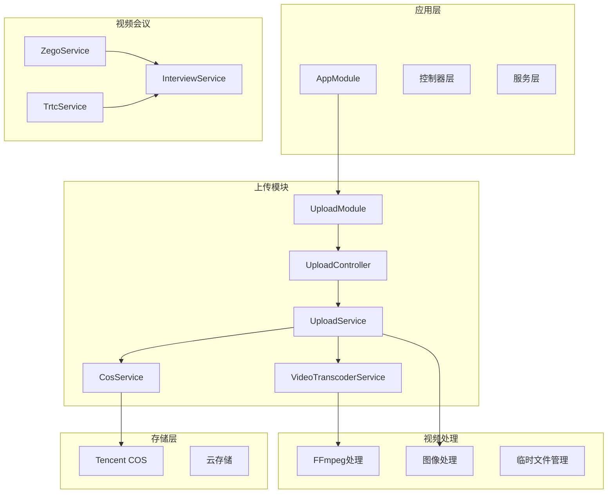
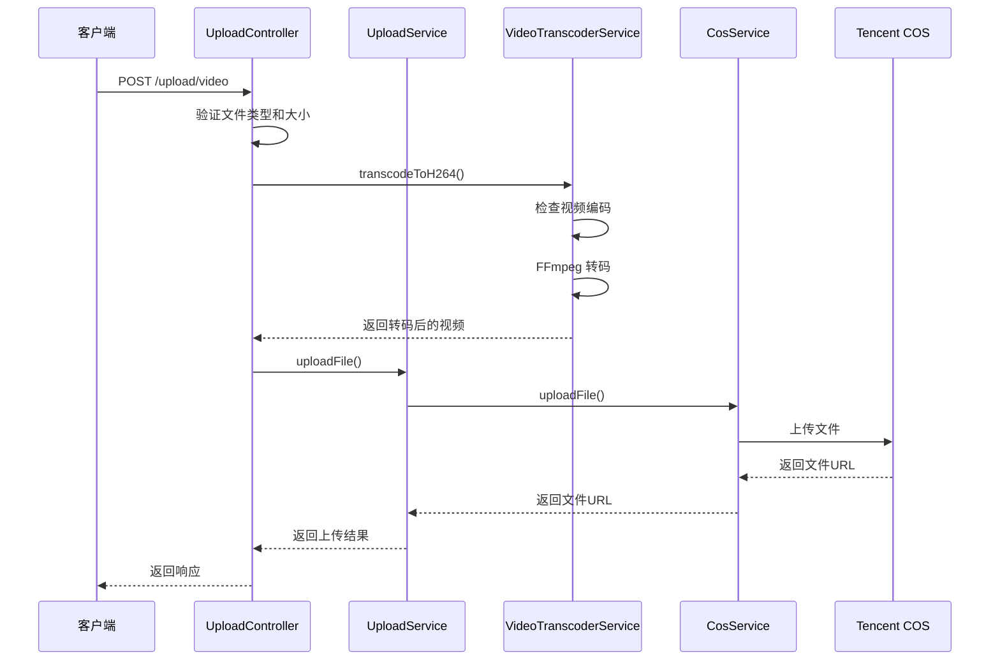
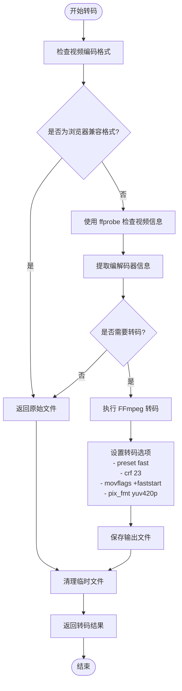
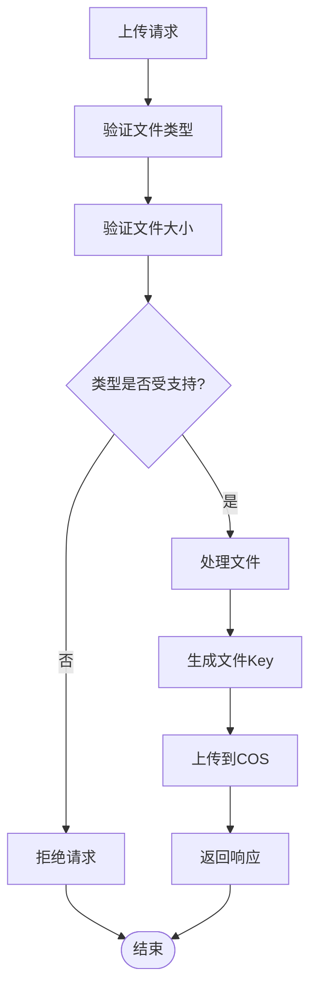
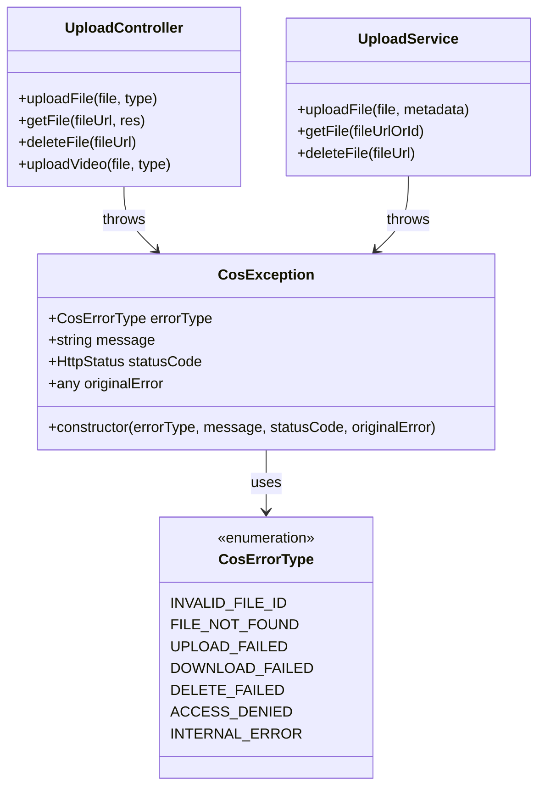
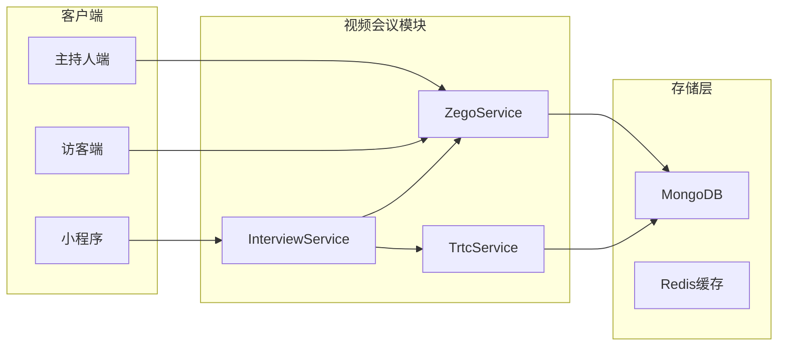
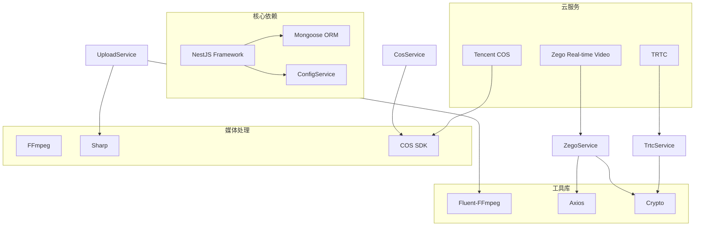

# 视频处理基础设施

<cite>
**本文档引用的文件**
- [backend/src/modules/upload/video-transcoder.service.ts](file://backend/src/modules/upload/video-transcoder.service.ts)
- [backend/src/modules/upload/upload.service.ts](file://backend/src/modules/upload/upload.service.ts)
- [backend/src/modules/upload/cos.service.ts](file://backend/src/modules/upload/cos.service.ts)
- [backend/src/modules/upload/upload.controller.ts](file://backend/src/modules/upload/upload.controller.ts)
- [backend/src/utils/image-processor.ts](file://backend/src/utils/image-processor.ts)
- [backend/src/config/cos.config.ts](file://backend/src/config/cos.config.ts)
- [backend/src/modules/upload/exceptions/cos.exception.ts](file://backend/src/modules/upload/exceptions/cos.exception.ts)
- [backend/src/modules/upload/upload.module.ts](file://backend/src/modules/upload/upload.module.ts)
- [backend/src/modules/trtc/trtc.service.ts](file://backend/src/modules/trtc/trtc.service.ts)
- [backend/src/modules/zego/zego.service.ts](file://backend/src/modules/zego/zego.service.ts)
- [backend/src/modules/interview/interview.service.ts](file://backend/src/modules/interview/interview.service.ts)
- [backend/src/modules/interview/interview.controller.ts](file://backend/src/modules/interview/interview.controller.ts)
- [backend/src/app.module.ts](file://backend/src/app.module.ts)
</cite>

## 目录
1. [简介](#简介)
2. [项目结构](#项目结构)
3. [核心组件](#核心组件)
4. [架构概览](#架构概览)
5. [详细组件分析](#详细组件分析)
6. [依赖关系分析](#依赖关系分析)
7. [性能考虑](#性能考虑)
8. [故障排除指南](#故障排除指南)
9. [结论](#结论)

## 简介

这是一个完整的视频处理基础设施，专注于视频文件的上传、转码、存储和管理。该系统基于 NestJS 框架构建，集成了多种视频处理技术和云存储服务。

主要功能包括：
- 视频文件的自动转码和格式标准化
- 腾讯云 COS 对象存储集成
- 视频格式兼容性处理（H.264、VP8、VP9、AV1）
- 视频上传、下载、删除的完整生命周期管理
- 错误处理和异常管理
- 性能优化和资源清理

## 项目结构

视频处理基础设施采用模块化设计，主要分为以下几个核心模块：

**图表来源**
- [backend/src/app.module.ts](file://backend/src/app.module.ts#L36-L82)
- [backend/src/modules/upload/upload.module.ts](file://backend/src/modules/upload/upload.module.ts#L8-L15)

**章节来源**
- [backend/src/app.module.ts](file://backend/src/app.module.ts#L1-L92)
- [backend/src/modules/upload/upload.module.ts](file://backend/src/modules/upload/upload.module.ts#L1-L16)

## 核心组件

### 视频转码服务 (VideoTranscoderService)

视频转码服务是整个基础设施的核心组件，负责将各种视频格式转换为浏览器兼容的 H.264 格式。

**主要特性：**
- 自动检测视频编码格式
- 条件转码（仅在必要时进行转码）
- FFmpeg 集成进行高质量转码
- 临时文件管理和清理
- 进度监控和日志记录

**转码流程：**
1. 检测输入视频的编码格式
2. 如果已经是浏览器兼容格式则直接返回
3. 否则使用 FFmpeg 进行转码
4. 生成新的 MP4 文件
5. 清理临时文件

**章节来源**
- [backend/src/modules/upload/video-transcoder.service.ts](file://backend/src/modules/upload/video-transcoder.service.ts#L1-L147)

### 上传服务 (UploadService)

上传服务提供统一的文件上传接口，支持多种文件类型的处理。

**支持的文件类型：**
- 图片：JPG、PNG、WEBP
- 文档：PDF
- 视频：MP4、QuickTime、AVI、WMV、WebM、MPEG、3GP

**核心功能：**
- 文件类型验证
- 大小限制检查
- 元数据提取和存储
- COS 对象存储集成
- 文件 URL 生成和管理

**章节来源**
- [backend/src/modules/upload/upload.service.ts](file://backend/src/modules/upload/upload.service.ts#L1-L93)

### COS 服务 (CosService)

COS 服务封装了腾讯云对象存储的所有操作，提供统一的 API 接口。

**主要功能：**
- 文件上传和下载
- 文件删除和存在性检查
- 签名 URL 生成
- 文件列表和元数据管理
- 上传凭证获取

**配置管理：**
- 支持 50MB 最大上传大小
- 上传凭证有效期 600 秒
- 下载链接有效期 3600 秒
- HTTPS 协议支持

**章节来源**
- [backend/src/modules/upload/cos.service.ts](file://backend/src/modules/upload/cos.service.ts#L1-L213)

### 异常处理 (CosException)

统一的异常处理机制，提供结构化的错误信息和状态码。

**错误类型：**
- INVALID_FILE_ID：无效的文件标识符
- FILE_NOT_FOUND：文件未找到
- UPLOAD_FAILED：上传失败
- DOWNLOAD_FAILED：下载失败
- DELETE_FAILED：删除失败
- ACCESS_DENIED：访问拒绝
- INTERNAL_ERROR：内部错误

**章节来源**
- [backend/src/modules/upload/exceptions/cos.exception.ts](file://backend/src/modules/upload/exceptions/cos.exception.ts#L1-L30)

## 架构概览

视频处理基础设施采用分层架构设计，确保各组件职责明确、耦合度低。

**图表来源**
- [backend/src/modules/upload/upload.controller.ts](file://backend/src/modules/upload/upload.controller.ts#L204-L271)
- [backend/src/modules/upload/upload.service.ts](file://backend/src/modules/upload/upload.service.ts#L17-L31)
- [backend/src/modules/upload/video-transcoder.service.ts](file://backend/src/modules/upload/video-transcoder.service.ts#L14-L52)

## 详细组件分析

### 视频转码流程

视频转码是整个系统的关键环节，涉及复杂的媒体处理逻辑。

**图表来源**
- [backend/src/modules/upload/video-transcoder.service.ts](file://backend/src/modules/upload/video-transcoder.service.ts#L57-L119)

**转码参数说明：**
- **preset fast**：快速转码速度，平衡质量和速度
- **crf 23**：恒定质量因子，提供良好的视觉质量
- **movflags +faststart**：优化 Web 播放，允许边下载边播放
- **pix_fmt yuv420p**：提高浏览器兼容性

**章节来源**
- [backend/src/modules/upload/video-transcoder.service.ts](file://backend/src/modules/upload/video-transcoder.service.ts#L87-L119)

### 文件上传处理流程

文件上传处理涉及多层验证和处理逻辑。

**图表来源**
- [backend/src/modules/upload/upload.controller.ts](file://backend/src/modules/upload/upload.controller.ts#L62-L101)

**章节来源**
- [backend/src/modules/upload/upload.controller.ts](file://backend/src/modules/upload/upload.controller.ts#L38-L101)

### 错误处理机制

系统实现了完善的错误处理机制，确保异常情况下的稳定运行。

**图表来源**
- [backend/src/modules/upload/exceptions/cos.exception.ts](file://backend/src/modules/upload/exceptions/cos.exception.ts#L3-L11)
- [backend/src/modules/upload/upload.controller.ts](file://backend/src/modules/upload/upload.controller.ts#L91-L100)

**章节来源**
- [backend/src/modules/upload/exceptions/cos.exception.ts](file://backend/src/modules/upload/exceptions/cos.exception.ts#L1-L30)

### 视频会议集成

系统还集成了视频会议功能，支持实时音视频通话。

**图表来源**
- [backend/src/modules/zego/zego.service.ts](file://backend/src/modules/zego/zego.service.ts#L40-L66)
- [backend/src/modules/interview/interview.service.ts](file://backend/src/modules/interview/interview.service.ts#L10-L18)

**章节来源**
- [backend/src/modules/zego/zego.service.ts](file://backend/src/modules/zego/zego.service.ts#L1-L819)
- [backend/src/modules/trtc/trtc.service.ts](file://backend/src/modules/trtc/trtc.service.ts#L1-L84)
- [backend/src/modules/interview/interview.service.ts](file://backend/src/modules/interview/interview.service.ts#L1-L369)

## 依赖关系分析

视频处理基础设施的依赖关系相对简单，主要依赖于几个核心库：

**图表来源**
- [backend/src/modules/upload/video-transcoder.service.ts](file://backend/src/modules/upload/video-transcoder.service.ts#L1-L6)
- [backend/src/modules/upload/cos.service.ts](file://backend/src/modules/upload/cos.service.ts#L1-L5)

**章节来源**
- [backend/src/modules/upload/video-transcoder.service.ts](file://backend/src/modules/upload/video-transcoder.service.ts#L1-L6)
- [backend/src/modules/upload/cos.service.ts](file://backend/src/modules/upload/cos.service.ts#L1-L5)

## 性能考虑

### 转码性能优化

1. **条件转码**：只对非浏览器兼容格式进行转码，减少不必要的处理
2. **临时文件管理**：及时清理临时文件，避免磁盘空间占用
3. **并发处理**：支持多文件并发上传和转码
4. **进度监控**：提供详细的转码进度反馈

### 存储优化

1. **CDN 加速**：通过 COS CDN 提供文件访问加速
2. **缓存策略**：设置合理的缓存头，减少重复请求
3. **签名 URL**：使用短期有效的签名 URL，保证安全性
4. **文件压缩**：对图片进行压缩处理，减少存储空间

### 内存管理

1. **流式处理**：使用流式处理方式，避免大文件内存溢出
2. **资源清理**：及时释放临时文件和连接资源
3. **错误恢复**：异常情况下确保资源正确清理

## 故障排除指南

### 常见问题及解决方案

**1. 视频转码失败**
- 检查 FFmpeg 是否正确安装
- 验证输入视频格式是否受支持
- 确认磁盘空间充足
- 查看转码日志获取详细错误信息

**2. 文件上传失败**
- 检查文件大小是否超过限制
- 验证文件类型是否在允许列表中
- 确认 COS 凭证配置正确
- 检查网络连接状态

**3. COS 访问权限问题**
- 验证 SecretId 和 SecretKey 配置
- 检查 Bucket 权限设置
- 确认域名解析正常
- 验证防火墙设置

**4. 视频会议连接问题**
- 检查网络连接稳定性
- 验证 Token 生成逻辑
- 确认服务器时间同步
- 检查 API 调用频率限制

**章节来源**
- [backend/src/modules/upload/video-transcoder.service.ts](file://backend/src/modules/upload/video-transcoder.service.ts#L47-L51)
- [backend/src/modules/upload/upload.controller.ts](file://backend/src/modules/upload/upload.controller.ts#L259-L270)

### 日志分析

系统提供了详细的日志记录，便于问题诊断：

1. **转码日志**：记录转码开始、进度、完成和错误信息
2. **上传日志**：记录文件上传的各个阶段状态
3. **存储日志**：记录 COS 操作的详细信息
4. **错误日志**：记录所有异常情况和错误堆栈

**章节来源**
- [backend/src/modules/upload/video-transcoder.service.ts](file://backend/src/modules/upload/video-transcoder.service.ts#L20-L38)
- [backend/src/modules/upload/upload.service.ts](file://backend/src/modules/upload/upload.service.ts#L17-L26)

## 结论

视频处理基础设施提供了一个完整、可靠的视频处理解决方案，具有以下优势：

1. **模块化设计**：清晰的模块划分，便于维护和扩展
2. **高可靠性**：完善的错误处理和异常恢复机制
3. **高性能**：优化的转码流程和存储策略
4. **易用性**：简洁的 API 接口和详细的文档
5. **安全性**：多层次的安全防护和权限控制

该基础设施能够满足各种视频处理需求，从简单的文件上传到复杂的视频转码和存储管理，为用户提供了一站式的视频处理解决方案。