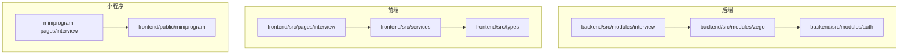
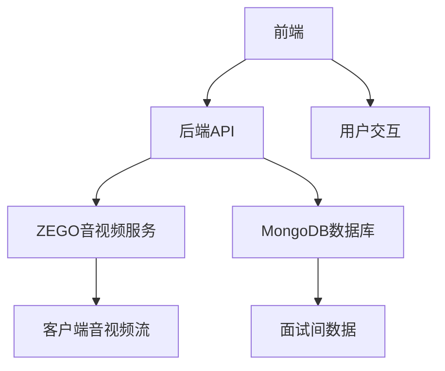
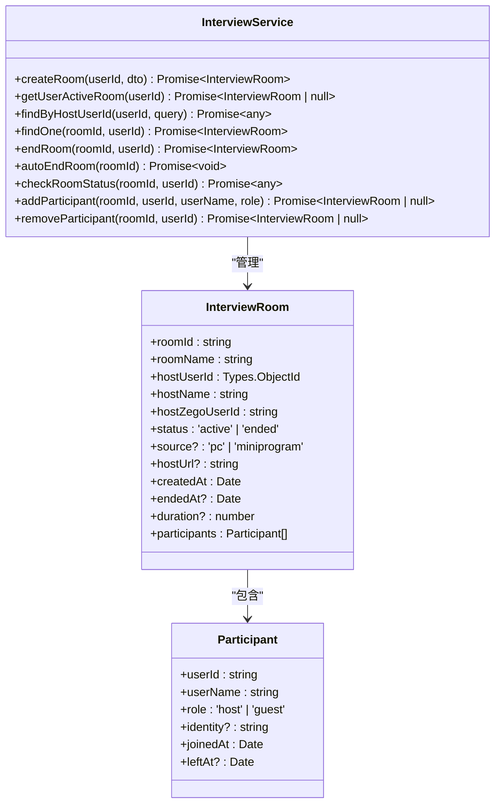
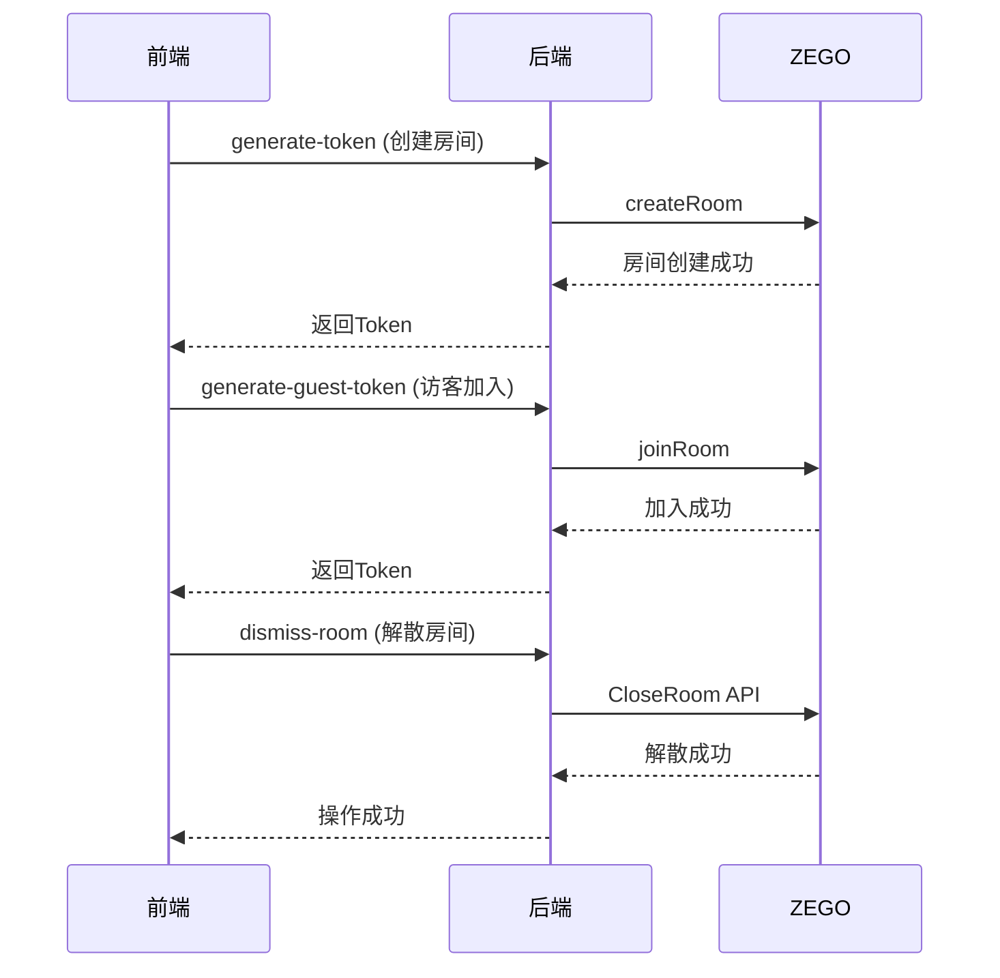
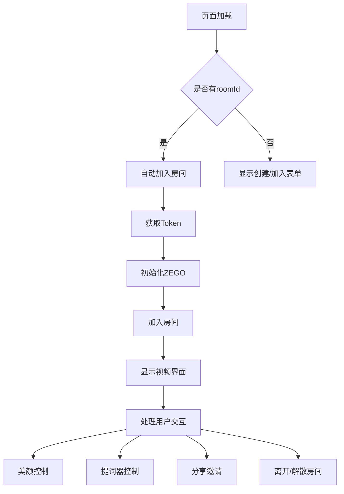
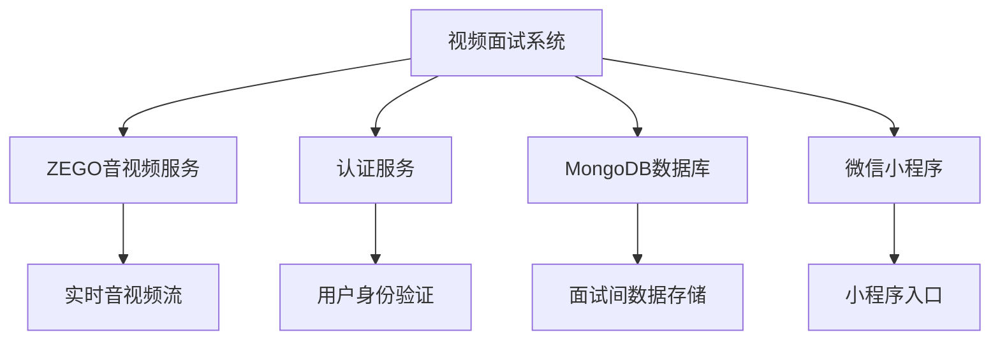

# 视频面试系统

<cite>
**本文档引用文件**   
- [interview.controller.ts](file://backend/src/modules/interview/interview.controller.ts)
- [interview.service.ts](file://backend/src/modules/interview/interview.service.ts)
- [interview-room.entity.ts](file://backend/src/modules/interview/models/interview-room.entity.ts)
- [VideoInterview.tsx](file://frontend/src/pages/interview/VideoInterview.tsx)
- [VideoInterviewMiniprogram.tsx](file://frontend/src/pages/interview/VideoInterviewMiniprogram.tsx)
- [zego.service.ts](file://backend/src/modules/zego/zego.service.ts)
- [zego.controller.ts](file://backend/src/modules/zego/zego.controller.ts)
- [interview.service.ts](file://frontend/src/services/interview.service.ts)
- [zego.ts](file://frontend/src/services/zego.ts)
- [interview.types.ts](file://frontend/src/types/interview.types.ts)
- [interview.js](file://miniprogram-pages/interview/interview.js)
- [video-interview-guest.html](file://frontend/public/miniprogram/video-interview-guest.html)
</cite>

## 目录
1. [简介](#简介)
2. [项目结构](#项目结构)
3. [核心组件](#核心组件)
4. [架构概述](#架构概述)
5. [详细组件分析](#详细组件分析)
6. [依赖分析](#依赖分析)
7. [性能考虑](#性能考虑)
8. [故障排除指南](#故障排除指南)
9. [结论](#结论)

## 简介
视频面试系统是安德家政CRM平台中的核心功能模块，支持家政人员与客户之间的在线视频面试。该系统基于ZEGO实时音视频技术构建，提供完整的视频面试解决方案，包括面试间创建、管理、参与者控制、提词器、美颜等功能。系统支持多端访问，包括PC端、H5移动端和微信小程序，确保用户在不同设备上都能获得良好的视频面试体验。

## 项目结构
视频面试系统分布在后端和前端两个主要目录中。后端采用NestJS框架，前端使用React技术栈。系统通过RESTful API进行前后端通信，实现了完整的视频面试功能。

**图源**
- [interview.controller.ts](file://backend/src/modules/interview/interview.controller.ts)
- [zego.service.ts](file://backend/src/modules/zego/zego.service.ts)
- [VideoInterview.tsx](file://frontend/src/pages/interview/VideoInterview.tsx)
- [interview.js](file://miniprogram-pages/interview/interview.js)

## 核心组件

视频面试系统的核心组件包括面试间管理、ZEGO音视频服务、参与者管理、提词器和美颜功能。这些组件协同工作，为用户提供完整的视频面试体验。

**组件源**
- [interview.service.ts](file://backend/src/modules/interview/interview.service.ts)
- [zego.service.ts](file://backend/src/modules/zego/zego.service.ts)
- [VideoInterview.tsx](file://frontend/src/pages/interview/VideoInterview.tsx)

## 架构概述

视频面试系统的架构分为三层：前端展示层、后端服务层和第三方音视频服务层。前端负责用户界面展示和交互，后端处理业务逻辑和数据存储，ZEGO提供实时音视频通信能力。

**图源**
- [interview.controller.ts](file://backend/src/modules/interview/interview.controller.ts)
- [zego.controller.ts](file://backend/src/modules/zego/zego.controller.ts)
- [VideoInterview.tsx](file://frontend/src/pages/interview/VideoInterview.tsx)

## 详细组件分析

### 面试间管理组件
面试间管理组件负责面试间的创建、查询、结束等操作。系统采用单例模式，确保每个主持人在同一时间只能有一个活跃的面试间。

**图源**
- [interview.service.ts](file://backend/src/modules/interview/interview.service.ts)
- [interview-room.entity.ts](file://backend/src/modules/interview/models/interview-room.entity.ts)

### ZEGO音视频服务组件
ZEGO音视频服务组件负责与ZEGO服务器通信，管理房间状态、用户加入/离开、踢人、解散房间等操作。该组件还实现了提词器和远程控制功能。

**图源**
- [zego.service.ts](file://backend/src/modules/zego/zego.service.ts)
- [zego.controller.ts](file://backend/src/modules/zego/zego.controller.ts)

### 前端视频面试组件
前端视频面试组件负责用户界面展示和与ZEGO SDK的集成。组件支持美颜、提词器、分享等功能，并适配PC端和移动端。

**图源**
- [VideoInterview.tsx](file://frontend/src/pages/interview/VideoInterview.tsx)
- [VideoInterviewMiniprogram.tsx](file://frontend/src/pages/interview/VideoInterviewMiniprogram.tsx)

## 依赖分析

视频面试系统依赖于多个内部和外部组件。内部依赖包括认证模块、数据库等，外部依赖主要是ZEGO实时音视频服务。

**图源**
- [interview.service.ts](file://backend/src/modules/interview/interview.service.ts)
- [zego.service.ts](file://backend/src/modules/zego/zego.service.ts)
- [interview.js](file://miniprogram-pages/interview/interview.js)

## 性能考虑

视频面试系统在性能方面进行了多项优化，包括自动清理超时房间、网络质量检测、设备自适应配置等。系统通过定时任务清理长时间无活动的房间，避免资源浪费。前端组件根据设备类型自动调整视频分辨率和帧率，确保在不同设备上都能流畅运行。

## 故障排除指南

### 常见问题及解决方案
- **无法创建面试间**：检查用户是否已登录，Token是否有效
- **访客无法加入**：确认房间是否已结束，访客是否被踢出
- **视频卡顿**：检查网络连接，尝试降低视频分辨率
- **音频问题**：检查麦克风权限，确保未被静音
- **小程序无法打开**：确认是否在微信环境中，检查URL参数

**组件源**
- [interview.service.ts](file://backend/src/modules/interview/interview.service.ts)
- [zego.service.ts](file://backend/src/modules/zego/zego.service.ts)
- [VideoInterview.tsx](file://frontend/src/pages/interview/VideoInterview.tsx)

## 结论

视频面试系统为安德家政平台提供了完整的在线面试解决方案。系统架构清晰，功能完善，支持多端访问。通过与ZEGO音视频服务的深度集成，系统提供了高质量的实时音视频通信能力。未来可以进一步优化移动端体验，增加录制功能，提升系统的可用性和用户体验。