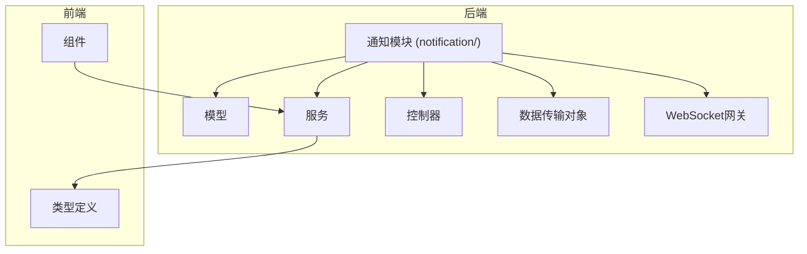
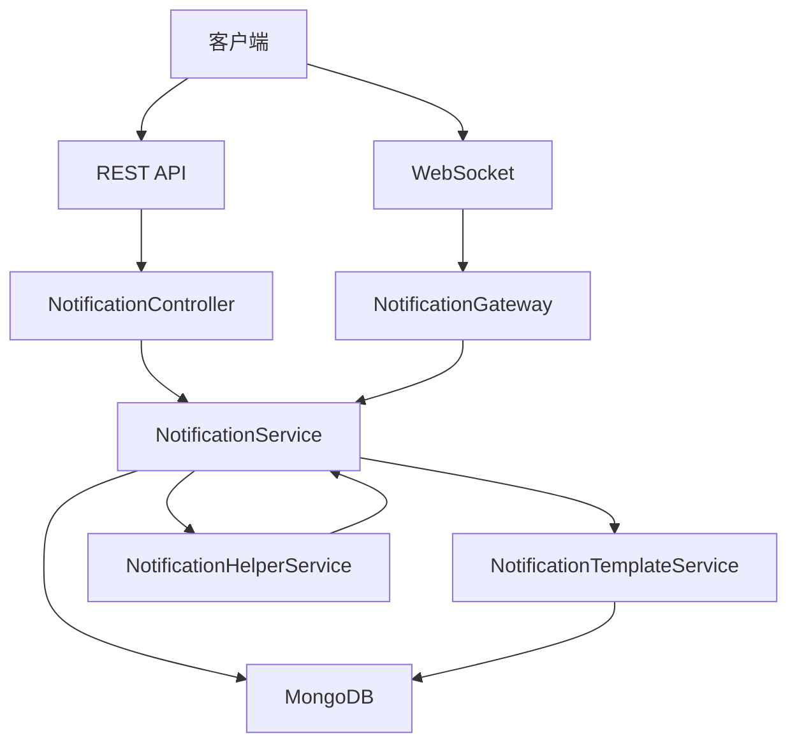
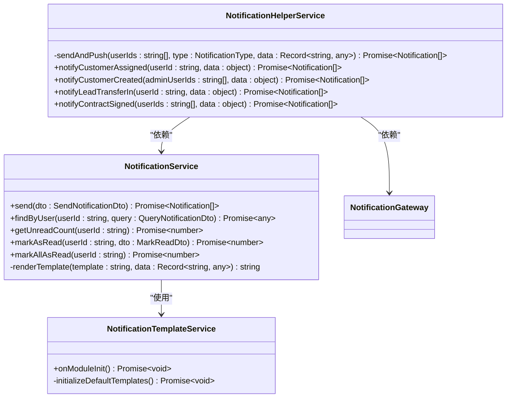
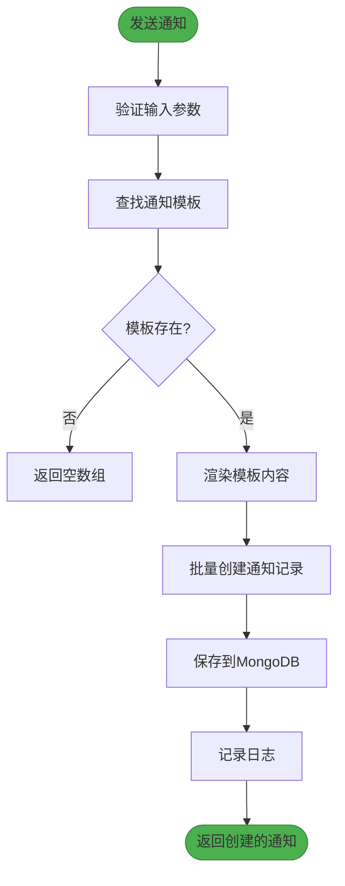
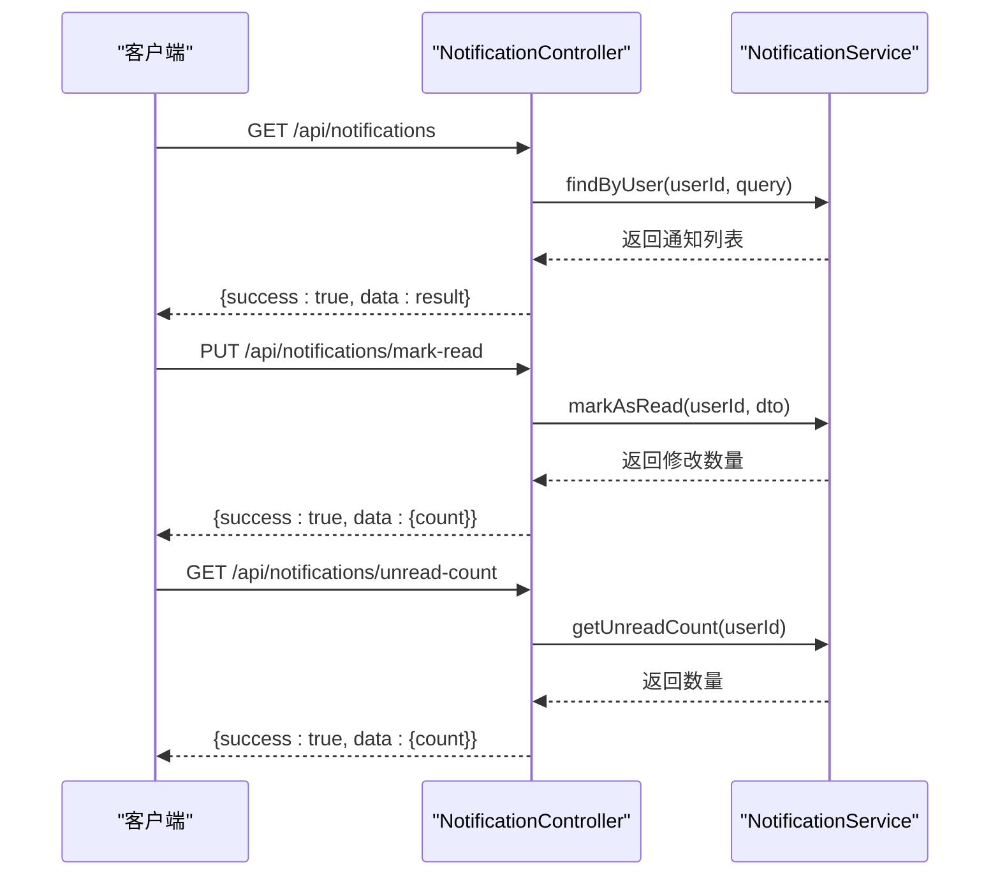
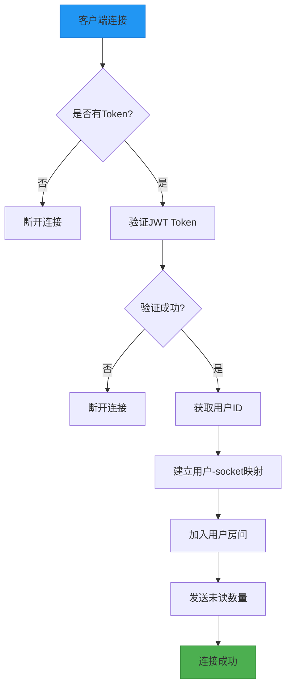
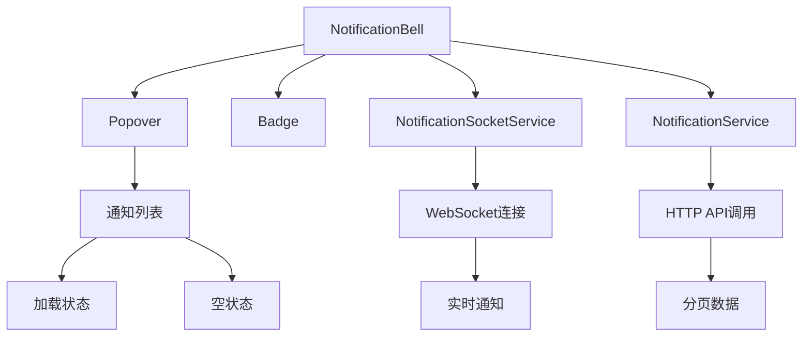
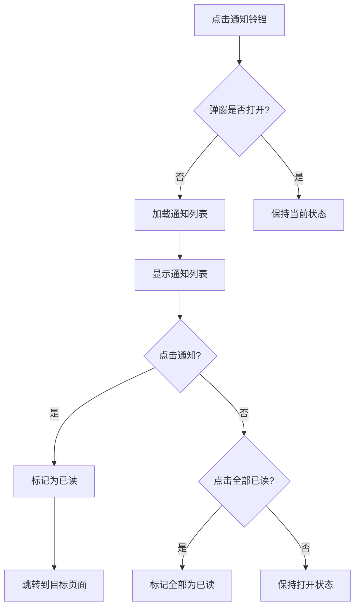
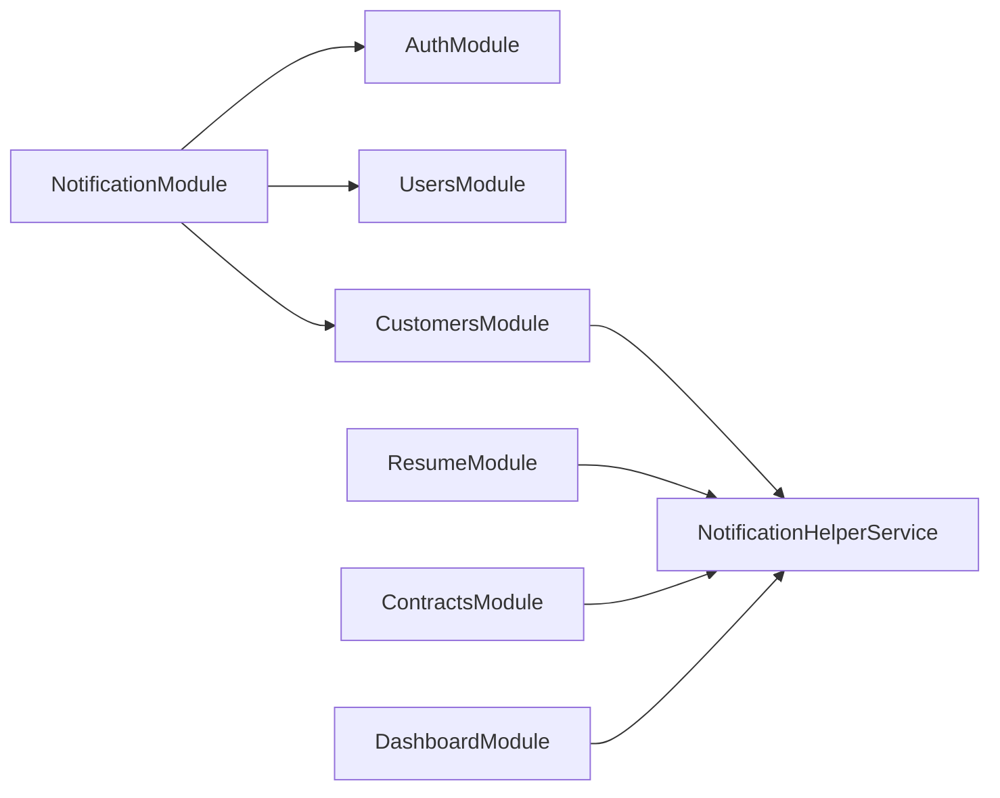

# 通知系统

<cite>
**本文档引用文件**  
- [notification.module.ts](file://backend/src/modules/notification/notification.module.ts)
- [notification.service.ts](file://backend/src/modules/notification/notification.service.ts)
- [notification.controller.ts](file://backend/src/modules/notification/notification.controller.ts)
- [notification.gateway.ts](file://backend/src/modules/notification/notification.gateway.ts)
- [notification.model.ts](file://backend/src/modules/notification/models/notification.model.ts)
- [notification-template.model.ts](file://backend/src/modules/notification/models/notification-template.model.ts)
- [create-notification.dto.ts](file://backend/src/modules/notification/dto/create-notification.dto.ts)
- [query-notification.dto.ts](file://backend/src/modules/notification/dto/query-notification.dto.ts)
- [notification-template.service.ts](file://backend/src/modules/notification/notification-template.service.ts)
- [notification-helper.service.ts](file://backend/src/modules/notification/notification-helper.service.ts)
- [NotificationBell.tsx](file://frontend/src/components/NotificationBell.tsx)
- [notification-socket.service.ts](file://frontend/src/services/notification-socket.service.ts)
- [notification.service.ts](file://frontend/src/services/notification.service.ts)
- [notification.types.ts](file://frontend/src/types/notification.types.ts)
- [notification-system-implementation.md](file://docs/notification-system-implementation.md)
- [notification-system-test-guide.md](file://docs/notification-system-test-guide.md)
- [notification-system-deployment.md](file://docs/notification-system-deployment.md)
- [notification-system-customer-create-fix.md](file://docs/notification-system-customer-create-fix.md)
</cite>

## 目录
1. [简介](#简介)
2. [项目结构](#项目结构)
3. [核心组件](#核心组件)
4. [架构概述](#架构概述)
5. [详细组件分析](#详细组件分析)
6. [依赖分析](#依赖分析)
7. [性能考虑](#性能考虑)
8. [故障排除指南](#故障排除指南)
9. [结论](#结论)

## 简介
安得家政CRM系统的通知系统是一个完整的站内通知解决方案，支持实时推送、批量管理、模板化消息和多业务场景集成。系统采用NestJS后端与React前端架构，通过WebSocket实现实时通信，为用户提供及时的工作提醒和系统通知。

## 项目结构
通知系统在项目中具有清晰的模块化结构，分为后端服务和前端组件两大部分。

**Diagram sources**
- [notification.module.ts](file://backend/src/modules/notification/notification.module.ts)
- [NotificationBell.tsx](file://frontend/src/components/NotificationBell.tsx)

**Section sources**
- [notification.module.ts](file://backend/src/modules/notification/notification.module.ts)
- [NotificationBell.tsx](file://frontend/src/components/NotificationBell.tsx)

## 核心组件
通知系统由多个核心组件构成，包括通知服务、控制器、网关、模型和辅助服务。系统支持25+种通知类型和15+个预定义模板，实现了客户分配、公海分配等关键业务场景的通知功能。

**Section sources**
- [notification.service.ts](file://backend/src/modules/notification/notification.service.ts)
- [notification.controller.ts](file://backend/src/modules/notification/notification.controller.ts)
- [notification.gateway.ts](file://backend/src/modules/notification/notification.gateway.ts)

## 架构概述
通知系统采用分层架构设计，包含数据层、服务层、API层和实时通信层，确保系统的可维护性和扩展性。

**Diagram sources**
- [notification.controller.ts](file://backend/src/modules/notification/notification.controller.ts)
- [notification.gateway.ts](file://backend/src/modules/notification/notification.gateway.ts)
- [notification.service.ts](file://backend/src/modules/notification/notification.service.ts)

## 详细组件分析

### 通知服务分析
通知服务是系统的核心业务逻辑层，负责处理所有通知相关的操作。

#### 服务类图

**Diagram sources**
- [notification.service.ts](file://backend/src/modules/notification/notification.service.ts)
- [notification-template.service.ts](file://backend/src/modules/notification/notification-template.service.ts)
- [notification-helper.service.ts](file://backend/src/modules/notification/notification-helper.service.ts)

#### 通知发送流程

**Diagram sources**
- [notification.service.ts](file://backend/src/modules/notification/notification.service.ts#L23-L66)

### 通知控制器分析
通知控制器提供RESTful API接口，处理HTTP请求并返回标准化响应。

#### API调用序列图

**Diagram sources**
- [notification.controller.ts](file://backend/src/modules/notification/notification.controller.ts#L24-L98)

### 通知网关分析
通知网关处理WebSocket实时通信，实现服务器到客户端的实时消息推送。

#### WebSocket连接流程

**Diagram sources**
- [notification.gateway.ts](file://backend/src/modules/notification/notification.gateway.ts#L40-L83)

### 前端组件分析
前端通知系统由多个组件和服务构成，提供用户友好的通知交互体验。

#### 前端架构图

**Diagram sources**
- [NotificationBell.tsx](file://frontend/src/components/NotificationBell.tsx)
- [notification-socket.service.ts](file://frontend/src/services/notification-socket.service.ts)

#### 通知铃铛交互流程

**Diagram sources**
- [NotificationBell.tsx](file://frontend/src/components/NotificationBell.tsx#L126-L157)

## 依赖分析
通知系统与其他模块存在明确的依赖关系，确保业务逻辑的完整性和一致性。

**Diagram sources**
- [notification.module.ts](file://backend/src/modules/notification/notification.module.ts#L1-L46)
- [customers.service.ts](file://backend/src/modules/customers/customers.service.ts)

**Section sources**
- [notification.module.ts](file://backend/src/modules/notification/notification.module.ts#L1-L46)
- [customers.service.ts](file://backend/src/modules/customers/customers.service.ts)

## 性能考虑
通知系统在设计时考虑了性能优化，通过批量操作、索引优化和错误隔离等策略确保系统高效运行。

- **数据库索引**: 在`userId`、`status`和`createdAt`字段上创建复合索引，优化查询性能
- **批量操作**: 使用`insertMany`和`updateMany`进行批量数据库操作，减少IO开销
- **错误隔离**: 通知发送失败不会影响主业务流程，通过try-catch捕获异常
- **连接管理**: WebSocket连接使用用户ID映射，便于精确推送和连接管理
- **内存优化**: 使用Map数据结构存储用户-socket映射，提供O(1)查找性能

## 故障排除指南
本节提供常见问题的诊断和解决方案，帮助快速定位和修复通知系统问题。

**Section sources**
- [notification-system-test-guide.md](file://docs/notification-system-test-guide.md)
- [notification-system-customer-create-fix.md](file://docs/notification-system-customer-create-fix.md)

### 常见问题及解决方案

| 问题现象 | 可能原因 | 解决方案 |
|--------|--------|--------|
| 通知铃铛不显示 | WebSocket连接失败或Token过期 | 检查Console错误，重新登录获取新token |
| 通知不实时更新 | WebSocket断开或后端服务未运行 | 检查PM2服务状态，重启后端服务 |
| 点击通知无反应 | actionUrl配置错误或路由不存在 | 检查通知模板中的actionUrl配置，确认前端路由 |
| 通知发送失败 | 模板不存在或用户ID无效 | 检查模板启用状态，验证用户ID格式 |
| 未读数量不准确 | 标记已读未同步或缓存问题 | 手动刷新页面，检查数据库记录 |

### 调试步骤
1. **检查WebSocket连接**: 在浏览器Console执行`notificationSocketService.isConnected()`
2. **查看后端日志**: `pm2 logs backend-dev \| grep -i "notification"`
3. **检查数据库记录**: 查询`notifications`集合验证通知是否创建
4. **网络请求检查**: 在开发者工具中筛选WS连接，查看`/notifications`连接状态

## 结论
安得家政CRM通知系统已成功实现核心功能，包括实时推送、批量管理、模板化消息和关键业务场景集成。系统架构清晰，组件职责明确，具备良好的可维护性和扩展性。目前已完成客户分配、公海分配和客户创建等核心场景的通知功能，并通过了完整的测试验证。建议后续逐步实现简历、合同和日报等模块的通知集成，进一步提升系统的完整性和用户体验。