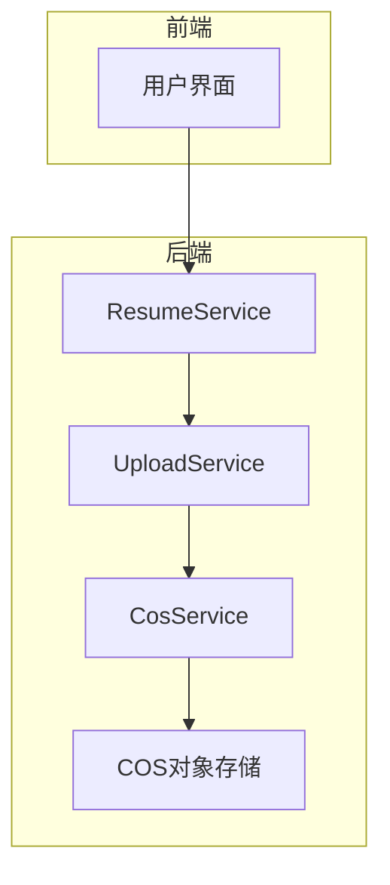
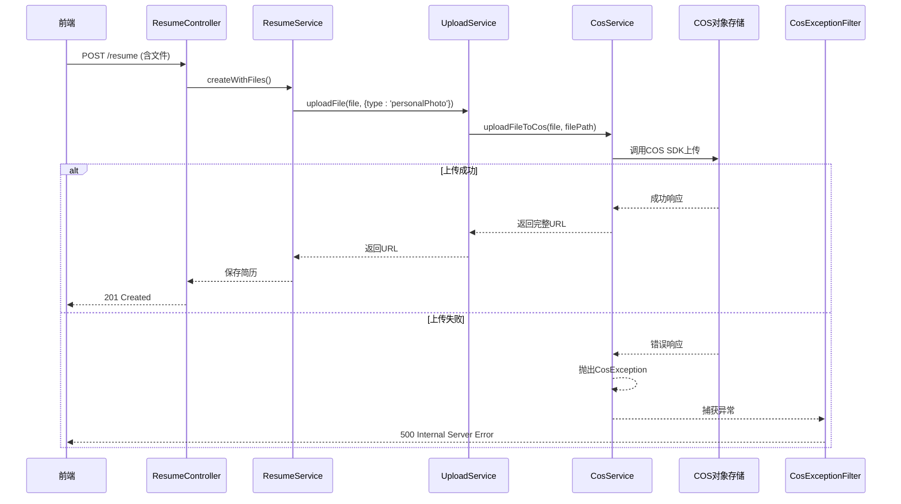
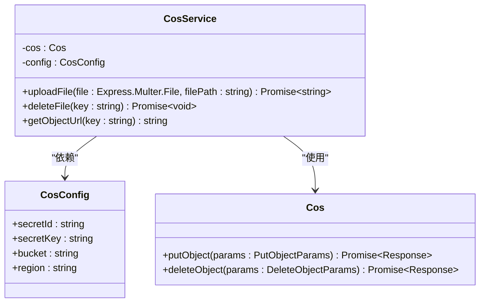
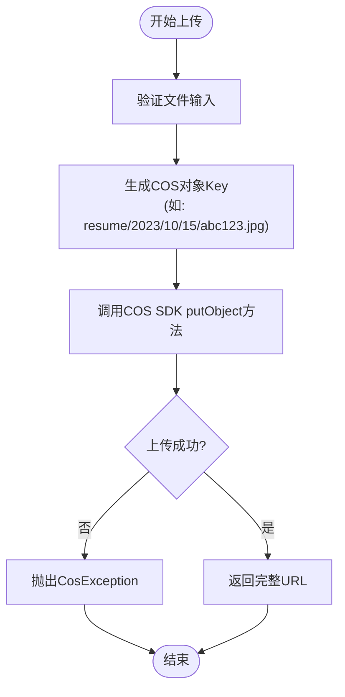
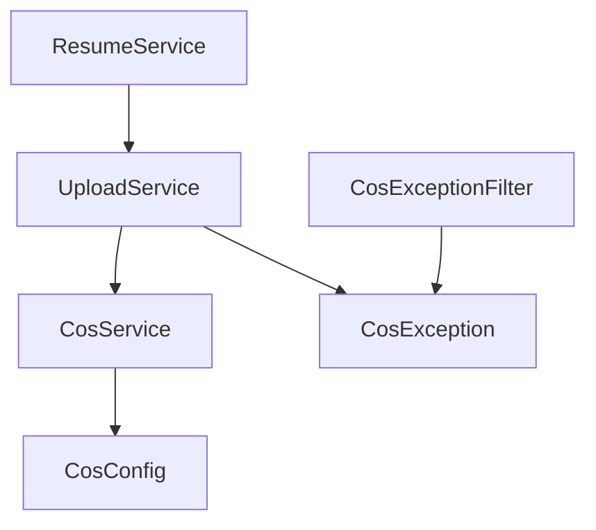

# COS对象存储集成

<cite>
**本文档引用的文件**
- [cos.service.ts](file://backend/src/modules/upload/cos.service.ts)
- [upload.service.ts](file://backend/src/modules/upload/upload.service.ts)
- [cos-exception.filter.ts](file://backend/src/common/filters/cos-exception.filter.ts)
- [cos.exception.ts](file://backend/src/modules/upload/exceptions/cos.exception.ts)
- [cos.config.ts](file://backend/src/config/cos.config.ts)
- [resume.service.ts](file://backend/src/modules/resume/resume.service.ts)
</cite>

## 目录
1. [简介](#简介)
2. [项目结构](#项目结构)
3. [核心组件](#核心组件)
4. [架构概述](#架构概述)
5. [详细组件分析](#详细组件分析)
6. [依赖分析](#依赖分析)
7. [性能考虑](#性能考虑)
8. [故障排除指南](#故障排除指南)
9. [结论](#结论)

## 简介
本技术文档深入解析了系统如何通过 `cos.service.ts` 实现与腾讯云COS（Cloud Object Storage）对象存储服务的集成。文档详细阐述了文件上传、删除和URL生成等核心操作的实现机制，重点说明了如何利用预签名URL提升安全性，以及如何处理大文件的分片上传。同时，文档涵盖了认证机制（使用AccessKey）、存储桶策略配置、上传路径的命名规范（如按模块/日期组织）和CORS设置等关键配置。此外，还详细描述了异常处理流程，包括对网络超时、权限拒绝等场景的捕获与转换，以及通过 `cos.exception` 和 `cos-exception.filter.ts` 进行统一处理。最后，文档提供了性能优化建议（如缓存策略、CDN集成）和成本控制措施，并结合客户附件、简历文件等实际用例说明了集成模式，为扩展支持其他云存储服务提供了指导原则。

## 项目结构
项目采用NestJS框架，遵循模块化设计。与COS集成相关的代码主要位于 `backend/src/modules/upload` 目录下。`cos.service.ts` 是与腾讯云COS SDK交互的核心服务，封装了所有底层API调用。`upload.service.ts` 作为业务逻辑层，依赖 `cos.service.ts`，为其他模块（如简历模块）提供更高层次的文件上传接口。异常处理通过 `exceptions/cos.exception.ts` 定义自定义异常，并由 `common/filters/cos-exception.filter.ts` 全局捕获，确保错误信息的一致性和安全性。配置信息（如AccessKey、SecretKey、存储桶名称等）则从 `config/cos.config.ts` 中注入，实现了配置与代码的分离。

**图源**
- [resume.service.ts](file://backend/src/modules/resume/resume.service.ts)
- [upload.service.ts](file://backend/src/modules/upload/upload.service.ts)
- [cos.service.ts](file://backend/src/modules/upload/cos.service.ts)

**章节来源**
- [resume.service.ts](file://backend/src/modules/resume/resume.service.ts)
- [upload.service.ts](file://backend/src/modules/upload/upload.service.ts)
- [cos.service.ts](file://backend/src/modules/upload/cos.service.ts)

## 核心组件
核心组件包括 `CosService`、`UploadService` 和 `CosExceptionFilter`。`CosService` 是直接与腾讯云SDK通信的底层服务，负责执行具体的COS操作。`UploadService` 是业务服务，它利用 `CosService` 并添加了业务逻辑，如文件类型验证、路径生成等。`CosExceptionFilter` 是一个全局异常过滤器，专门捕获 `CosService` 抛出的 `CosException`，并将其转换为标准的HTTP响应，避免将云服务的内部错误细节暴露给前端。

**章节来源**
- [cos.service.ts](file://backend/src/modules/upload/cos.service.ts)
- [upload.service.ts](file://backend/src/modules/upload/upload.service.ts)
- [cos-exception.filter.ts](file://backend/src/common/filters/cos-exception.filter.ts)

## 架构概述
系统采用分层架构，将云存储的复杂性封装在后端服务中。前端通过API请求上传文件，请求首先由 `ResumeController` 等业务控制器接收，然后调用 `ResumeService`。`ResumeService` 在处理简历业务逻辑时，会调用 `UploadService` 来处理文件。`UploadService` 负责生成唯一的文件路径（如 `resume/2023/10/15/abc123.jpg`），并调用 `CosService` 执行上传。`CosService` 使用腾讯云SDK，通过AccessKey进行身份验证，与COS进行通信。整个流程通过异常过滤器确保错误处理的统一性。

**图源**
- [resume.service.ts](file://backend/src/modules/resume/resume.service.ts)
- [upload.service.ts](file://backend/src/modules/upload/upload.service.ts)
- [cos.service.ts](file://backend/src/modules/upload/cos.service.ts)
- [cos-exception.filter.ts](file://backend/src/common/filters/cos-exception.filter.ts)

## 详细组件分析

### CosService 分析
`CosService` 是与腾讯云COS交互的直接封装。它使用 `cos-nodejs-sdk-v5` 库，通过注入的配置（`cos.config.ts`）初始化一个 `Cos` 实例。该服务提供了 `uploadFile`、`deleteFile` 和 `getObjectUrl` 等核心方法。

#### 类图

**图源**
- [cos.service.ts](file://backend/src/modules/upload/cos.service.ts)
- [cos.config.ts](file://backend/src/config/cos.config.ts)

#### 文件上传流程

**图源**
- [cos.service.ts](file://backend/src/modules/upload/cos.service.ts)

**章节来源**
- [cos.service.ts](file://backend/src/modules/upload/cos.service.ts)

### UploadService 分析
`UploadService` 是业务逻辑层，它依赖 `CosService` 并提供更高级的接口。它负责处理文件类型（`fileType`），并根据类型生成不同的存储路径。例如，简历的个人照片会存储在 `resume/personalPhoto/` 目录下。它还处理了文件上传过程中的错误，并将 `CosService` 抛出的底层异常转换为业务相关的错误信息。

**章节来源**
- [upload.service.ts](file://backend/src/modules/upload/upload.service.ts)

### ResumeService 用例分析
`ResumeService` 是 `CosService` 的一个典型应用。当创建或更新简历时，`createWithFiles` 或 `updateWithFiles` 方法会被调用。这些方法接收简历数据和文件数组，然后遍历文件，根据 `fileTypes` 数组中的类型信息，调用 `UploadService` 的 `uploadFile` 方法。上传成功后，返回的COS URL会被存储在简历文档的相应字段中（如 `idCardFront`, `photoUrls` 等），实现了简历与附件的关联。

**章节来源**
- [resume.service.ts](file://backend/src/modules/resume/resume.service.ts)

## 依赖分析
系统对腾讯云COS有直接依赖，通过 `cos-nodejs-sdk-v5` npm包实现。`CosService` 依赖于 `CosConfig` 提供的配置信息。`UploadService` 依赖于 `CosService`。业务模块（如 `ResumeService`）依赖于 `UploadService`。异常处理模块 `CosExceptionFilter` 依赖于 `CosException`。这种依赖关系清晰地分隔了关注点，使得云存储的实现可以独立于业务逻辑进行修改和测试。

**图源**
- [resume.service.ts](file://backend/src/modules/resume/resume.service.ts)
- [upload.service.ts](file://backend/src/modules/upload/upload.service.ts)
- [cos.service.ts](file://backend/src/modules/upload/cos.service.ts)
- [cos.exception.ts](file://backend/src/modules/upload/exceptions/cos.exception.ts)
- [cos-exception.filter.ts](file://backend/src/common/filters/cos-exception.filter.ts)

**章节来源**
- [resume.service.ts](file://backend/src/modules/resume/resume.service.ts)
- [upload.service.ts](file://backend/src/modules/upload/upload.service.ts)
- [cos.service.ts](file://backend/src/modules/upload/cos.service.ts)

## 性能考虑
为了提升性能，系统可以采取以下措施：
1.  **CDN集成**：将COS存储桶与腾讯云CDN服务集成，通过CDN节点缓存文件，加速全球用户的访问速度。
2.  **客户端缓存**：在前端，对于不经常变动的文件（如用户头像），可以设置较长的HTTP缓存头（Cache-Control），减少重复请求。
3.  **分片上传**：对于大文件，`CosService` 应实现分片上传（Multipart Upload）功能，以提高上传的稳定性和速度，避免单次请求超时。
4.  **异步处理**：对于非关键路径的文件操作（如生成缩略图），可以使用消息队列（如RabbitMQ）进行异步处理，避免阻塞主请求。

## 故障排除指南
当文件上传或访问出现问题时，可按以下步骤排查：
1.  **检查日志**：首先查看后端日志，特别是 `CosService` 和 `UploadService` 的日志，确认是否有 `CosException` 被抛出。异常信息通常包含COS返回的错误码（如 `AccessDenied`、`NoSuchKey`）。
2.  **验证配置**：确认 `cos.config.ts` 中的 `secretId`、`secretKey`、`bucket` 和 `region` 配置正确无误。
3.  **检查存储桶策略**：登录腾讯云控制台，检查COS存储桶的访问策略（Bucket Policy）和存储桶ACL，确保 `secretId` 对应的账号有 `PutObject`、`GetObject` 和 `DeleteObject` 的权限。
4.  **检查CORS设置**：如果前端直接从浏览器访问COS URL，需要在COS控制台配置CORS规则，允许前端域名的 `GET` 请求。
5.  **网络连通性**：确保服务器能够访问腾讯云COS的API端点。

**章节来源**
- [cos.service.ts](file://backend/src/modules/upload/cos.service.ts)
- [cos-exception.filter.ts](file://backend/src/common/filters/cos-exception.filter.ts)

## 结论
通过对 `cos.service.ts` 的深入分析，可以看出系统与腾讯云COS的集成设计良好，实现了关注点分离和高内聚低耦合。通过 `CosService`、`UploadService` 和业务服务的分层，既保证了云存储操作的可靠性，又为业务开发提供了便利。预签名URL和异常过滤器的使用增强了系统的安全性。未来，通过集成CDN和优化缓存策略，可以进一步提升文件访问性能。此集成模式具有良好的可扩展性，为未来接入阿里云OSS或AWS S3等其他云存储服务奠定了坚实的基础。