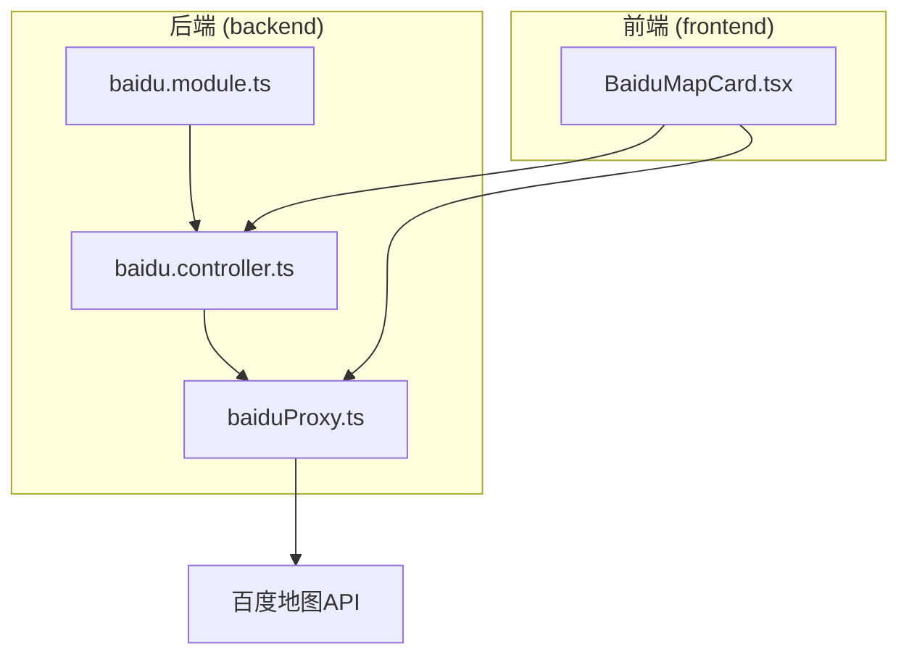
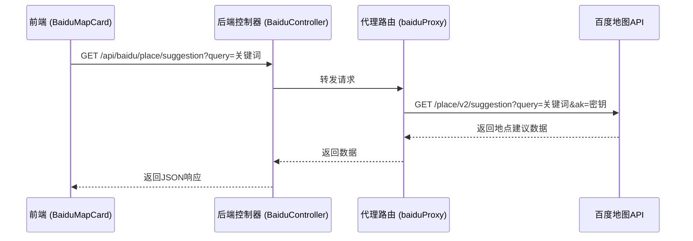
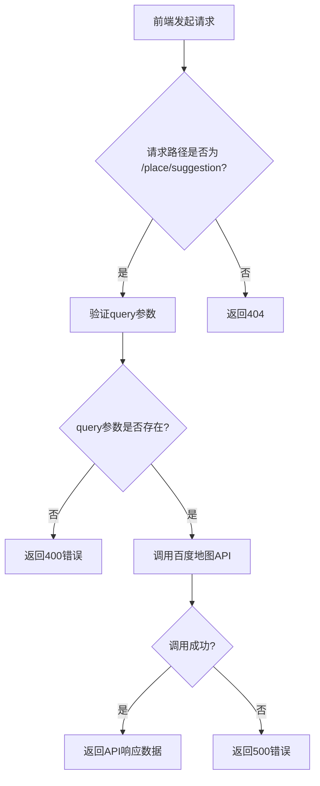
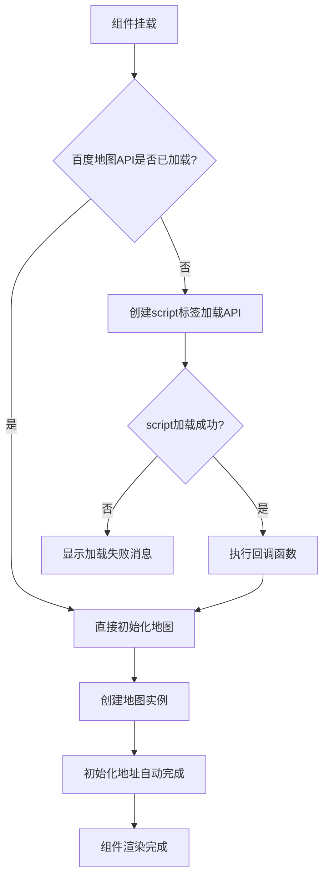
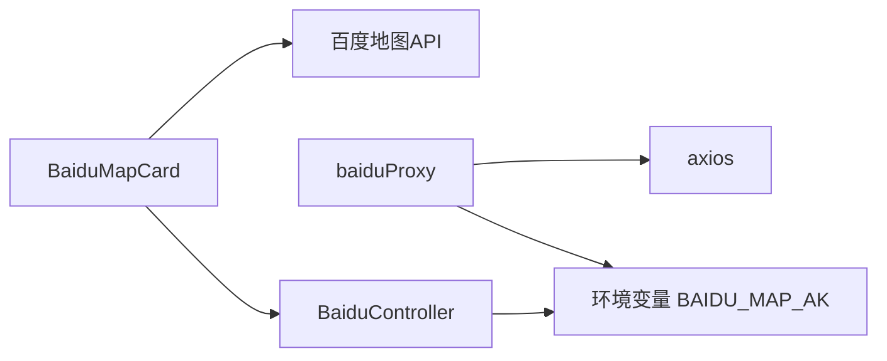

# 百度地图集成

<cite>
**本文档引用的文件**   
- [baidu.controller.ts](file://backend/src/modules/baidu/baidu.controller.ts)
- [baiduProxy.ts](file://backend/src/routes/baiduProxy.ts)
- [BaiduMapCard.tsx](file://frontend/src/pages/aunt/BaiduMapCard.tsx)
- [API_SPEC.md](file://backend/src/docs/API_SPEC.md)
</cite>

## 目录
1. [简介](#简介)
2. [项目结构](#项目结构)
3. [核心组件](#核心组件)
4. [架构概述](#架构概述)
5. [详细组件分析](#详细组件分析)
6. [依赖分析](#依赖分析)
7. [性能考虑](#性能考虑)
8. [故障排除指南](#故障排除指南)
9. [结论](#结论)

## 简介
本文档系统阐述了安得家政CRM系统中百度地图服务的前后端集成方案。系统通过后端API代理解决前端跨域问题，并集中管理百度地图AK密钥，确保了系统的安全性和可维护性。文档详细说明了地理编码、逆地理编码、地点建议等核心接口的调用方式，并分析了前端BaiduMapCard组件的地图渲染逻辑和地址自动补全功能的实现。同时，文档涵盖了AK密钥安全管理、请求频率控制、错误降级处理以及性能优化建议等关键方面，并提供了客户地址可视化和阿姨服务范围分析等实际业务场景的应用示例。

## 项目结构
根据项目目录结构，百度地图相关的功能模块主要分布在后端和前端两个部分。后端的百度地图服务实现在`backend/src/modules/baidu`和`backend/src/routes`目录下，而前端的地图组件则位于`frontend/src/pages/aunt`目录中。



**图示来源**
- [baidu.controller.ts](file://backend/src/modules/baidu/baidu.controller.ts)
- [baiduProxy.ts](file://backend/src/routes/baiduProxy.ts)
- [BaiduMapCard.tsx](file://frontend/src/pages/aunt/BaiduMapCard.tsx)

## 核心组件
系统的核心组件包括后端的`BaiduController`和`baiduProxy`，以及前端的`BaiduMapCard`组件。`BaiduController`作为NestJS应用的控制器，负责处理来自前端的API请求。`baiduProxy`则是一个Express路由，作为API代理，直接与百度地图API通信。前端的`BaiduMapCard`组件负责地图的渲染、用户交互和地址自动补全功能。

**组件来源**
- [baidu.controller.ts](file://backend/src/modules/baidu/baidu.controller.ts)
- [baiduProxy.ts](file://backend/src/routes/baiduProxy.ts)
- [BaiduMapCard.tsx](file://frontend/src/pages/aunt/BaiduMapCard.tsx)

## 架构概述
系统的整体架构采用前后端分离模式。前端应用通过调用后端API来访问百度地图服务，后端作为代理层，解决了前端直接调用第三方API可能遇到的跨域问题（CORS），并实现了AK密钥的集中安全管理。



**图示来源**
- [baidu.controller.ts](file://backend/src/modules/baidu/baidu.controller.ts)
- [baiduProxy.ts](file://backend/src/routes/baiduProxy.ts)
- [BaiduMapCard.tsx](file://frontend/src/pages/aunt/BaiduMapCard.tsx)

## 详细组件分析
本节将对前后端的关键组件进行深入分析，揭示其内部实现逻辑和交互流程。

### 后端API代理分析
后端通过`baiduProxy.ts`文件实现了一个轻量级的API代理，该代理使用Express框架创建路由，拦截前端请求并转发给百度地图API。

#### API代理流程


**图示来源**
- [baiduProxy.ts](file://backend/src/routes/baiduProxy.ts#L1-L48)

**组件来源**
- [baiduProxy.ts](file://backend/src/routes/baiduProxy.ts#L1-L48)

#### 核心代码分析
`baiduProxy.ts`文件中的核心代码实现了请求转发和错误处理：
```typescript
// 百度地图AK密钥，从环境变量获取
const BAIDU_AK = process.env.BAIDU_MAP_AK || 'VTbVdzUtKzhAgCxMvonJkfOJROIAZ4VX';

// 百度地图API代理路由
router.get('/place/suggestion', async (req: Request, res: Response) => {
  try {
    const { query, region, city_limit, output } = req.query;
    
    // 验证必要参数
    if (!query) {
      return res.status(400).json({ 
        status: 400,
        message: '缺少必要参数: query' 
      });
    }

    // 调用百度地图API
    const response = await axios.get('https://api.map.baidu.com/place/v2/suggestion', {
      params: {
        query,
        region: region || '',
        city_limit: city_limit || 'false',
        output: output || 'json',
        ak: BAIDU_AK
      },
      timeout: 5000
    });

    // 返回百度地图API的响应
    res.json(response.data);
  } catch (error) {
    console.error('百度地图API代理错误:', error);
    res.status(500).json({
      status: 500,
      message: '百度地图服务暂时不可用'
    });
  }
});
```
该代码首先从环境变量`BAIDU_MAP_AK`中读取AK密钥，如果未设置则使用一个默认值。然后，它定义了一个GET路由`/place/suggestion`，接收前端传来的查询参数。在调用百度地图API之前，会验证`query`参数是否为空。调用成功后，将百度地图API的原始响应数据直接返回给前端。任何错误都会被捕获，并返回一个500状态码的错误响应。

### 前端地图组件分析
前端的`BaiduMapCard.tsx`组件负责地图的渲染、用户交互和地址自动补全功能。

#### 组件初始化流程


**图示来源**
- [BaiduMapCard.tsx](file://frontend/src/pages/aunt/BaiduMapCard.tsx#L0-L322)

**组件来源**
- [BaiduMapCard.tsx](file://frontend/src/pages/aunt/BaiduMapCard.tsx#L0-L322)

#### 核心功能实现
##### 地图加载与初始化
组件通过`loadBaiduMapScript`函数动态加载百度地图JavaScript API。它首先检查API是否已加载，如果未加载，则创建一个`<script>`标签，其`src`属性指向百度地图API的URL，并将AK密钥硬编码在URL中（这是一个安全风险，应通过后端代理解决）。

```typescript
const loadBaiduMapScript = () => {
  if (isBaiduMapLoaded() || document.getElementById('baidu-map-script')) {
    // API已加载，直接初始化
    initializeMapAfterAPILoaded();
    return;
  }

  // 创建script元素
  const script = document.createElement('script');
  script.id = 'baidu-map-script';
  script.type = 'text/javascript';
  script.src = `https://api.map.baidu.com/api?v=3.0&ak=1noeQpvwS9oKOXjTDlbXb0pSEWnM6lAy&callback=BMap_INITIAL_CALLBACK`;
  
  // 添加错误处理
  script.onerror = () => {
    message.error('地图服务加载失败，请刷新页面重试');
  };
  
  document.head.appendChild(script);
};
```

##### 地址自动补全
组件通过`initializeAutocomplete`函数初始化百度地图的`Autocomplete`服务，为输入框提供智能提示。

```typescript
const initializeAutocomplete = () => {
  // 确保输入框元素存在
  const inputElement = inputRef.current?.input;
  
  // 创建自动完成实例
  const autocomplete: any = new window.BMap.Autocomplete({
    input: inputElement,
    location: mapInstanceRef.current,
    onSearchComplete: function(_results: any) {
      // 搜索完成后的操作
    }
  });
  
  // 选中地址事件
  autocomplete.addEventListener('onconfirm', function(e: any) {
    const item = e.item;
    const selectedAddress = item.value.business + item.value.province + item.value.city + item.value.district + item.value.street + item.value.streetNumber;
    
    // 更新地址状态并触发onChange
    setAddress(selectedAddress);
    if (onChange) {
      onChange(selectedAddress);
    }
    
    // 搜索选择的地址
    searchLocation(selectedAddress);
  });
};
```

##### 地理编码
`searchLocation`函数使用百度地图的`Geocoder`服务将地址文本转换为地理坐标（经纬度），并在地图上标记该位置。

```typescript
const searchLocation = (addressToSearch: string) => {
  const geocoder = new window.BMap.Geocoder();
  
  geocoder.getPoint(addressToSearch, function(point: any) {
    if (point) {
      // 清除旧标记，添加新标记
      mapInstanceRef.current.clearOverlays();
      const marker = new window.BMap.Marker(point);
      mapInstanceRef.current.addOverlay(marker);
      mapInstanceRef.current.centerAndZoom(point, 15);
      
      // 打开信息窗口
      const infoWindow = new window.BMap.InfoWindow(addressToSearch, {
        width: 200,
        height: 60,
        title: '所选位置'
      });
      marker.openInfoWindow(infoWindow);
    } else {
      message.error('未找到该地址，请重新输入');
    }
  }, addressToSearch);
};
```

## 依赖分析
系统的主要依赖关系如下：
- 前端`BaiduMapCard`组件依赖于百度地图JavaScript API。
- 后端`baiduProxy`依赖于`axios`库来发起HTTP请求。
- `baiduProxy`和`BaiduController`都依赖于环境变量`BAIDU_MAP_AK`来获取AK密钥。
- 前端通过调用后端API，间接依赖于后端的代理服务。



**图示来源**
- [baiduProxy.ts](file://backend/src/routes/baiduProxy.ts)
- [BaiduMapCard.tsx](file://frontend/src/pages/aunt/BaiduMapCard.tsx)

## 性能考虑
### 缓存策略
在分析代码库时，发现`backend/src/utils/image-cache.service.ts`文件中实现了一个基于文件系统的缓存机制，用于缓存图片处理结果。虽然该缓存未直接用于百度地图服务，但其设计模式（24小时有效期，定期清理过期缓存）可以作为参考，为百度地图的API响应数据实现类似的缓存策略，以减少对第三方API的调用频率，提高响应速度。

### 懒加载与按需加载
前端组件实现了按需加载模块的策略：
1.  **懒加载API**：百度地图JavaScript API是按需加载的，只有当`BaiduMapCard`组件被渲染时，才会动态创建`<script>`标签来加载API，避免了在应用启动时就加载庞大的地图库。
2.  **条件渲染**：组件使用`loading`状态，在API加载期间显示“地图加载中...”的Spin组件，提供了良好的用户体验。

## 故障排除指南
### AK密钥安全管理
当前实现存在AK密钥泄露的风险。在`BaiduMapCard.tsx`中，AK密钥被硬编码在`script.src`的URL中，任何访问前端代码的用户都可以看到该密钥。正确的做法是完全通过后端代理，前端不直接与百度地图API通信。后端代理`baiduProxy`已经正确地从环境变量读取密钥，前端应只调用后端的`/api/baidu/place/suggestion`接口。

### 错误降级处理
系统实现了多层次的错误降级处理：
1.  **前端加载失败**：当`<script>`标签的`onerror`事件触发时，会显示“地图服务加载失败”的错误消息。
2.  **前端初始化失败**：`initializeMap`函数使用`try-catch`捕获异常，并显示“地图初始化失败”的错误消息。
3.  **地址搜索失败**：`searchLocation`函数在`getPoint`回调中检查`point`是否有效，如果无效则提示“未找到该地址”。
4.  **后端代理失败**：`baiduProxy`在`try-catch`中捕获所有错误，并返回500状态码和“百度地图服务暂时不可用”的消息。

### 备用方案
文档中未提及明确的备用方案（如切换到高德地图）。但`frontend/src/utils/__tests__/BaiduAddressAutocomplete.tsx`文件的注释提到“该文件包含百度地图残留代码，可能干扰高德地图功能”，这暗示系统可能正在或计划迁移到高德地图，这可以作为未来实现备用方案的基础。

## 结论
安得家政CRM系统通过后端API代理的方式，成功集成了百度地图服务，解决了跨域和AK密钥安全问题。后端的`baiduProxy`和`BaiduController`提供了稳定可靠的API接口，前端的`BaiduMapCard`组件实现了流畅的地图交互和地址自动补全功能。系统在错误处理方面表现良好，但在AK密钥的前端安全上存在明显漏洞，建议立即修复，确保所有百度地图API调用都通过后端代理进行。此外，可以借鉴现有的缓存模式，为高频API调用增加缓存层，进一步提升系统性能。