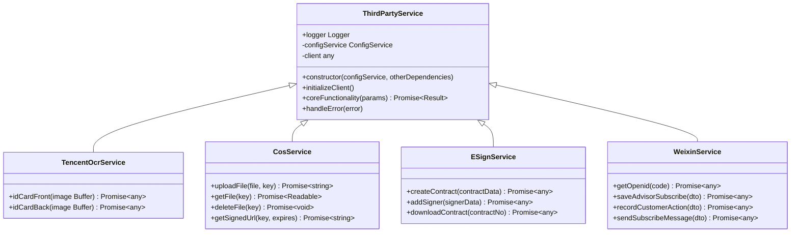
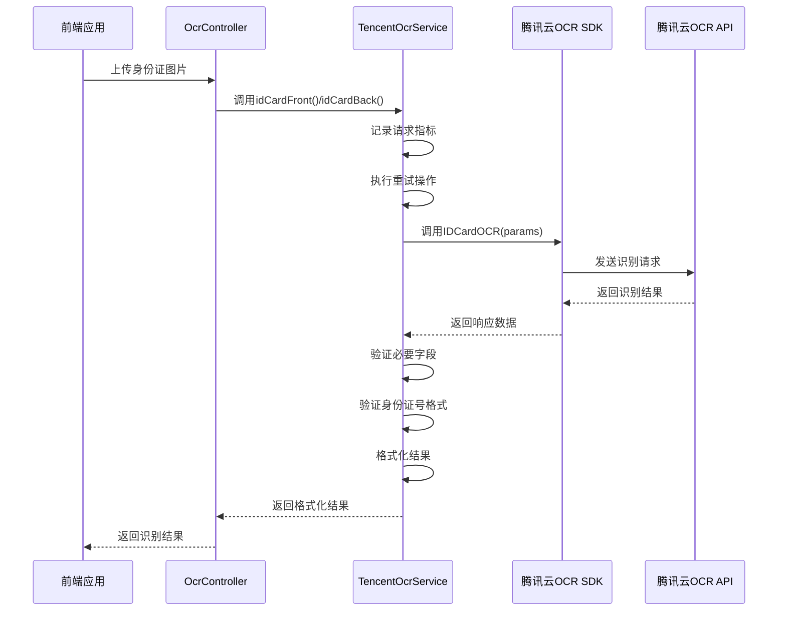
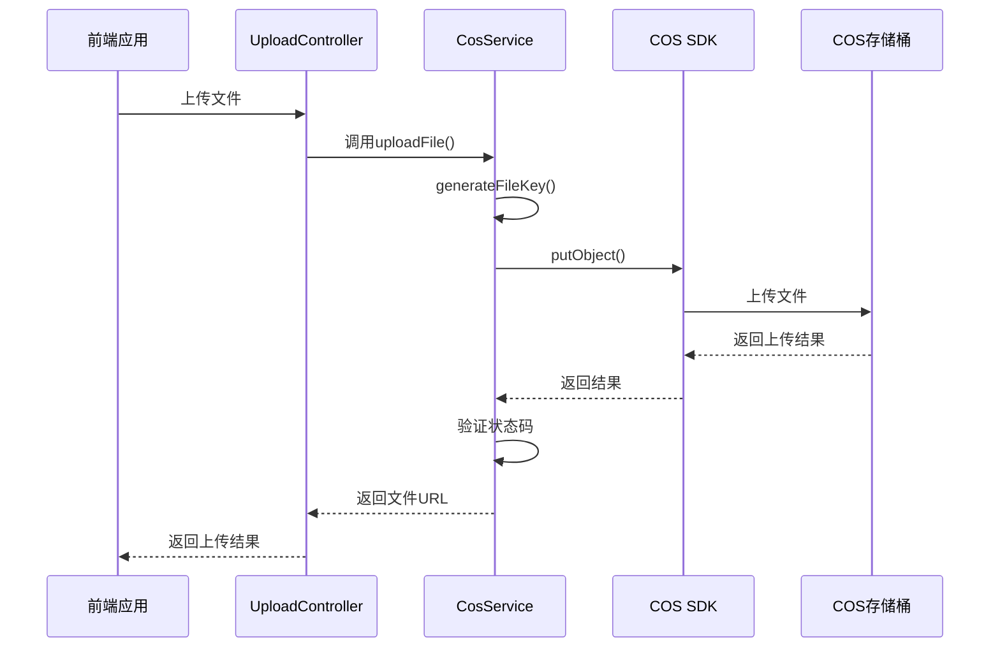
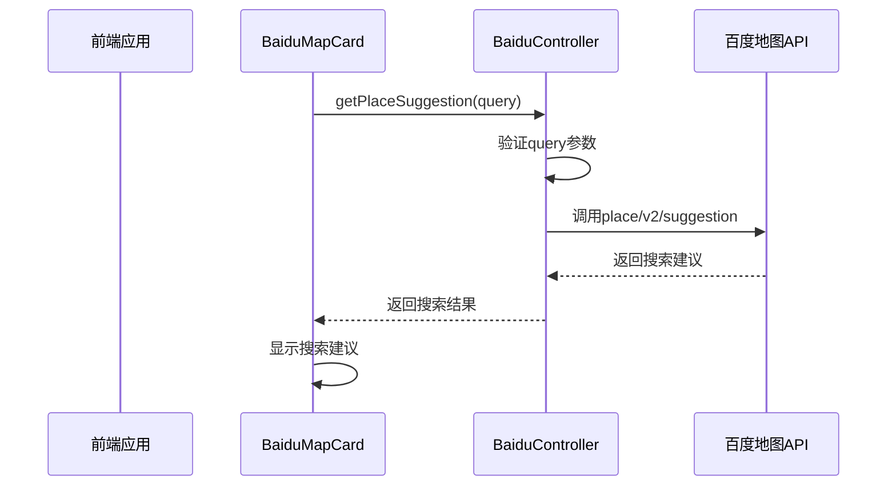
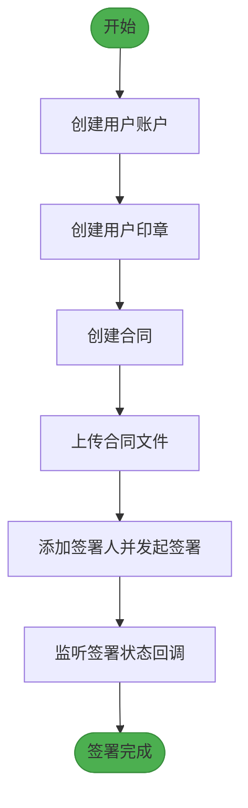

<docs>
# 第三方集成

<cite>
**本文档中引用的文件**
- [tencent-ocr.service.ts](file://backend/src/modules/ocr/tencent-ocr.service.ts)
- [cos.service.ts](file://backend/src/modules/upload/cos.service.ts)
- [cos.config.ts](file://backend/src/config/cos.config.ts)
- [baidu.controller.ts](file://backend/src/modules/baidu/baidu.controller.ts)
- [routes/baiduProxy.ts](file://backend/src/routes/baiduProxy.ts)
- [esign.service.ts](file://backend/src/modules/esign/esign.service.ts)
- [Api.py](file://爱签SDK/Api.py)
- [weixin.controller.ts](file://backend/src/modules/weixin/weixin.controller.ts)
- [weixin.service.ts](file://backend/src/modules/weixin/weixin.service.ts)
- [customer-lead.service.ts](file://backend/src/modules/weixin/services/customer-lead.service.ts)
- [WECHAT_API_DOCUMENTATION.md](file://WECHAT_API_DOCUMENTATION.md)
</cite>

## 更新摘要
**变更内容**   
- 新增微信API集成方案章节，详细说明微信小程序的用户认证、客户行为记录、自动客户线索创建和订阅消息推送功能
- 更新文档引用文件列表，添加微信集成相关文件
- 在目录中新增微信API集成方案章节
- 所有新增内容均基于`WECHAT_API_DOCUMENTATION.md`文档和相关源码文件

## 目录
1. [引言](#引言)
2. [项目结构分析](#项目结构分析)
3. [核心集成组件分析](#核心集成组件分析)
4. [腾讯OCR集成方案](#腾讯ocr集成方案)
5. [COS对象存储集成方案](#cos对象存储集成方案)
6. [百度地图集成方案](#百度地图集成方案)
7. [爱签电子签约集成方案](#爱签电子签约集成方案)
8. [微信API集成方案](#微信api集成方案)
9. [配置与安全最佳实践](#配置与安全最佳实践)
10. [扩展新集成的通用模式](#扩展新集成的通用模式)
11. [结论](#结论)

## 引言
本技术文档系统性地记录了安德家政CRM系统中所有第三方服务的集成方案。文档详细说明了腾讯OCR、COS对象存储、百度地图、爱签电子签约平台和微信API的集成实现，包括认证机制、API调用模式、错误处理和重试策略。通过深入分析相关服务文件的实现细节，为开发者提供了清晰的集成参考和最佳实践指导，确保第三方服务的稳定、安全和高效使用。

## 项目结构分析
安德家政CRM系统采用前后端分离的架构设计，后端基于NestJS框架构建，前端使用React技术栈。系统通过模块化设计将不同功能领域进行隔离，第三方服务集成主要分布在后端的`modules`目录下，每个集成都有独立的模块和服务文件。

```mermaid
graph TD
subgraph "后端 (NestJS)"
OCR[OCR模块]
COS[COS上传模块]
百度[百度地图模块]
爱签[爱签电子签约模块]
微信[微信API模块]
配置[配置文件]
OCR --> tencentOcr[tencent-ocr.service.ts]
COS --> cosService[cos.service.ts]
百度 --> baiduController[baidu.controller.ts]
爱签 --> esignService[esign.service.ts]
微信 --> weixinController[weixin.controller.ts]
配置 --> cosConfig[cos.config.ts]
end
subgraph "前端 (React)"
地图组件[BaiduMapCard.tsx]
API服务[api.ts]
end
百度 < --> 地图组件
后端 < --> 前端
```

**Diagram sources**
- [project_structure](file://#L1-L200)

**Section sources**
- [project_structure](file://#L1-L200)

## 核心集成组件分析
系统中的第三方服务集成遵循一致的设计模式：每个集成都有独立的服务类（Service）负责核心逻辑，控制器（Controller）暴露API端点，以及可选的配置文件。这种分层架构确保了代码的可维护性和可测试性。

### 服务层设计模式
所有第三方集成服务均使用`@Injectable()`装饰器标记为可注入的服务，通过依赖注入机制在控制器和其他服务中使用。服务类通常包含以下核心组件：
- **配置注入**：通过`ConfigService`从环境变量或配置文件获取认证凭据
- **客户端初始化**：在构造函数中初始化第三方SDK客户端
- **核心功能方法**：封装具体的API调用逻辑
- **错误处理**：统一的异常捕获和处理机制
- **日志记录**：使用`Logger`记录关键操作和错误信息



**Diagram sources**
- [tencent-ocr.service.ts](file://backend/src/modules/ocr/tencent-ocr.service.ts#L1-L200)
- [cos.service.ts](file://backend/src/modules/upload/cos.service.ts#L1-L200)
- [esign.service.ts](file://backend/src/modules/esign/esign.service.ts#L1-L200)
- [weixin.service.ts](file://backend/src/modules/weixin/weixin.service.ts#L1-L200)

**Section sources**
- [tencent-ocr.service.ts](file://backend/src/modules/ocr/tencent-ocr.service.ts#L1-L200)
- [cos.service.ts](file://backend/src/modules/upload/cos.service.ts#L1-L200)
- [esign.service.ts](file://backend/src/modules/esign/esign.service.ts#L1-L200)
- [weixin.service.ts](file://backend/src/modules/weixin/weixin.service.ts#L1-L200)

## 腾讯OCR集成方案
腾讯OCR集成通过`tencent-ocr.service.ts`文件实现，提供了身份证正反面识别功能。服务使用腾讯云OCR SDK进行API调用，并实现了完善的错误处理和重试机制。

### 身份证识别流程
身份证识别流程包括图像上传、API调用、结果验证和格式化等步骤。服务首先将图像转换为Base64编码，然后调用腾讯云OCR API进行识别，最后对识别结果进行验证和格式化处理。



**Diagram sources**
- [tencent-ocr.service.ts](file://backend/src/modules/ocr/tencent-ocr.service.ts#L50-L130)
- [ocr.controller.ts](file://backend/src/modules/ocr/ocr.controller.ts#L1-L30)

**Section sources**
- [tencent-ocr.service.ts](file://backend/src/modules/ocr/tencent-ocr.service.ts#L1-L200)
- [ocr.controller.ts](file://backend/src/modules/ocr/ocr.controller.ts#L1-L50)

### 认证与配置
腾讯OCR服务通过环境变量获取认证凭据，确保密钥的安全性。服务在构造函数中初始化腾讯云OCR客户端，使用从`ConfigService`获取的`TENCENT_OCR_SECRET_ID`和`TENCENT_OCR_SECRET_KEY`进行身份验证。

```typescript
constructor(
  private configService: ConfigService,
  private metricsService: OcrMetricsService
) {
  const SECRET_ID = this.configService.get('TENCENT_OCR_SECRET_ID');
  const SECRET_KEY = this.configService.get('TENCENT_OCR_SECRET_KEY');
  
  if (!SECRET_ID || !SECRET_KEY) {
    throw new Error('腾讯云OCR凭证未配置');
  }

  const clientConfig = {
    credential: {
      secretId: SECRET_ID,
      secretKey: SECRET_KEY,
    },
    region: 'ap-guangzhou',
    profile: {
      httpProfile: {
        endpoint: 'ocr.tencentcloudapi.com',
      },
    },
  };

  this.client = new OcrClient(clientConfig);
}
```

### API调用与错误处理
服务实现了通用的重试机制，使用`retry`库对API调用进行最多3次重试，采用指数退避策略（factor: 2），初始超时1秒，最大超时5秒。这种机制有效应对了网络波动和临时性API错误。

```typescript
private async retryOperation<T>(operation: () => Promise<T>): Promise<T> {
  const retryOperation = retry.operation({
    retries: 3,
    factor: 2,
    minTimeout: 1000,
    maxTimeout: 5000,
  });

  return new Promise((resolve, reject) => {
    retryOperation.attempt(async (currentAttempt) => {
      try {
        const result = await operation();
        resolve(result);
      } catch (error) {
        this.logger.warn(`尝试 ${currentAttempt} 失败: ${error.message}`);
        if (retryOperation.retry(error)) {
          return;
        }
        reject(error);
      }
    });
  });
}
```

### 结果验证与格式化
服务对OCR识别结果进行严格验证，确保必要字段的存在和格式正确性。对于身份证正面，验证姓名、民族、住址、身份证号、性别和出生日期字段；对于背面，验证签发机关和有效日期字段。同时，服务将腾讯云OCR的响应格式转换为与百度OCR兼容的格式，确保前端处理的一致性。

```typescript
// 验证必要字段
const requiredFields = ['Name', 'Nation', 'Address', 'IdNum', 'Sex', 'Birth'];
const missingFields = requiredFields.filter(field => !response[field]);

if (missingFields.length > 0) {
  throw new Error(`身份证识别结果缺少必要字段: ${missingFields.join(', ')}`);
}

// 验证身份证号格式
const idNumber = response.IdNum;
if (!/^\d{17}[\dXx]$/.test(idNumber)) {
  throw new Error('身份证号格式不正确');
}
```

## COS对象存储集成方案
COS对象存储集成通过`cos.service.ts`文件实现，提供了文件上传、下载、删除和获取签名URL等功能。服务使用腾讯云COS SDK与对象存储服务进行交互。

### 文件上传流程
文件上传流程包括生成唯一文件标识符、上传文件到COS和返回访问URL等步骤。服务首先根据原始文件名、类型和时间戳生成唯一的文件键（Key），然后使用COS SDK将文件上传到指定存储桶，最后返回文件的HTTPS访问链接。



**Diagram sources**
- [cos.service.ts](file://backend/src/modules/upload/cos.service.ts#L50-L100)
- [upload.controller.ts](file://backend/src/modules/upload/upload.controller.ts#L1-L30)

**Section sources**
- [cos.service.ts](file://backend/src/modules/upload/cos.service.ts#L1-L200)
- [upload.controller.ts](file://backend/src/modules/upload/upload.controller.ts#L1-L50)

### 认证与配置
COS服务的认证凭据通过环境变量注入，包括`COS_SECRET_ID`、`COS_SECRET_KEY`、`COS_BUCKET`和`COS_REGION`等关键参数。

```typescript
export const cosConfig = {
  SecretId: process.env.COS_SECRET_ID || '',
  SecretKey: process.env.COS_SECRET_KEY || '',
  Bucket: 'housekeeping-1254058915',
  Region: 'ap-guangzhou',
  Domain: `housekeeping-1254058915.cos.${process.env.COS_REGION || 'ap-guangzhou'}.myqcloud.com`,
  UploadMaxSize: 1024 * 1024 * 50,
  UploadExpireTime: 600,
  DownloadExpireTime: 3600,
};
```

### 核心功能实现
COS服务提供了丰富的文件操作功能，包括：

1. **文件上传**：`uploadFile()`方法将文件缓冲区上传到COS，返回文件的HTTPS访问URL
2. **文件下载**：`getFile()`方法从COS获取文件流，转换为Node.js可读流返回
3. **文件删除**：`deleteFile()`方法从COS删除指定文件
4. **签名URL**：`getSignedUrl()`方法生成带签名的临时访问URL，用于安全的文件下载
5. **文件存在检查**：`doesFileExist()`方法检查文件是否存在于COS中
6. **文件信息获取**：`getFileInfo()`方法获取文件的元数据信息
7. **文件列表获取**：`listFiles()`方法获取指定前缀的文件列表

```typescript
async uploadFile(file: Express.Multer.File, key: string): Promise<string> {
  try {
    const result = await this.cos.putObject({
      Bucket: cosConfig.Bucket,
      Region: cosConfig.Region,
      Key: key,
      Body: file.buffer,
      ContentType: file.mimetype,
    });

    if (result.statusCode === 200) {
      return `https://${cosConfig.Domain}/${key}`;
    }
    throw new Error('上传文件失败');
  } catch (error) {
    this.logger.error(`上传文件到COS失败: ${error.message}`);
    throw error;
  }
}
```

### 错误处理策略
COS服务实现了完善的错误处理机制，对每个操作都进行了try-catch包装，并记录详细的错误日志。对于文件存在检查，特别处理了404状态码，返回`false`而不是抛出异常，这符合该方法的预期行为。

```typescript
async doesFileExist(key: string): Promise<boolean> {
  try {
    const result = await this.cos.headObject({
      Bucket: cosConfig.Bucket,
      Region: cosConfig.Region,
      Key: key,
    });

    return result.statusCode === 200;
  } catch (error) {
    if (error.statusCode === 404) {
      return false;
    }
    throw error;
  }
}
```

## 百度地图集成方案
百度地图集成通过`baidu.controller.ts`文件实现，提供了地点搜索建议功能。服务通过代理模式调用百度地图API，避免了前端直接暴露API密钥的风险。

### 地点搜索流程
地点搜索流程包括参数验证、API调用和结果返回等步骤。服务首先验证必要的查询参数，然后使用axios库调用百度地图地点搜索API，最后将结果直接返回给前端。



**Diagram sources**
- [baidu.controller.ts](file://backend/src/modules/baidu/baidu.controller.ts#L1-L50)
- [BaiduMapCard.tsx](file://frontend/src/pages/aunt/BaiduMapCard.tsx#L1-L100)

**Section sources**
- [baidu.controller.ts](file://backend/src/modules/baidu/baidu.controller.ts#L1-L50)
- [BaiduMapCard.tsx](file://frontend/src/pages/aunt/BaiduMapCard.tsx#L1-L100)

### 认证与安全
百度地图API使用AK（Access Key）进行认证，AK通过`ConfigService`从环境变量`BAIDU_MAP_AK`中获取。服务在构造函数中注入`ConfigService`，并在API调用时将AK作为参数传递。

```typescript
@Get('suggestion')
async getPlaceSuggestion(
  @Query('query') query: string,
  @Query('region') region?: string,
  @Query('city_limit') cityLimit?: string,
  @Query('output') output?: string,
) {
  const BAIDU_AK = this.configService.get<string>('BAIDU_MAP_AK');
  
  if (!query) {
    throw new HttpException('缺少必要参数: query', 400);
  }

  try {
    const response = await axios.get('https://api.map.baidu.com/place/v2/suggestion', {
      params: {
        query,
        region: region || '',
        city_limit: cityLimit || 'false',
        output: output || 'json',
        ak: BAIDU_AK,
      },
      timeout: 5000,
    });

    return response.data;
  } catch (error) {
    console.error('百度地图API调用失败:', error);
    throw new HttpException('百度地图服务暂时不可用', 503);
  }
}
```

### 前端集成实现
前端通过`BaiduMapCard`组件集成百度地图功能，组件实现了完整的地图生命周期管理，包括脚本加载、地图初始化、自动完成和地理编码等功能。组件使用`React.memo`优化性能，避免不必要的重渲染。

```typescript
// 加载百度地图API
const loadBaiduMapScript = () => {
  if (isBaiduMapLoaded() || document.getElementById('baidu-map-script')) {
    initializeMapAfterAPILoaded();
    return;
  }

  window.BMap_INITIAL_CALLBACK = () => {
    scriptLoadedRef.current = true;
    initializeMapAfterAPILoaded();
  };

  const script = document.createElement('script');
  script.id = 'baidu-map-script';
  script.type = 'text/javascript';
  script.src = `https://api.map.baidu.com/api?v=3.0&ak=1noeQpvwS9oKOXjTDlbXb0pSEWnM6lAy&callback=BMap_INITIAL_CALLBACK`;
  document.head.appendChild(script);
};
```

### 代理模式优势
系统还实现了`baiduProxy.ts`路由，作为百度地图API的代理层。这种代理模式具有以下优势：
- **安全性**：避免在前端代码中暴露API密钥
- **灵活性**：可以在代理层添加缓存、请求验证和日志记录等功能
- **可维护性**：集中管理API调用，便于后续的API版本升级和错误处理

## 爱签电子签约集成方案
爱签电子签约集成通过`esign.service.ts`文件实现，提供了合同创建、签署和下载等功能。服务使用axios库直接调用爱签OpenAPI，并与爱签Python SDK（Api.py）的调用模式保持一致。

### 合同签署流程
合同签署流程包括用户创建、印章创建、合同创建和发起签署等步骤。服务首先创建个人或企业用户账户，然后为用户创建电子印章，接着上传合同文件并创建合同，最后添加签署人并发起签署流程。



**Diagram sources**
- [esign.service.ts](file://backend/src/modules/esign/esign.service.ts#L1-L200)
- [Api.py](file://爱签SDK/Api.py#L1-L100)

**Section sources**
- [esign.service.ts](file://backend/src/modules/esign/esign.service.ts#L1-L200)
- [Api.py](file://爱签SDK/Api.py#L1-L100)

### 认证与配置
爱签服务使用OpenAPI模式进行认证，需要appId和RSA密钥对。服务优先从私