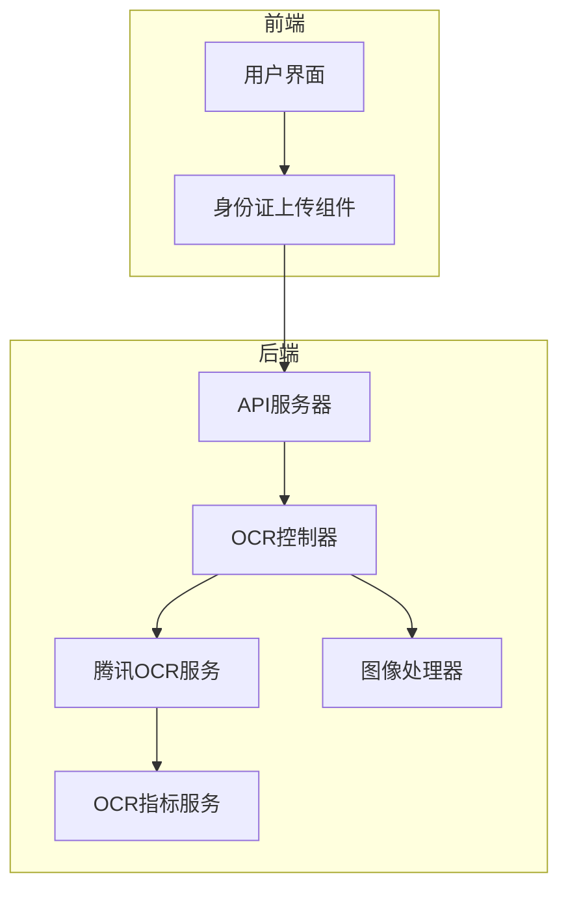
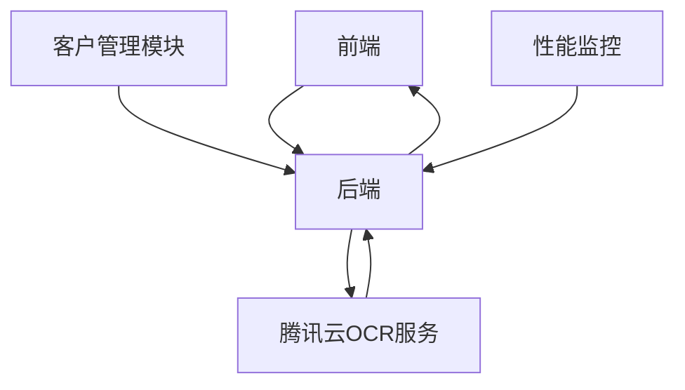
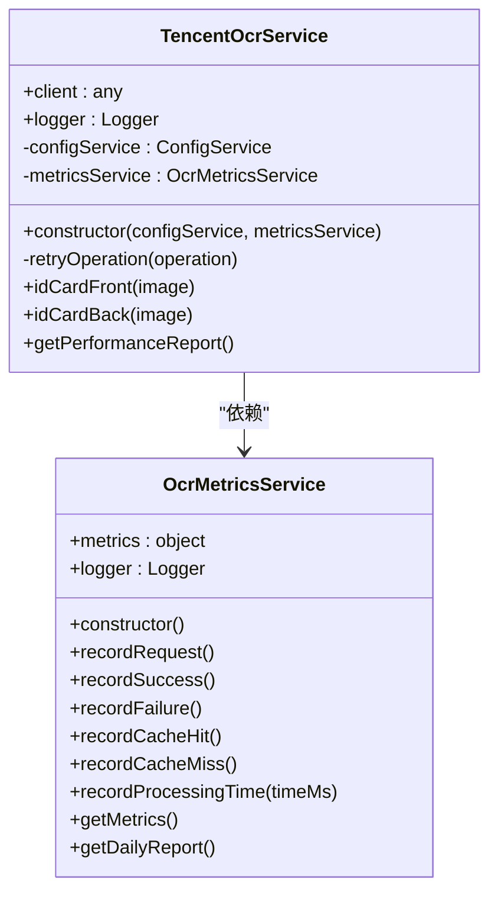
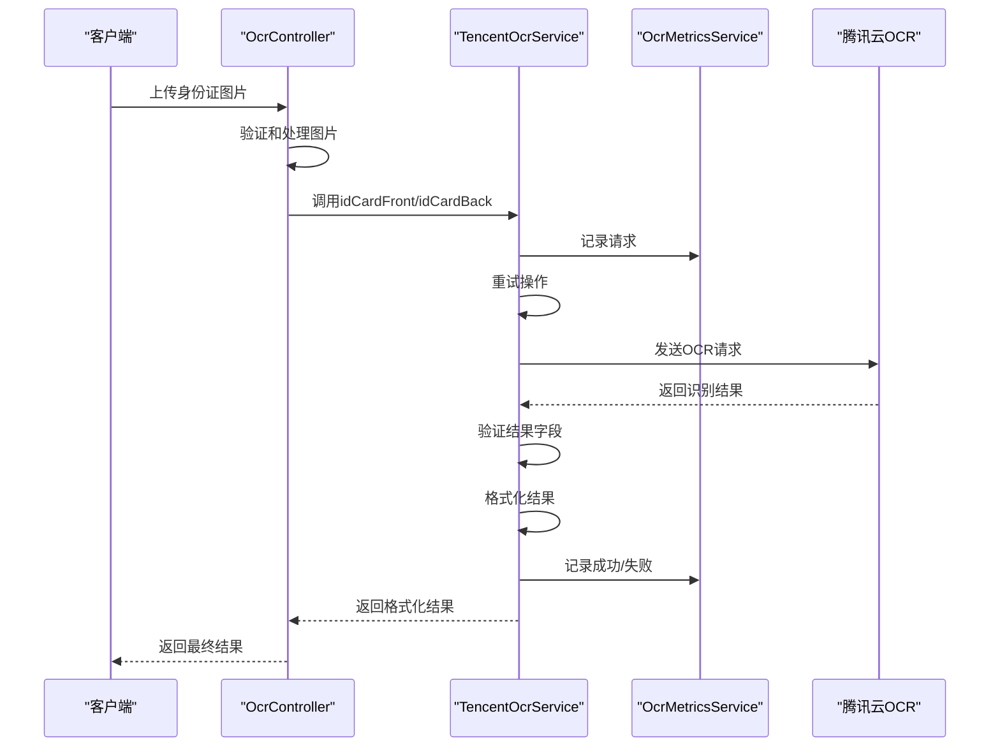
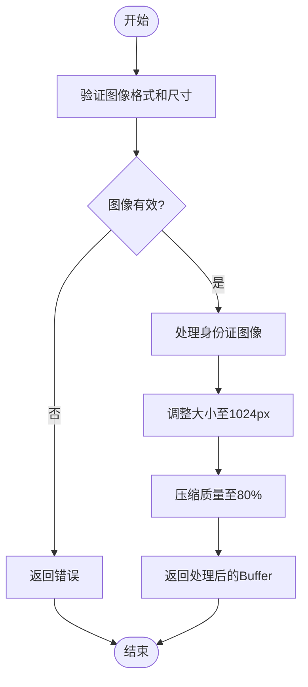
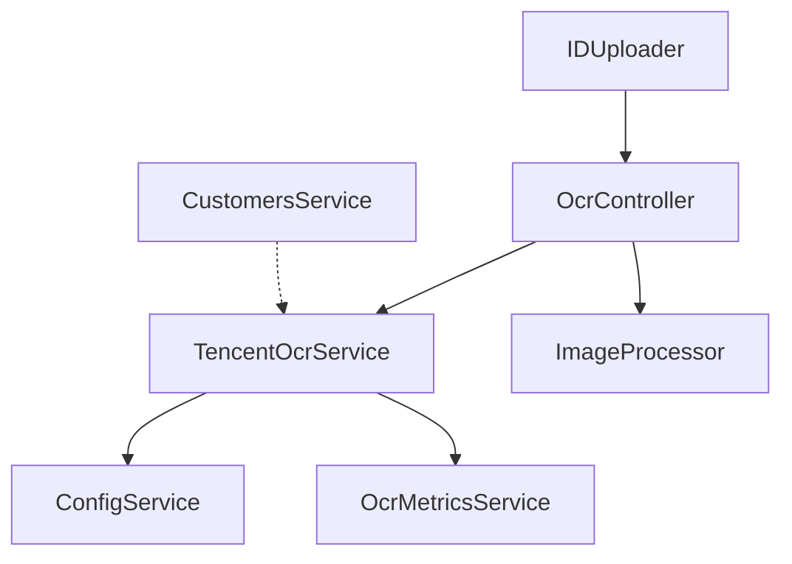

# 腾讯OCR集成

<cite>
**本文档引用文件**   
- [tencent-ocr.service.ts](file://backend/src/modules/ocr/tencent-ocr.service.ts)
- [ocr.metrics.service.ts](file://backend/src/modules/ocr/ocr.metrics.service.ts)
- [ocr.controller.ts](file://backend/src/modules/ocr/ocr.controller.ts)
- [image-processor.ts](file://backend/src/utils/image-processor.ts)
- [customers.service.ts](file://backend/src/modules/customers/customers.service.ts)
- [ecosystem.config.js](file://backend/ecosystem.config.js)
- [IDUploader.tsx](file://frontend/src/components/IDUploader.tsx)
</cite>

## 目录
1. [简介](#简介)
2. [项目结构](#项目结构)
3. [核心组件](#核心组件)
4. [架构概述](#架构概述)
5. [详细组件分析](#详细组件分析)
6. [依赖分析](#依赖分析)
7. [性能考量](#性能考量)
8. [故障排除指南](#故障排除指南)
9. [结论](#结论)

## 简介
本文档详细说明了如何在项目中集成腾讯云OCR服务，重点描述身份证识别功能的实现。文档涵盖了API请求构造、签名算法、HTTPS调用流程及响应解析机制，同时包括错误码处理、重试策略、性能监控指标上报、调用频率限制等内容。此外，还提供了配置项说明、安全建议以及与客户管理模块的集成方式。

## 项目结构
本项目采用NestJS框架构建后端服务，前端使用React技术栈。OCR服务位于`backend/src/modules/ocr`目录下，主要包括`tencent-ocr.service.ts`、`ocr.controller.ts`和`ocr.metrics.service.ts`三个核心文件。前端身份证上传组件位于`frontend/src/components/IDUploader.tsx`。



**图示来源**
- [tencent-ocr.service.ts](file://backend/src/modules/ocr/tencent-ocr.service.ts)
- [ocr.controller.ts](file://backend/src/modules/ocr/ocr.controller.ts)
- [ocr.metrics.service.ts](file://backend/src/modules/ocr/ocr.metrics.service.ts)
- [image-processor.ts](file://backend/src/utils/image-processor.ts)
- [IDUploader.tsx](file://frontend/src/components/IDUploader.tsx)

**章节来源**
- [tencent-ocr.service.ts](file://backend/src/modules/ocr/tencent-ocr.service.ts)
- [ocr.controller.ts](file://backend/src/modules/ocr/ocr.controller.ts)

## 核心组件
核心组件包括腾讯云OCR服务、OCR控制器、OCR指标服务和图像处理器。这些组件协同工作，实现了从图像上传到身份证信息识别的完整流程。

**章节来源**
- [tencent-ocr.service.ts](file://backend/src/modules/ocr/tencent-ocr.service.ts)
- [ocr.controller.ts](file://backend/src/modules/ocr/ocr.controller.ts)
- [ocr.metrics.service.ts](file://backend/src/modules/ocr/ocr.metrics.service.ts)
- [image-processor.ts](file://backend/src/utils/image-processor.ts)

## 架构概述
系统架构分为前端、后端和第三方服务三层。前端负责用户交互和图像上传，后端处理业务逻辑并调用腾讯云OCR服务，第三方服务提供OCR识别能力。



**图示来源**
- [tencent-ocr.service.ts](file://backend/src/modules/ocr/tencent-ocr.service.ts)
- [ocr.controller.ts](file://backend/src/modules/ocr/ocr.controller.ts)

## 详细组件分析

### 腾讯OCR服务分析
`TencentOcrService`类负责与腾讯云OCR服务进行交互，实现了身份证正反面识别功能。

#### 类图


**图示来源**
- [tencent-ocr.service.ts](file://backend/src/modules/ocr/tencent-ocr.service.ts)
- [ocr.metrics.service.ts](file://backend/src/modules/ocr/ocr.metrics.service.ts)

#### 身份证识别流程


**图示来源**
- [tencent-ocr.service.ts](file://backend/src/modules/ocr/tencent-ocr.service.ts)
- [ocr.controller.ts](file://backend/src/modules/ocr/ocr.controller.ts)

**章节来源**
- [tencent-ocr.service.ts](file://backend/src/modules/ocr/tencent-ocr.service.ts#L0-L191)
- [ocr.controller.ts](file://backend/src/modules/ocr/ocr.controller.ts#L0-L199)

### 图像处理器分析
`ImageProcessor`类负责对上传的身份证图片进行预处理，确保符合OCR服务的要求。

#### 图像处理流程


**图示来源**
- [image-processor.ts](file://backend/src/utils/image-processor.ts)

**章节来源**
- [image-processor.ts](file://backend/src/utils/image-processor.ts#L0-L73)

### 客户管理模块集成分析
客户管理模块通过调用OCR服务实现身份证自动识别功能，但当前代码中尚未实现直接集成。

**章节来源**
- [customers.service.ts](file://backend/src/modules/customers/customers.service.ts#L0-L308)

## 依赖分析
系统各组件之间的依赖关系如下：



**图示来源**
- [tencent-ocr.service.ts](file://backend/src/modules/ocr/tencent-ocr.service.ts)
- [ocr.controller.ts](file://backend/src/modules/ocr/ocr.controller.ts)
- [customers.service.ts](file://backend/src/modules/customers/customers.service.ts)
- [IDUploader.tsx](file://frontend/src/components/IDUploader.tsx)

**章节来源**
- [tencent-ocr.service.ts](file://backend/src/modules/ocr/tencent-ocr.service.ts)
- [ocr.controller.ts](file://backend/src/modules/ocr/ocr.controller.ts)
- [customers.service.ts](file://backend/src/modules/customers/customers.service.ts)

## 性能考量
### 性能监控指标
`OcrMetricsService`提供了全面的性能监控功能，包括：
- 总请求数
- 成功请求数
- 失败请求数
- 平均处理时间
- 成功率
- 运行时间

### 重试策略
系统实现了智能重试机制，配置如下：
- 最大重试次数：3次
- 退避因子：2（指数退避）
- 最小超时时间：1000ms
- 最大超时时间：5000ms

### 调用频率限制
系统通过以下方式控制调用频率：
- 图像大小限制：5MB
- 文件类型限制：仅支持JPG、JPEG、PNG
- 客户端上传限制：前端和后端双重验证

## 故障排除指南
### 常见错误及解决方案
1. **鉴权失败**
   - 检查环境变量`.env`文件中`TENCENT_OCR_SECRET_ID`和`TENCENT_OCR_SECRET_KEY`是否正确配置
   - 确认密钥未过期且具有OCR服务权限

2. **无效图像**
   - 确保上传的图片格式为JPG、JPEG或PNG
   - 检查图片大小不超过5MB
   - 确认图片尺寸不小于300x300像素

3. **识别结果缺少必要字段**
   - 检查身份证图片是否完整，无遮挡
   - 确保图片清晰可辨，无模糊或反光
   - 建议使用白色背景拍摄

4. **网络连接超时**
   - 检查服务器网络连接
   - 确认可以访问`ocr.tencentcloudapi.com`
   - 检查防火墙设置

### 调试技巧
1. **启用详细日志**
   ```bash
   # 在ecosystem.config.js中设置日志级别
   log_date_format: 'YYYY-MM-DD HH:mm:ss',
   error_file: 'logs/backend-dev-error.log',
   out_file: 'logs/backend-dev-out.log'
   ```

2. **检查性能报告**
   ```bash
   # 调用健康检查接口获取性能报告
   GET /ocr/metrics
   ```

3. **验证配置**
   ```bash
   # 检查环境变量配置
   cat .env | grep TENCENT_OCR
   ```

**章节来源**
- [tencent-ocr.service.ts](file://backend/src/modules/ocr/tencent-ocr.service.ts)
- [ocr.controller.ts](file://backend/src/modules/ocr/ocr.controller.ts)
- [ecosystem.config.js](file://backend/ecosystem.config.js)

## 结论
本文档详细介绍了腾讯云OCR服务在项目中的集成方案。通过`tencent-ocr.service.ts`实现了与腾讯云OCR服务的安全通信，利用`ocr.controller.ts`提供了RESTful API接口，`ocr.metrics.service.ts`实现了全面的性能监控。系统具备完善的错误处理机制和重试策略，确保了服务的稳定性和可靠性。建议在客户管理模块中进一步集成OCR服务，实现身份证信息的自动识别和填充，提升用户体验。