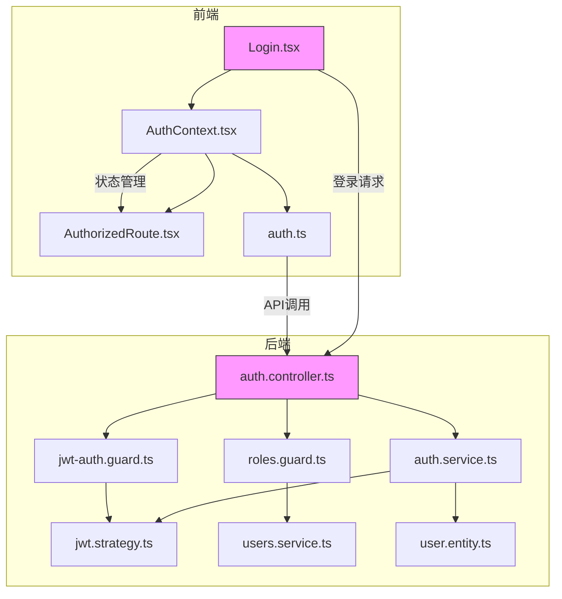
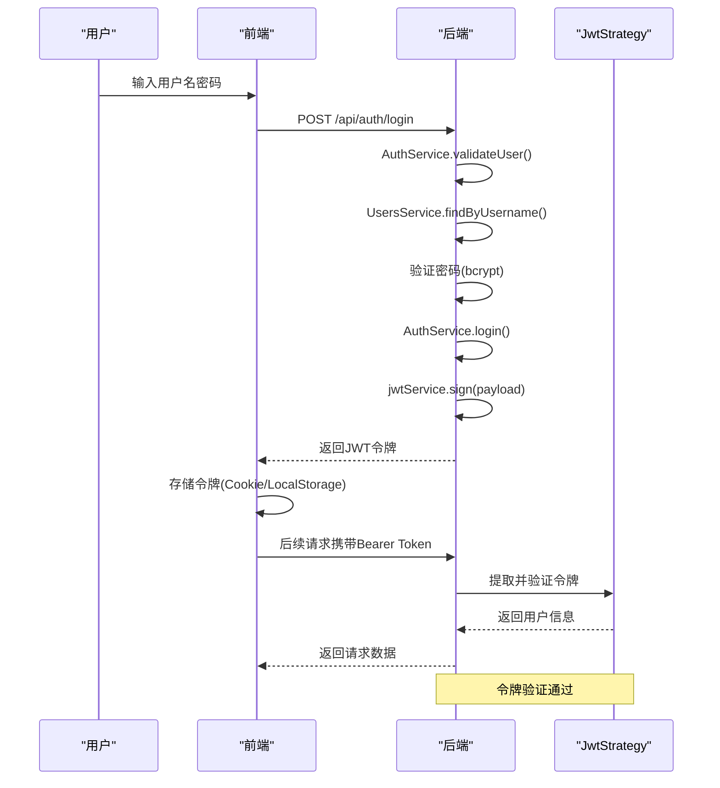

<docs>
# 认证与授权

<cite>
**本文档引用的文件**  
- [jwt.strategy.ts](file://backend/src/modules/auth/jwt.strategy.ts)
- [jwt-auth.guard.ts](file://backend/src/modules/auth/guards/jwt-auth.guard.ts)
- [roles.guard.ts](file://backend/src/modules/auth/guards/roles.guard.ts)
- [roles.decorator.ts](file://backend/src/modules/auth/decorators/roles.decorator.ts)
- [public.decorator.ts](file://backend/src/modules/auth/decorators/public.decorator.ts)
- [auth.service.ts](file://backend/src/modules/auth/auth.service.ts)
- [auth.controller.ts](file://backend/src/modules/auth/auth.controller.ts)
- [AuthContext.tsx](file://frontend/src/contexts/AuthContext.tsx)
- [auth.ts](file://frontend/src/services/auth.ts)
- [user.entity.ts](file://backend/src/modules/users/models/user.entity.ts)
- [role.entity.ts](file://backend/src/modules/roles/models/role.entity.ts)
- [users.service.ts](file://backend/src/modules/users/users.service.ts)
- [AuthorizedRoute.tsx](file://frontend/src/components/AuthorizedRoute.tsx)
- [Login.tsx](file://frontend/src/pages/Login.tsx)
- [auth.module.ts](file://backend/src/modules/auth/auth.module.ts)
- [main.ts](file://backend/src/main.ts)
- [http-exception.filter.ts](file://backend/src/common/filters/http-exception.filter.ts)
- [api-response.interceptor.ts](file://backend/src/common/interceptors/api-response.interceptor.ts)
</cite>

## 更新摘要
**已更新内容**  
- 新增了小程序登录功能的详细说明
- 增加了获取当前用户信息和上传头像的API文档
- 更新了前端认证服务和上下文管理的相关内容
- 补充了新的代码示例和实现细节

## 目录
1. [系统安全架构概述](#系统安全架构概述)
2. [JWT认证机制详解](#jwt认证机制详解)
3. [基于角色的访问控制（RBAC）](#基于角色的访问控制rbac)
4. [前端认证状态管理](#前端认证状态管理)
5. [安全最佳实践](#安全最佳实践)
6. [常见安全漏洞防范](#常见安全漏洞防范)

## 系统安全架构概述

本系统采用基于JWT（JSON Web Token）的无状态认证机制和基于角色的访问控制（RBAC）模型，构建了完整的安全防护体系。后端使用NestJS框架的Passport模块实现JWT认证，通过自定义守卫（Guards）和装饰器（Decorators）实现细粒度的权限控制。前端通过AuthContext统一管理用户状态，确保认证信息的安全存储和访问。

系统安全架构包含以下核心组件：
- **JWT认证策略**：负责令牌的生成、验证和刷新
- **认证守卫**：拦截请求并执行身份验证
- **角色守卫**：执行基于角色的权限检查
- **权限装饰器**：声明式地定义路由权限
- **前端认证上下文**：管理用户登录状态和令牌



**图示来源**
- [Login.tsx](file://frontend/src/pages/Login.tsx)
- [auth.controller.ts](file://backend/src/modules/auth/auth.controller.ts)

## JWT认证机制详解

### JWT生成与验证流程

系统采用JWT作为主要的认证令牌，其生成和验证流程如下：



**图示来源**
- [auth.service.ts](file://backend/src/modules/auth/auth.service.ts)
- [jwt.strategy.ts](file://backend/src/modules/auth/jwt.strategy.ts)

### JWT策略实现

`JwtStrategy`类是JWT认证的核心，继承自Passport的`PassportStrategy(Strategy)`，负责验证JWT令牌的有效性。

```typescript
import { ExtractJwt, Strategy } from 'passport-jwt';
import { PassportStrategy } from '@nestjs/passport';
import { Injectable } from '@nestjs/common';

@Injectable()
export class JwtStrategy extends PassportStrategy(Strategy) {
  constructor() {
    super({
      jwtFromRequest: ExtractJwt.fromAuthHeaderAsBearerToken(),
      ignoreExpiration: false,
      secretOrKey: process.env.JWT_SECRET || 'andejiazheng-secret-key',
    });
  }

  async validate(payload: any) {
    return {
      userId: payload.sub,
      username: payload.username,
    };
  }
}
```

**关键配置说明：**
- **jwtFromRequest**: 从请求头的`Authorization`字段提取Bearer Token
- **ignoreExpiration**: 不忽略令牌过期时间，确保安全性
- **secretOrKey**: 用于签名和验证JWT的密钥，优先使用环境变量

`validate`方法在令牌验证通过后被调用，返回用户标识信息，这些信息将被附加到请求对象中供后续处理使用。

**代码来源**
- [jwt.strategy.ts](file://backend/src/modules/auth/jwt.strategy.ts#L1-L20)

### JWT认证守卫

`JwtAuthGuard`是基于JWT策略的认证守卫，用于保护需要身份验证的路由。

```typescript
import { Injectable, ExecutionContext } from '@nestjs/common';
import { Reflector } from '@nestjs/core';
import { AuthGuard } from '@nestjs/passport';
import { IS_PUBLIC_KEY } from '../decorators/public.decorator';

@Injectable()
export class JwtAuthGuard extends AuthGuard('jwt') {
  constructor(private reflector: Reflector) {
    super();
  }

  canActivate(context: ExecutionContext) {
    const isPublic = this.reflector.getAllAndOverride<boolean>(IS_PUBLIC_KEY, [
      context.getHandler(),
      context.getClass(),
    ]);
    if (isPublic) {
      return true;
    }
    return super.canActivate(context);
  }
} 
```

该守卫通过`Reflector`检查当前路由是否标记为`@Public()`，如果是则跳过认证，否则执行JWT验证流程。

**代码来源**
- [jwt-auth.guard.ts](file://backend/src/modules/auth/guards/jwt-auth.guard.ts#L1-L21)

### 认证服务实现

`AuthService`提供了完整的认证业务逻辑，包括登录、登出、会话管理和令牌刷新。

```typescript
async login(username: string, password: string, ip: string, userAgent: string) {
  try {
    const user = await this.validateUser(username, password, ip, userAgent);
    if (!user) {
      throw new UnauthorizedException('用户名或密码错误');
    }
    
    const payload = { username: user.username, sub: user._id };
    const token = this.jwtService.sign(payload);
    
    return {
      access_token: token,
      user: {
        id: user._id,
        username: user.username,
        role: user.role,
        permissions: user.permissions,
        name: user.name,
        phone: user.phone,
        email: user.email,
        avatar: user.avatar || null,
        department: user.department || null
      },
    };
  } catch (error) {
    // 错误处理逻辑
  }
}

async miniprogramLogin(code: string, phone: string, ip: string, userAgent: string) {
  try {
    // 1. 通过code获取openid
    let openidResult;
    try {
      openidResult = await this.getWechatOpenid(code);
    } catch (error) {
      console.warn('微信API调用失败，使用模拟openid:', error.message);
      openidResult = { openid: `mock_openid_${Date.now()}` };
    }

    // 2. 通过手机号查找CRM用户
    const user = await this.usersService.findByPhone(phone);
    if (!user) {
      throw new UnauthorizedException('手机号未注册，请联系管理员');
    }

    // 3. 记录登录日志
    await this.logLoginAttempt(user._id.toString(), ip, userAgent, 'success');

    // 4. 生成JWT token
    const payload = { username: user.username, sub: user._id, openid: openidResult.openid };
    const token = this.jwtService.sign(payload);

    return {
      success: true,
      data: {
        access_token: token,
        user: {
          id: user._id,
          username: user.username,
          name: user.name,
          phone: user.phone,
          email: user.email,
          avatar: user.avatar || null,
          role: user.role,
          department: user.department || null,
          permissions: user.permissions
        },
        openid: openidResult.openid
      },
      message: '小程序登录成功'
    };
  } catch (error) {
    // 错误处理逻辑
  }
}

async refreshToken(userId: string) {
  const user = await this.usersService.findById(userId);
  if (!user) {
    throw new NotFoundException('用户不存在');
  }

  const payload = { username: user.username, sub: user._id };
  return {
    token: this.jwtService.sign(payload)
  };
}
```

**核心功能：**
- **登录验证**：包含密码比对、登录尝试次数限制
- **令牌生成**：使用`jwtService.sign()`生成JWT
- **令牌刷新**：为已认证用户提供新的有效令牌
- **登录日志**：记录登录尝试和成功登录信息
- **小程序登录**：支持微信小程序通过code和手机号登录

**代码来源**
- [auth.service.ts](file://backend/src/modules/auth/auth.service.ts#L100-L167)

### 认证控制器

`AuthController`定义了认证相关的API端点。

```typescript
@Controller('auth')
export class AuthController {
  constructor(private authService: AuthService) {}

  @Post('login')
  @HttpCode(HttpStatus.OK)
  async login(
    @Body('username') username: string,
    @Body('password') password: string,
    @Req() req,
  ) {
    const ip = req.ip || req.connection.remoteAddress;
    const userAgent = req.headers['user-agent'];
    return this.authService.login(username, password, ip, userAgent);
  }

  @Post('miniprogram-login')
  @HttpCode(HttpStatus.OK)
  async miniprogramLogin(
    @Body('code') code: string,
    @Body('phone') phone: string,
    @Req() req,
  ) {
    const ip = req.ip || req.connection.remoteAddress;
    const userAgent = req.headers['user-agent'];
    return this.authService.miniprogramLogin(code, phone, ip, userAgent);
  }

  @Post('logout')
  @UseGuards(JwtAuthGuard)
  @HttpCode(HttpStatus.OK)
  async logout(@Req() req) {
    return this.authService.logout(req.user.userId);
  }

  @Get('session')
  @UseGuards(JwtAuthGuard)
  async getSession(@Req() req) {
    return this.authService.getSession(req.user.userId);
  }

  @Post('refresh')
  @UseGuards(JwtAuthGuard)
  async refreshToken(@Req() req) {
    return this.authService.refreshToken(req.user.userId);
  }

  @Get('me')
  @UseGuards(JwtAuthGuard)
  @ApiOperation({ summary: '获取当前用户信息' })
  async getCurrentUser(@Req() req) {
    try {
      const data = await this.authService.getCurrentUser(req.user.userId);
      return { success: true, data, message: '获取用户信息成功' };
    } catch (error) {
      return { success: false, data: null, message: error.message || '获取用户信息失败' };
    }
  }

  @Post('avatar')
  @UseGuards(JwtAuthGuard)
  @UseInterceptors(FileInterceptor('avatar', avatarMulterConfig))
  @ApiOperation({ summary: '上传用户头像' })
  @ApiConsumes('multipart/form-data')
  @ApiBody({
    schema: {
      type: 'object',
      properties: {
        avatar: {
          type: 'string',
          format: 'binary',
          description: '头像文件'
        },
      },
      required: ['avatar']
    },
  })
  async uploadAvatar(
    @UploadedFile() file: Express.Multer.File,
    @Req() req,
  ) {
    try {
      if (!file) {
        throw new BadRequestException('请选择要上传的头像文件');
      }

      const data = await this.authService.uploadAvatar(req.user.userId, file);
      return { success: true, data, message: '头像上传成功' };
    } catch (error) {
      return { success: false, data: null, message: error.message || '头像上传失败' };
    }
  }
}
```

**API端点说明：**
- `POST /api/auth/login`: 用户登录，返回JWT令牌
- `POST /api/auth/miniprogram-login`: 小程序登录，通过微信code和手机号登录
- `POST /api/auth/logout`: 用户登出
- `GET /api/auth/session`: 获取当前会话