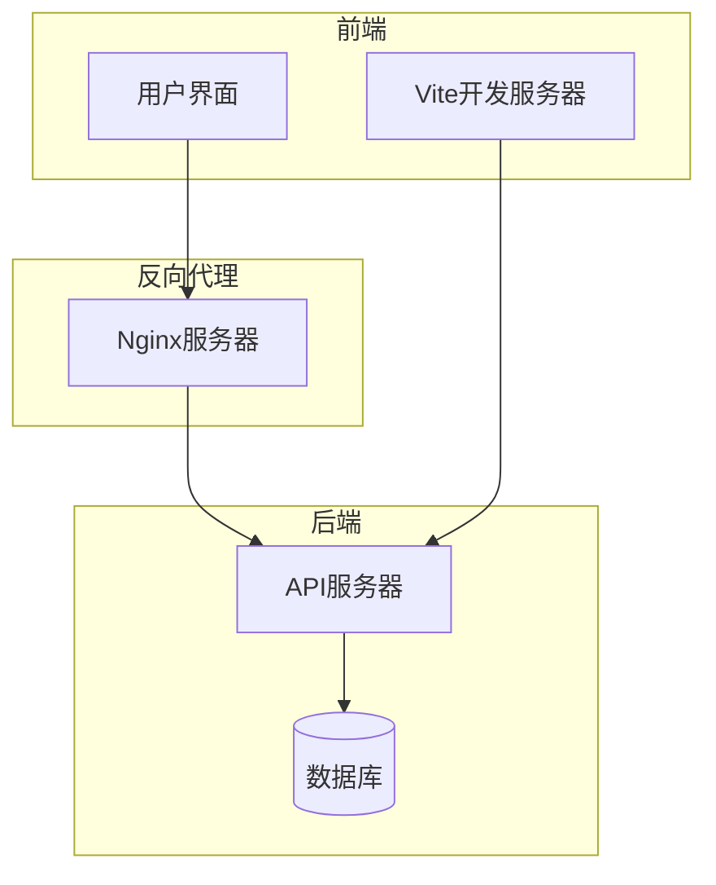
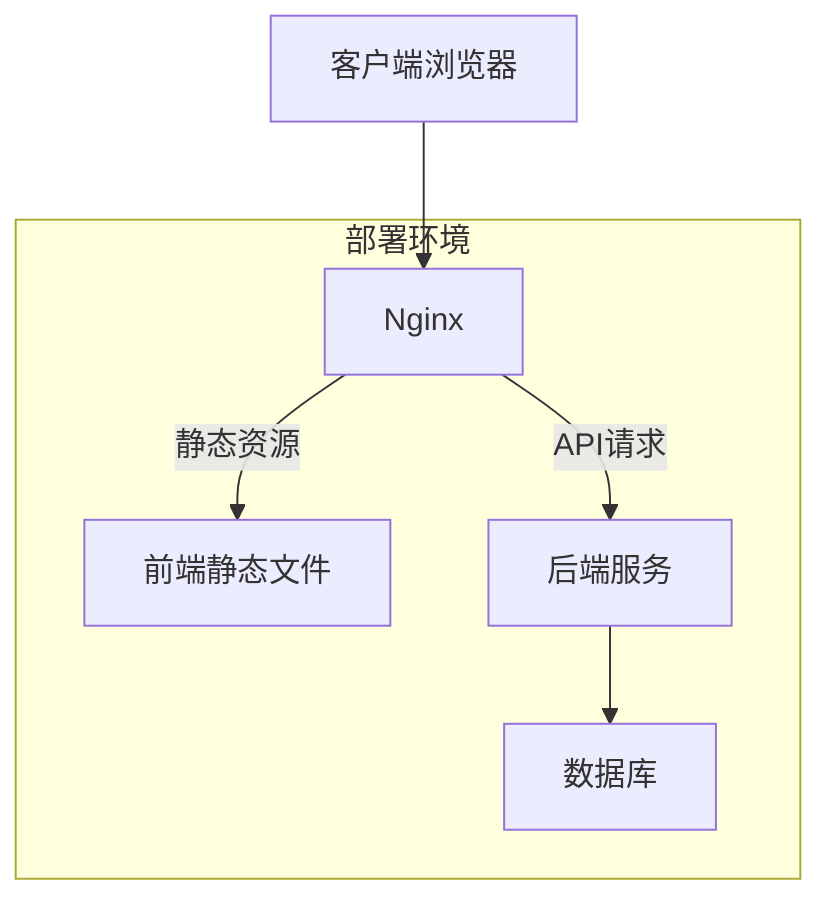
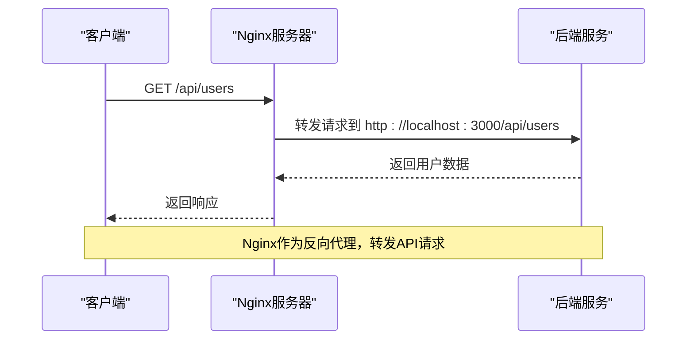
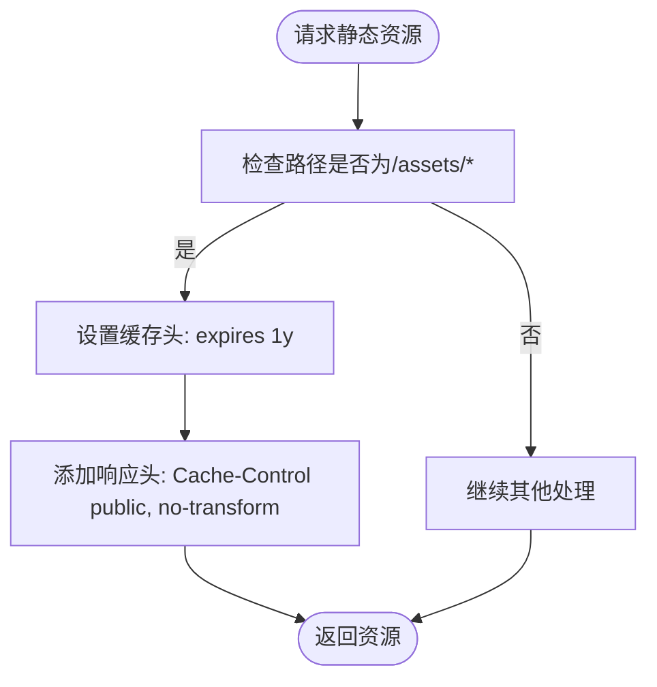
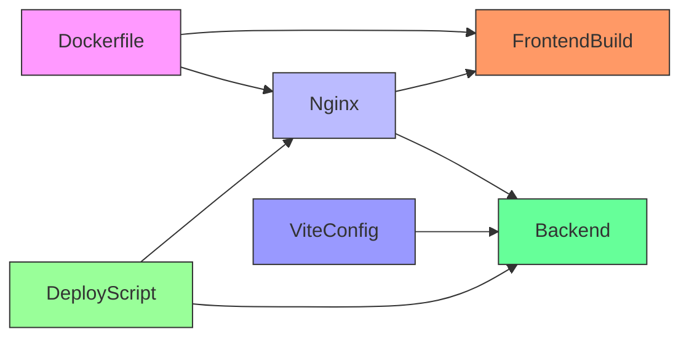

# 反向代理配置

<cite>
**本文档引用的文件**
- [nginx.conf](file://frontend/nginx.conf)
- [Dockerfile](file://frontend/Dockerfile)
- [ecosystem.config.js](file://backend/ecosystem.config.js)
- [vite.config.ts](file://frontend/vite.config.ts)
- [deploy.sh](file://scripts/deploy.sh)
</cite>

## 目录
1. [项目结构](#项目结构)
2. [核心组件](#核心组件)
3. [架构概述](#架构概述)
4. [详细组件分析](#详细组件分析)
5. [依赖分析](#依赖分析)
6. [性能考虑](#性能考虑)
7. [故障排除指南](#故障排除指南)
8. [结论](#结论)

## 项目结构
本项目采用前后端分离的架构，前端使用React框架，后端使用NestJS框架。前端构建产物通过Nginx提供静态服务，并通过反向代理将API请求转发到后端服务。



**图示来源**
- [nginx.conf](file://frontend/nginx.conf)
- [vite.config.ts](file://frontend/vite.config.ts)
- [ecosystem.config.js](file://backend/ecosystem.config.js)

**本节来源**
- [nginx.conf](file://frontend/nginx.conf)
- [Dockerfile](file://frontend/Dockerfile)

## 核心组件
Nginx配置文件是本项目的核心组件之一，负责处理所有HTTP请求的路由和代理。配置文件定义了静态资源服务、API代理、缓存策略和安全规则。

**本节来源**
- [nginx.conf](file://frontend/nginx.conf)

## 架构概述
本项目采用典型的前后端分离架构，通过Nginx实现反向代理和负载均衡。前端应用通过HTML5 History模式支持单页应用的路由，API请求通过Nginx代理到后端服务。



**图示来源**
- [nginx.conf](file://frontend/nginx.conf)
- [ecosystem.config.js](file://backend/ecosystem.config.js)

## 详细组件分析

### Nginx配置分析
Nginx配置文件定义了服务器的基本行为，包括监听端口、域名绑定、静态资源处理和API代理规则。

#### 服务器块配置
```nginx
server {
    listen 80;
    server_name localhost;

    root /usr/share/nginx/html;
    index index.html;

    # 支持 HTML5 History 模式
    location / {
        try_files $uri $uri/ /index.html;
    }

    # API 代理配置
    location /api/ {
        proxy_pass http://localhost:3000/api/;
        proxy_http_version 1.1;
        proxy_set_header Upgrade $http_upgrade;
        proxy_set_header Connection 'upgrade';
        proxy_set_header Host $host;
        proxy_cache_bypass $http_upgrade;
        proxy_set_header X-Real-IP $remote_addr;
        proxy_set_header X-Forwarded-For $proxy_add_x_forwarded_for;
        proxy_set_header X-Forwarded-Proto $scheme;
    }

    # 静态资源缓存设置
    location /assets {
        expires 1y;
        add_header Cache-Control "public, no-transform";
    }

    # 禁止访问 . 文件
    location ~ /\. {
        deny all;
    }
} 
```

**本节来源**
- [nginx.conf](file://frontend/nginx.conf)

#### API代理流程


**图示来源**
- [nginx.conf](file://frontend/nginx.conf)
- [ecosystem.config.js](file://backend/ecosystem.config.js)

#### 静态资源缓存策略


**图示来源**
- [nginx.conf](file://frontend/nginx.conf)

## 依赖分析
项目各组件之间存在明确的依赖关系，Nginx依赖于前端构建产物和后端服务，前端开发环境依赖于Vite代理配置。



**图示来源**
- [Dockerfile](file://frontend/Dockerfile)
- [nginx.conf](file://frontend/nginx.conf)
- [vite.config.ts](file://frontend/vite.config.ts)
- [deploy.sh](file://scripts/deploy.sh)

**本节来源**
- [Dockerfile](file://frontend/Dockerfile)
- [ecosystem.config.js](file://backend/ecosystem.config.js)

## 性能考虑
### 缓存策略
Nginx配置中为静态资源设置了长期缓存，通过`expires 1y`指令将/assets路径下的资源缓存1年，减少重复请求。

### 压缩优化
虽然当前Nginx配置中未显式启用Gzip压缩，但后端服务在`production.config.js`中启用了压缩功能，确保API响应经过压缩传输。

### 连接优化
通过`proxy_http_version 1.1`保持HTTP/1.1连接，支持WebSocket升级，提高连接效率。

## 故障排除指南
### 配置验证
Nginx配置的验证和更新主要通过Docker容器化部署实现。当更新`nginx.conf`文件后，需要重新构建Docker镜像并重启容器。

```bash
# 重新构建前端镜像
docker build -f frontend/Dockerfile -t frontend .

# 重启容器
docker-compose up -d frontend
```

### 热更新操作
本项目未配置Nginx热更新，配置更改需要重新部署。部署脚本`scripts/deploy.sh`提供了完整的部署流程，包括备份、构建、部署和健康检查。

### 常见问题
1. **API请求404错误**：检查后端服务是否在3000端口运行
2. **静态资源加载慢**：确认Nginx缓存配置是否生效
3. **WebSocket连接失败**：检查`proxy_set_header`配置是否正确传递升级头

**本节来源**
- [deploy.sh](file://scripts/deploy.sh)
- [Dockerfile](file://frontend/Dockerfile)

## 结论
本项目的Nginx配置实现了前后端分离架构中的关键功能，包括静态资源服务、API反向代理和基本安全防护。通过Docker容器化部署，确保了配置的一致性和可移植性。建议未来增加SSL/TLS配置、Gzip压缩和请求速率限制等安全和性能优化措施。