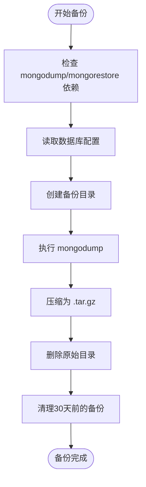
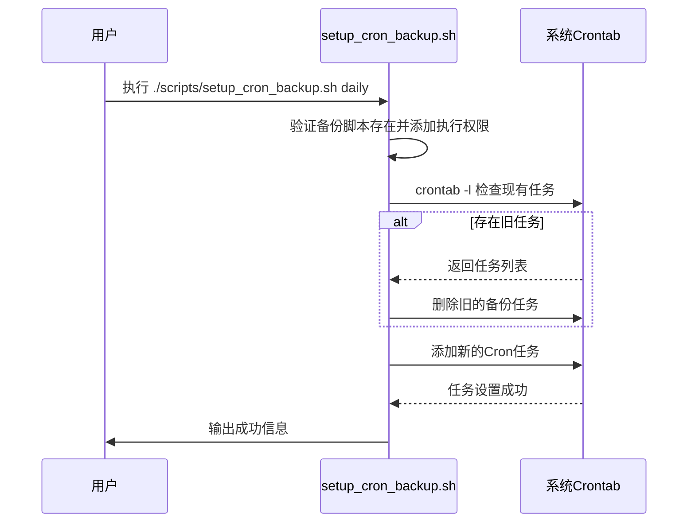
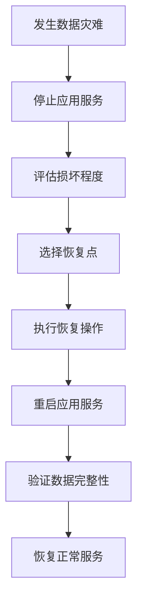

# 数据库备份与恢复

<cite>
**本文档引用的文件**  
- [db_backup.sh](file://scripts/db_backup.sh)
- [setup_cron_backup.sh](file://scripts/setup_cron_backup.sh)
- [BACKUP_RESTORE.md](file://BACKUP_RESTORE.md)
</cite>

## 目录
1. [数据库备份与恢复策略](#数据库备份与恢复策略)
2. [db_backup.sh 脚本机制详解](#db_backupsh-脚本机制详解)
3. [自动化备份配置](#自动化备份配置)
4. [全量与增量备份操作指南](#全量与增量备份操作指南)
5. [异地存储方案](#异地存储方案)
6. [灾难恢复流程](#灾难恢复流程)
7. [性能影响评估与优化建议](#性能影响评估与优化建议)

## 数据库备份与恢复策略

安得家政CRM系统采用基于MongoDB的数据库备份与恢复策略，确保数据安全性和业务连续性。系统通过自动化脚本实现定期备份，并支持手动备份与恢复操作。

备份策略遵循以下核心原则：
- **自动化执行**：通过Cron定时任务实现每日、每周或每月的自动备份。
- **保留策略**：默认保留最近30天的备份文件，防止磁盘空间过度占用。
- **安全覆盖**：恢复操作会完全覆盖现有数据库，需用户确认后执行。
- **日志记录**：所有备份与恢复操作均记录日志，便于监控和故障排查。

该策略适用于生产环境的数据保护，确保在发生数据丢失、损坏或系统故障时能够快速恢复服务。

**Section sources**
- [BACKUP_RESTORE.md](file://BACKUP_RESTORE.md#L1-L20)

## db_backup.sh 脚本机制详解

`db_backup.sh` 是系统核心的数据库备份与恢复脚本，支持备份、恢复、列出备份和帮助等功能。

### 备份文件命名规则

备份文件采用统一的命名格式：
```
{数据库名}_{年月日_时分秒}.tar.gz
```
例如：`housekeeping_20250607_141419.tar.gz`

该命名规则包含数据库名称和精确到秒的时间戳，便于识别备份时间和来源。

### 压缩方式

脚本使用 `tar -czf` 命令对备份目录进行压缩，生成 `.tar.gz` 格式的压缩包。此方式结合了 `tar` 的归档功能和 `gzip` 的高效压缩，有效减少存储空间占用。

### 存储路径管理

- **备份目录**：`backups/mongodb/`
- **日志目录**：`logs/db_backup.log`

脚本在执行时会自动创建备份目录（如不存在），并在备份完成后清理超过30天的旧备份文件，确保存储空间合理利用。

### 数据库连接配置

脚本优先从以下位置读取数据库连接信息：
1. 项目根目录下的 `.env` 文件中的 `MONGO_URI`
2. 环境变量 `MONGO_HOST`, `MONGO_PORT`, `MONGO_DB`, `MONGO_USER`, `MONGO_PASS`
3. 脚本内默认值（`localhost:27017`, 数据库名 `housekeeping`）

脚本通过正则表达式解析 `MONGO_URI`，提取主机、端口、用户名、密码和数据库名。



**Diagram sources**
- [db_backup.sh](file://scripts/db_backup.sh#L1-L227)

**Section sources**
- [db_backup.sh](file://scripts/db_backup.sh#L1-L227)
- [BACKUP_RESTORE.md](file://BACKUP_RESTORE.md#L25-L40)

## 自动化备份配置

`setup_cron_backup.sh` 脚本用于配置系统的定时备份任务，支持每日、每周和每月三种频率。

### 定时任务配置

| 频率 | 执行时间 | Cron 表达式 |
|------|--------|------------|
| 每日 | 凌晨2点 | `0 2 * * *` |
| 每周 | 周日凌晨3点 | `0 3 * * 0` |
| 每月 | 每月1日凌晨4点 | `0 4 1 * *` |

### 配置步骤

```bash
# 设置每日备份
./scripts/setup_cron_backup.sh daily

# 设置每周备份
./scripts/setup_cron_backup.sh weekly

# 设置每月备份
./scripts/setup_cron_backup.sh monthly
```

脚本会检查当前用户的Crontab中是否已存在备份任务，若存在则先删除再添加新任务，避免重复。

所有备份任务的输出和错误信息均重定向到 `logs/db_backup.log`，便于后续审计。



**Diagram sources**
- [setup_cron_backup.sh](file://scripts/setup_cron_backup.sh#L1-L128)

**Section sources**
- [setup_cron_backup.sh](file://scripts/setup_cron_backup.sh#L1-L128)
- [BACKUP_RESTORE.md](file://BACKUP_RESTORE.md#L42-L55)

## 全量与增量备份操作指南

### 全量备份

系统当前采用全量备份策略，每次备份都会完整导出整个数据库。

**手动执行全量备份：**
```bash
./scripts/db_backup.sh backup
```

**自动全量备份：**
通过 `setup_cron_backup.sh` 配置定时任务后，系统将按计划自动执行全量备份。

### 增量备份

目前系统未实现增量备份功能。所有备份均为全量备份。建议通过以下方式优化备份策略：
- 使用每日全量备份 + 每周归档的组合策略
- 结合MongoDB的Oplog实现真正的增量备份（需额外配置）

### 备份操作验证

执行备份后，可通过以下命令验证备份文件：
```bash
# 列出所有备份
./scripts/db_backup.sh list

# 检查备份文件是否存在
ls -la backups/mongodb/
```

**Section sources**
- [db_backup.sh](file://scripts/db_backup.sh#L100-L130)
- [BACKUP_RESTORE.md](file://BACKUP_RESTORE.md#L60-L70)

## 异地存储方案

为提高数据安全性，建议实施异地存储策略。

### 推荐方案

1. **COS对象存储同步**
   - 利用项目中已配置的腾讯云COS服务
   - 在备份完成后，通过脚本自动上传到COS
   - 配置生命周期策略，自动转为低频存储以降低成本

2. **跨区域复制**
   - 将备份文件复制到不同地理位置的服务器
   - 使用 `rsync` 或 `scp` 命令实现自动化同步

3. **云存储服务**
   - AWS S3、阿里云OSS等第三方云存储
   - 配置跨区域复制和版本控制

### 实施建议

```bash
# 示例：备份后上传到COS
./scripts/db_backup.sh backup
coscli cp backups/mongodb/*.tar.gz cos://your-bucket/backups/
```

**Section sources**
- [BACKUP_RESTORE.md](file://BACKUP_RESTORE.md#L120-L130)
- [cos.config.ts](file://backend/src/config/cos.config.ts#L1-L20)

## 灾难恢复流程

### 标准恢复流程



### 详细步骤

1. **停止应用服务**
   ```bash
   pm2 stop all
   ```

2. **查看可用备份**
   ```bash
   ./scripts/db_backup.sh list
   ```

3. **执行恢复**
   ```bash
   # 恢复最新备份
   ./scripts/db_backup.sh restore
   
   # 恢复指定备份
   ./scripts/db_backup.sh restore housekeeping_20250607_141419.tar.gz
   ```
   系统会提示确认，输入 `y` 继续。

4. **重启服务**
   ```bash
   pm2 restart all
   ```

5. **验证恢复**
   - 检查关键业务数据
   - 验证用户登录功能
   - 测试核心业务流程

### 时间点恢复

由于当前为全量备份，无法精确到秒级的时间点恢复。建议：
- 每日备份可恢复到前一天的状态
- 结合应用日志进行数据补录

### 版本兼容性处理

- 确保 `mongodump` 和 `mongorestore` 工具版本与MongoDB服务器版本兼容
- 生产环境应使用与数据库版本匹配的MongoDB工具包
- 升级数据库版本前，先测试备份恢复流程

**Section sources**
- [db_backup.sh](file://scripts/db_backup.sh#L132-L190)
- [BACKUP_RESTORE.md](file://BACKUP_RESTORE.md#L75-L100)

## 性能影响评估与优化建议

### 性能影响

| 操作 | CPU 影响 | 内存 影响 | 磁盘 I/O | 网络 | 预计耗时 |
|------|---------|----------|---------|------|---------|
| 备份 | 高 | 中 | 高 | 无 | 5-30分钟 |
| 恢复 | 高 | 高 | 高 | 无 | 10-60分钟 |

**影响说明：**
- 备份期间 `mongodump` 会读取全部数据，增加磁盘I/O和CPU负载
- 恢复期间 `mongorestore` 会重建所有索引，消耗大量内存和CPU

### 优化建议

1. **调整备份时间**
   - 将备份安排在业务低峰期（如凌晨2点）
   - 避免与系统维护、数据同步等任务冲突

2. **资源监控**
   - 监控备份期间的系统资源使用情况
   - 设置告警，当备份耗时异常增长时通知管理员

3. **增量备份升级**
   - 考虑实现基于Oplog的增量备份
   - 减少每日备份的数据量和时间

4. **压缩优化**
   - 测试不同压缩算法（如 `pigz` 并行压缩）
   - 权衡压缩率与CPU消耗

5. **存储优化**
   - 定期清理旧备份
   - 使用硬链接实现备份快照，减少存储占用

6. **异地备份优化**
   - 压缩后再传输，减少网络带宽占用
   - 使用限速参数避免影响业务网络

**Section sources**
- [db_backup.sh](file://scripts/db_backup.sh#L1-L227)
- [BACKUP_RESTORE.md](file://BACKUP_RESTORE.md#L105-L115)