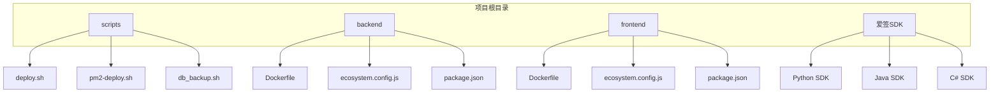
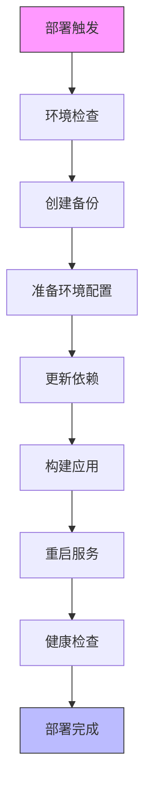
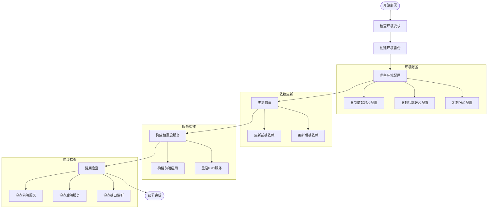
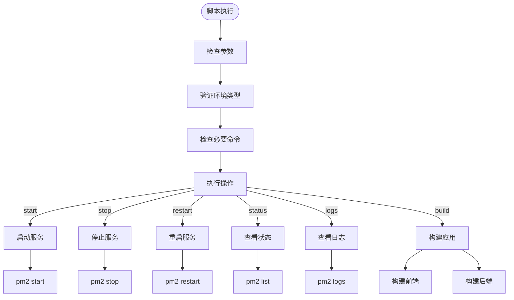
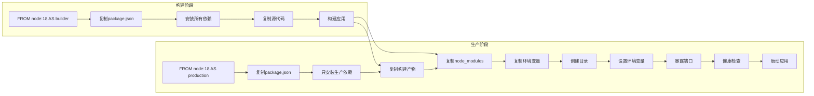
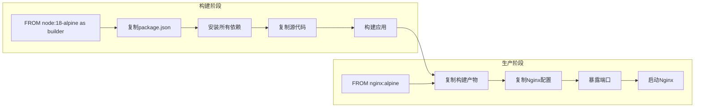
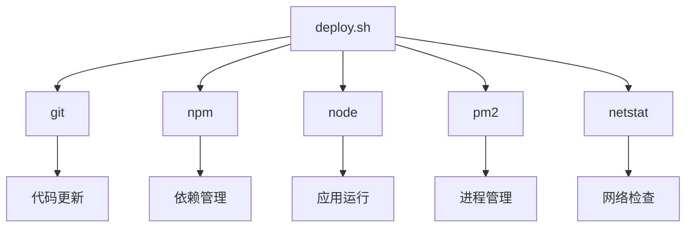

# 自动化部署

<cite>
**本文档引用的文件**   
- [deploy.sh](file://deploy.sh)
- [scripts/deploy.sh](file://scripts/deploy.sh)
- [pm2-deploy.sh](file://pm2-deploy.sh)
- [backend/Dockerfile](file://backend/Dockerfile)
- [frontend/Dockerfile](file://frontend/Dockerfile)
- [backend/ecosystem.config.js](file://backend/ecosystem.config.js)
- [frontend/ecosystem.config.js](file://frontend/ecosystem.config.js)
</cite>

## 目录
1. [引言](#引言)
2. [项目结构](#项目结构)
3. [核心组件](#核心组件)
4. [架构概述](#架构概述)
5. [详细组件分析](#详细组件分析)
6. [依赖分析](#依赖分析)
7. [性能考虑](#性能考虑)
8. [故障排除指南](#故障排除指南)
9. [结论](#结论)

## 引言

本文档详细说明了安得家政CRM系统的自动化部署流程实现机制。重点解析了`deploy.sh`和`pm2-deploy.sh`脚本的工作原理，描述了如何通过脚本协调前后端服务的构建、Docker镜像的生成与部署。文档解释了Dockerfile中定义的多阶段构建策略，包括依赖安装、代码编译和镜像优化。提供了脚本参数配置说明、执行流程图解和常见错误处理方案。结合实际部署场景，展示了从代码提交到服务上线的完整CI/CD流程，并给出了最佳实践建议。

## 项目结构

项目采用前后端分离的架构设计，主要包含以下核心目录：

- **backend**: NestJS后端服务，包含业务逻辑、数据库模型和API接口
- **frontend**: React前端应用，使用Vite构建，包含UI组件和页面
- **scripts**: 部署和运维脚本，包括部署、备份和管理脚本
- **爱签SDK**: 第三方电子签名服务集成SDK

这种结构化的组织方式使得前后端可以独立开发、构建和部署，提高了开发效率和系统可维护性。

**Diagram sources**
- [project_structure](file://project_structure)

## 核心组件

自动化部署流程的核心组件包括两个主要的Shell脚本：`deploy.sh`和`pm2-deploy.sh`，以及用于容器化部署的Dockerfile。

`deploy.sh`脚本是自动化部署的主要入口，支持开发和生产两种环境的部署。它通过参数化配置实现了环境的灵活切换，包含了从环境检查、备份创建、配置准备、依赖更新到服务重建和健康检查的完整部署流程。

`pm2-deploy.sh`脚本则专注于PM2进程管理，提供了启动、停止、重启、状态查看、日志查看和构建等操作，使得服务管理更加便捷和标准化。

**Section sources**
- [deploy.sh](file://deploy.sh#L1-L221)
- [pm2-deploy.sh](file://pm2-deploy.sh#L1-L184)

## 架构概述

自动化部署流程采用了分层架构设计，主要包括以下几个层次：

1. **环境管理层**: 负责环境变量和配置文件的管理
2. **依赖管理层**: 负责前后端依赖的安装和更新
3. **构建层**: 负责前后端应用的编译和打包
4. **部署层**: 负责服务的启动、停止和重启
5. **监控层**: 负责部署后的健康检查和状态验证

**Diagram sources**
- [deploy.sh](file://deploy.sh#L1-L221)

## 详细组件分析

### deploy.sh 脚本分析

`deploy.sh`脚本是自动化部署的核心，它实现了从环境准备到服务部署的完整流程。脚本首先定义了颜色输出、配置变量和日志函数，然后通过一系列函数实现了部署的各个步骤。

#### 部署流程图解

**Diagram sources**
- [deploy.sh](file://deploy.sh#L1-L221)

**Section sources**
- [deploy.sh](file://deploy.sh#L1-L221)

### pm2-deploy.sh 脚本分析

`pm2-deploy.sh`脚本提供了对PM2服务的精细化管理功能。与`deploy.sh`不同，它更专注于服务的运行时管理，而不是完整的部署流程。

#### 服务管理操作流程

**Diagram sources**
- [pm2-deploy.sh](file://pm2-deploy.sh#L1-L184)

**Section sources**
- [pm2-deploy.sh](file://pm2-deploy.sh#L1-L184)

### Dockerfile 多阶段构建分析

项目的Dockerfile采用了多阶段构建策略，有效优化了镜像大小和安全性。

#### 后端Dockerfile构建流程

**Diagram sources**
- [backend/Dockerfile](file://backend/Dockerfile#L1-L50)

#### 前端Dockerfile构建流程

**Diagram sources**
- [frontend/Dockerfile](file://frontend/Dockerfile#L1-L26)

**Section sources**
- [backend/Dockerfile](file://backend/Dockerfile#L1-L50)
- [frontend/Dockerfile](file://frontend/Dockerfile#L1-L26)

## 依赖分析

自动化部署流程依赖于一系列系统工具和Node.js生态工具。主要依赖包括：

- **git**: 用于代码版本控制和更新
- **npm**: Node.js包管理器，用于依赖安装和脚本执行
- **node**: JavaScript运行时环境
- **pm2**: Node.js进程管理器，用于服务的启动、停止和监控
- **netstat**: 网络工具，用于端口监听检查

这些依赖通过`check_requirements`函数在部署开始时进行验证，确保部署环境的完整性。

**Diagram sources**
- [deploy.sh](file://deploy.sh#L30-L40)
- [pm2-deploy.sh](file://pm2-deploy.sh#L30-L40)

**Section sources**
- [deploy.sh](file://deploy.sh#L30-L40)
- [pm2-deploy.sh](file://pm2-deploy.sh#L30-L40)

## 性能考虑

自动化部署流程在设计时考虑了多个性能和可靠性因素：

1. **备份机制**: 在部署前自动创建配置文件和PM2进程列表的备份，确保部署失败时可以快速回滚
2. **环境隔离**: 通过环境变量和配置文件区分开发和生产环境，避免配置冲突
3. **依赖优化**: 使用`npm ci`命令确保依赖安装的一致性和速度
4. **健康检查**: 部署完成后进行服务状态、进程和端口的健康检查，确保服务正常运行
5. **错误处理**: 采用适当的错误处理策略，对于关键错误直接退出，对于非关键错误给出警告

这些设计确保了部署流程的稳定性和可靠性，减少了部署过程中的风险。

## 故障排除指南

在自动化部署过程中可能遇到的常见问题及解决方案：

### 部署脚本常见错误

1. **命令未安装错误**
   - **现象**: `xxx 未安装`
   - **原因**: 系统缺少必要的命令工具
   - **解决方案**: 安装缺失的工具，如`sudo apt-get install git npm nodejs pm2`

2. **环境类型错误**
   - **现象**: `错误: 请指定环境类型 (dev 或 prod)`
   - **原因**: 未提供或提供了错误的环境参数
   - **解决方案**: 确保使用正确的参数调用脚本，如`./deploy.sh prod`

3. **依赖安装失败**
   - **现象**: `前端依赖更新失败` 或 `后端依赖更新失败`
   - **原因**: 网络问题或package.json文件错误
   - **解决方案**: 检查网络连接，验证package.json文件的正确性

4. **构建失败**
   - **现象**: `前端构建失败` 或 `后端构建失败`
   - **原因**: 代码错误或依赖问题
   - **解决方案**: 检查构建日志，修复代码错误，确保依赖正确安装

5. **服务启动失败**
   - **现象**: `前端服务启动失败` 或 `后端服务启动失败`
   - **原因**: PM2配置错误或端口被占用
   - **解决方案**: 检查ecosystem.config.js配置，确认端口未被其他进程占用

### PM2服务管理问题

1. **服务状态异常**
   - **现象**: 服务状态为`errored`或`stopped`
   - **解决方案**: 查看服务日志`pm2 logs [service-name]`，根据错误信息进行修复

2. **内存溢出重启**
   - **现象**: 服务频繁重启
   - **原因**: 内存使用超过300M限制
   - **解决方案**: 优化代码内存使用，或在ecosystem.config.js中调整`max_memory_restart`值

3. **端口冲突**
   - **现象**: 服务无法启动，提示端口已被使用
   - **解决方案**: 使用`netstat -tuln | grep :[port]`查找占用端口的进程并终止，或修改服务端口配置

**Section sources**
- [deploy.sh](file://deploy.sh#L1-L221)
- [pm2-deploy.sh](file://pm2-deploy.sh#L1-L184)
- [backend/ecosystem.config.js](file://backend/ecosystem.config.js#L1-L56)
- [frontend/ecosystem.config.js](file://frontend/ecosystem.config.js#L1-L23)

## 结论

安得家政CRM系统的自动化部署流程设计完善，通过`deploy.sh`和`pm2-deploy.sh`脚本实现了前后端服务的自动化构建和部署。多阶段Docker构建策略有效优化了镜像大小和安全性。部署流程包含了完整的备份、配置管理、依赖更新、服务重建和健康检查机制，确保了部署的可靠性和稳定性。

最佳实践建议：
1. 在生产环境部署前，先在开发环境进行测试
2. 定期清理旧的备份文件，避免磁盘空间不足
3. 监控服务的内存使用情况，及时优化内存消耗大的功能
4. 保持部署脚本和配置文件的版本控制，便于追踪变更
5. 定期演练回滚流程，确保在紧急情况下能够快速恢复服务

这套自动化部署方案不仅提高了部署效率，还增强了系统的可靠性和可维护性，为业务的稳定运行提供了有力保障。