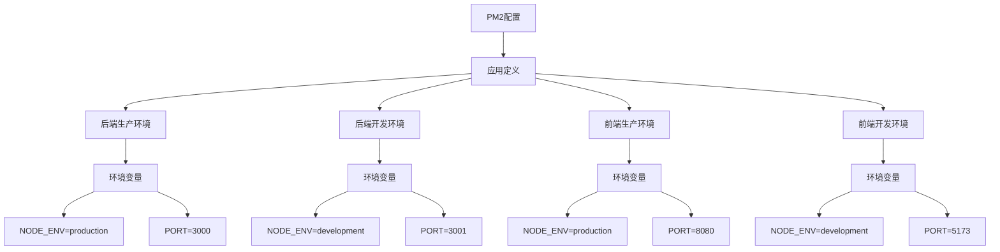
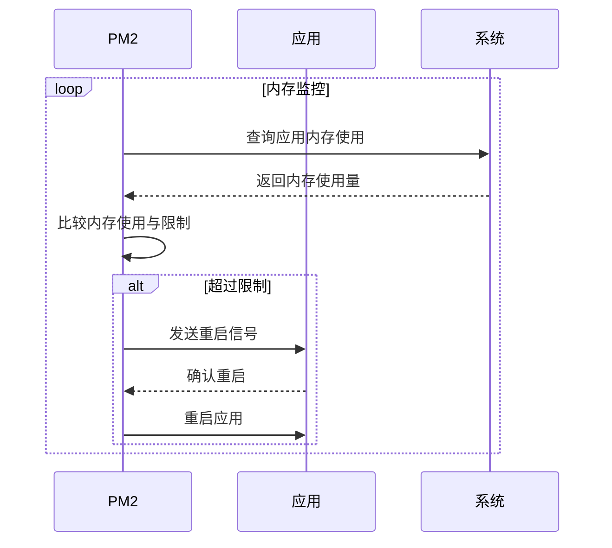
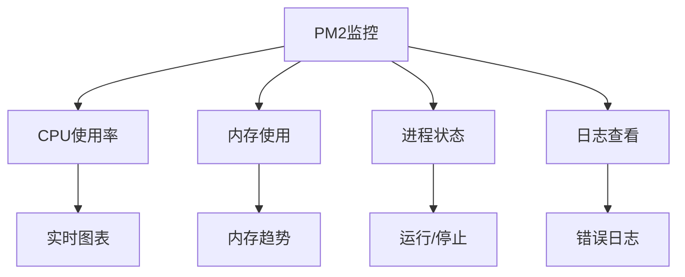

# 进程管理

<cite>
**本文档引用文件**   
- [backend/ecosystem.config.js](file://backend/ecosystem.config.js)
- [frontend/ecosystem.config.js](file://frontend/ecosystem.config.js)
- [ecosystem.config.js](file://ecosystem.config.js)
- [pm2-deploy.sh](file://pm2-deploy.sh)
- [scripts/manage.sh](file://scripts/manage.sh)
- [start_production.sh](file://start_production.sh)
- [MIGRATION_COMPLETE.md](file://MIGRATION_COMPLETE.md)
- [PROJECT_MANAGEMENT.md](file://PROJECT_MANAGEMENT.md)
</cite>

## 目录
1. [项目概述](#项目概述)
2. [PM2配置详解](#pm2配置详解)
3. [进程管理功能](#进程管理功能)
4. [部署与运维脚本](#部署与运维脚本)
5. [监控与性能分析](#监控与性能分析)
6. [最佳实践与故障排除](#最佳实践与故障排除)

## 项目概述

安得家政CRM项目采用PM2作为主要的进程管理工具，实现了前后端服务的统一管理和监控。项目架构包含NestJS后端应用和React前端应用，通过PM2进行进程管理，替代了原有的Docker方案，提升了资源利用效率和运维便捷性。

根据项目文档，选择PM2作为主要管理方案的原因包括：适合项目规模、资源效率高、运维简单、实时监控和集群支持。PM2方案相比Docker节省了约200MB内存，启动时间小于30秒，CPU效率更高，且内置强大的监控功能。

项目已完全统一使用PM2管理，Docker已完全清理，系统运行正常。通过统一的管理脚本，实现了服务的启动、停止、重启、状态查看和日志管理等日常操作。

**Section sources**
- [MIGRATION_COMPLETE.md](file://MIGRATION_COMPLETE.md)
- [PROJECT_MANAGEMENT.md](file://PROJECT_MANAGEMENT.md)

## PM2配置详解

### 根目录PM2配置

项目根目录下的`ecosystem.config.js`文件定义了完整的进程管理配置，包含前后端的开发和生产环境配置。

```javascript
module.exports = {
  apps: [
    // 后端生产环境
    {
      name: 'backend-prod',
      cwd: './backend',
      script: 'dist/main.js',
      env: {
        NODE_ENV: 'production',
        PORT: 3000
      },
      instances: 1,
      exec_mode: 'fork',
      max_memory_restart: '300M',
      error_file: '../logs/backend-prod-error.log',
      out_file: '../logs/backend-prod-out.log',
      log_date_format: 'YYYY-MM-DD HH:mm:ss',
      merge_logs: true,
      time: true,
      env_file: '.env'
    },
    // 后端开发环境
    {
      name: 'backend-dev',
      cwd: './backend',
      script: 'dist/main.js',
      watch: ['dist'],
      ignore_watch: ['node_modules', 'logs', 'uploads'],
      env: {
        NODE_ENV: 'development',
        PORT: 3001
      },
      instances: 1,
      exec_mode: 'fork',
      max_memory_restart: '300M',
      error_file: '../logs/backend-dev-error.log',
      out_file: '../logs/backend-dev-out.log',
      log_date_format: 'YYYY-MM-DD HH:mm:ss',
      merge_logs: true,
      time: true,
      env_file: '.env.dev'
    },
    // 前端生产环境 - 使用serve静态部署
    {
      name: 'frontend-prod',
      cwd: './frontend',
      script: 'npm',
      args: 'run start:prod',
      env: {
        NODE_ENV: 'production',
        PORT: 8080
      },
      instances: 1,
      exec_mode: 'fork',
      max_memory_restart: '200M',
      error_file: '../logs/frontend-prod-error.log',
      out_file: '../logs/frontend-prod-out.log',
      log_date_format: 'YYYY-MM-DD HH:mm:ss',
      merge_logs: true,
      time: true
    },
    // 前端开发环境 - 使用Vite开发服务器
    {
      name: 'frontend-dev',
      cwd: './frontend',
      script: 'npm',
      args: 'run dev -- --port 5173 --host',
      env: {
        NODE_ENV: 'development',
        PORT: 5173,
        VITE_API_BASE_URL: 'http://localhost:3001/api'
      },
      instances: 1,
      exec_mode: 'fork',
      max_memory_restart: '200M',
      error_file: '../logs/frontend-dev-error.log',
      out_file: '../logs/frontend-dev-out.log',
      log_date_format: 'YYYY-MM-DD HH:mm:ss',
      merge_logs: true,
      time: true
    }
  ]
};
```

该配置文件定义了四个应用实例，分别对应前后端的开发和生产环境。每个应用都配置了独立的日志文件、内存限制和环境变量。

### 后端PM2配置

后端目录下的`ecosystem.config.js`文件定义了后端服务的特定配置，包含环境变量和爱签电子合同服务的配置。

```javascript
module.exports = {
  apps: [
    {
      name: 'backend-dev',
      script: 'dist/main.js',
      watch: true,
      env: {
        NODE_ENV: 'development',
        PORT: 3001,
        ESIGN_APP_ID: '141496759',
        ESIGN_HOST: 'https://prev.asign.cn',
        ESIGN_PRIVATE_KEY: 'MIIEvQIBADANBgkqhkiG9w0BAQEFAASCBKcwggSjAgEAAoIBAQCORZpy+TPUZCdm2Wf9iqRp6YJ2IE2kzf1c9jZNx6/dkQGWtbx+tp1YBPYeC1sAv/7OjTsowRRJ318dUZ1TONtk59yZj8lCFtkRe53fDbnQKk3mW4rVeFBn4pQ/ya2dEM+jZOdjLKTHWNtUD7cyVl4qagsX+8TCoFBJ9lPypM0imvF1WcsLv9WgkID9+jvD0Nfa4XSTEQSzS1AroEmX9eOX87yTYTMFZNj0OcuDUf8ifwhcz1Qoa2k9NAMhUK9Gjw+4XI7P8FUj+2051A9yFu2LpoiLnDk6y+nbCSmW3WbJT59u1jNz/sGujG6LitYQCzKJIRGs8FGbNSA7p0MgjfyJAgMBAAECggEAXeuVClF45b04Ra0/+SCNaV29wj2RBDr4B2aCctZgQuR3KAbRaNUlCfY8g5j7eoNEsxaI915/BkVvhOtb8JSYQQTPnJBPTFHI+sGgdp+ZCtLimi/Udxf1/J6XP4TkF8wBRtxV5CKUpQUDxXqadaCOiXF34V1ThyhN2IXE5WnmAfFBk271ovsiTlRM9OlGzgyhWXqULBpADdI+LkHYrtZYaMVcGDloAlU881D0e38Hgtb7Z8TB7qyZwZjc4Y5aeYujyEFSTXNU2vPcwaWO2gYSHfgq6H3a3aST9htYQk02EDnsPB2zdls7Q6SNJGeKiXEsJcivCQV9Sh49TS5Yobm0AQKBgQD8Y+P98timrfqZULK1VJ10lTxKSj+ORejCjoWU6Hsn4yNVFG9P7HSRN4IkOLpeOG9/ptaveAjqY9hwilv4Glx7XGyKaQy5h6sgqljM0/Cq28n8hQNbjMJ11IadwTsvmx0F2ht+5ZG2IfqcJyOiir4n+lnNJhzUflVR95bIC0fk7wKBgQCQToWnHw1mj2wWM8ZqFVWRoF4UF1AQsvUJ0uEaRGiDSRZvRgNOS1JeB54Lkp5tZnjSkHqrM4SHSSchxUeshbk4+aKbCVE6M1zYXLjj8hi+r8z3wvKY+QXAXVSjhF7aOadCihElSixfb/qfNwa78OBqnHpEzPQE+R0cZkSEdJjmBwKBgFfTFqHmoFcX0U0KVLVelU/dIlajkYwbbYxN9dPENh7CHihb7QP9vu5NR379MnTY5Iuh7bCvb0LIraczrh8eZTIUDjz3oxLoT7cVL8NOuL9rrdSuIGX6DCzeYF2CwOqm6imAJPM6RUMAfelagT7tUpAswJTvfza+I0hbhF9l9YWHAoGAR7P8jRHM4s0Y898+E7AOGJIKrQj4a5PAVeVGnHqpQ7KpRxkOw3SBtN8sFKwBtHJaTqYjjbXHgEFFBG62Mm8vnbPMrCRxC+5Bj/BinkDJMta/jcx8Jq51wSOezrETQHOtPE7GPjUg3zsQ2NPKsM/7cn3V8yGzjlUJtfbKzNXyszkCgYEA9rt1fn9khwIHFCd7qdB+/zUTwD4mzTZ3V1QtZHdIvz+s9uudbIs9IOrJmR3JYBX6Nay5BY2noFZyyYkZMGKFaCqZzEJT+i64vus6VMCNZAu7dnWCpDoQkKegLFTnCBiMBW9TRC4wi4dTYeVL/iEUE6AKRe4rvU86+wzzwi+5ntw='
      },
      env_development: {
        NODE_ENV: 'development',
        PORT: 3001,
        ESIGN_APP_ID: '141496759',
        ESIGN_HOST: 'https://prev.asign.cn',
        ESIGN_PRIVATE_KEY: 'MIIEvQIBADANBgkqhkiG9w0BAQEFAASCBKcwggSjAgEAAoIBAQCORZpy+TPUZCdm2Wf9iqRp6YJ2IE2kzf1c9jZNx6/dkQGWtbx+tp1YBPYeC1sAv/7OjTsowRRJ318dUZ1TONtk59yZj8lCFtkRe53fDbnQKk3mW4rVeFBn4pQ/ya2dEM+jZOdjLKTHWNtUD7cyVl4qagsX+8TCoFBJ9lPypM0imvF1WcsLv9WgkID9+jvD0Nfa4XSTEQSzS1AroEmX9eOX87yTYTMFZNj0OcuDUf8ifwhcz1Qoa2k9NAMhUK9Gjw+4XI7P8FUj+2051A9yFu2LpoiLnDk6y+nbCSmW3WbJT59u1jNz/sGujG6LitYQCzKJIRGs8FGbNSA7p0MgjfyJAgMBAAECggEAXeuVClF45b04Ra0/+SCNaV29wj2RBDr4B2aCctZgQuR3KAbRaNUlCfY8g5j7eoNEsxaI915/BkVvhOtb8JSYQQTPnJBPTFHI+sGgdp+ZCtLimi/Udxf1/J6XP4TkF8wBRtxV5CKUpQUDxXqadaCOiXF34V1ThyhN2IXE5WnmAfFBk271ovsiTlRM9OlGzgyhWXqULBpADdI+LkHYrtZYaMVcGDloAlU881D0e38Hgtb7Z8TB7qyZwZjc4Y5aeYujyEFSTXNU2vPcwaWO2gYSHfgq6H3a3aST9htYQk02EDnsPB2zdls7Q6SNJGeKiXEsJcivCQV9Sh49TS5Yobm0AQKBgQD8Y+P98timrfqZULK1VJ10lTxKSj+ORejCjoWU6Hsn4yNVFG9P7HSRN4IkOLpeOG9/ptaveAjqY9hwilv4Glx7XGyKaQy5h6sgqljM0/Cq28n8hQNbjMJ11IadwTsvmx0F2ht+5ZG2IfqcJyOiir4n+lnNJhzUflVR95bIC0fk7wKBgQCQToWnHw1mj2wWM8ZqFVWRoF4UF1AQsvUJ0uEaRGiDSRZvRgNOS1JeB54Lkp5tZnjSkHqrM4SHSSchxUeshbk4+aKbCVE6M1zYXLjj8hi+r8z3wvKY+QXAXVSjhF7aOadCihElSixfb/qfNwa78OBqnHpEzPQE+R0cZkSEdJjmBwKBgFfTFqHmoFcX0U0KVLVelU/dIlajkYwbbYxN9dPENh7CHihb7QP9vu5NR379MnTY5Iuh7bCvb0LIraczrh8eZTIUDjz3oxLoT7cVL8NOuL9rrdSuIGX6DCzeYF2CwOqm6imAJPM6RUMAfelagT7tUpAswJTvfza+I0hbhF9l9YWHAoGAR7P8jRHM4s0Y898+E7AOGJIKrQj4a5PAVeVGnHqpQ7KpRxkOw3SBtN8sFKwBtHJaTqYjjbXHgEFFBG62Mm8vnbPMrCRxC+5Bj/BinkDJMta/jcx8Jq51wSOezrETQHOtPE7GPjUg3zsQ2NPKsM/7cn3V8yGzjlUJtfbKzNXyszkCgYEA9rt1fn9khwIHFCd7qdB+/zUTwD4mzTZ3V1QtZHdIvz+s9uudbIs9IOrJmR3JYBX6Nay5BY2noFZyyYkZMGKFaCqZzEJT+i64vus6VMCNZAu7dnWCpDoQkKegLFTnCBiMBW9TRC4wi4dTYeVL/iEUE6AKRe4rvU86+wzzwi+5ntw='
      },
      max_memory_restart: '300M',
      log_date_format: 'YYYY-MM-DD HH:mm:ss',
      error_file: 'logs/backend-dev-error.log',
      out_file: 'logs/backend-dev-out.log',
      merge_logs: true,
      instances: 1,
      exec_mode: 'fork',
      env_file: '.env'
    },
    {
      name: 'backend-prod',
      script: 'dist/main.js',
      env: {
        NODE_ENV: 'production',
        PORT: 3000,
        ESIGN_APP_ID: '141496759',
        ESIGN_HOST: 'https://prev.asign.cn',
        ESIGN_PRIVATE_KEY: 'MIIEvQIBADANBgkqhkiG9w0BAQEFAASCBKcwggSjAgEAAoIBAQCORZpy+TPUZCdm2Wf9iqRp6YJ2IE2kzf1c9jZNx6/dkQGWtbx+tp1YBPYeC1sAv/7OjTsowRRJ318dUZ1TONtk59yZj8lCFtkRe53fDbnQKk3mW4rVeFBn4pQ/ya2dEM+jZOdjLKTHWNtUD7cyVl4qagsX+8TCoFBJ9lPypM0imvF1WcsLv9WgkID9+jvD0Nfa4XSTEQSzS1AroEmX9eOX87yTYTMFZNj0OcuDUf8ifwhcz1Qoa2k9NAMhUK9Gjw+4XI7P8FUj+2051A9yFu2LpoiLnDk6y+nbCSmW3WbJT59u1jNz/sGujG6LitYQCzKJIRGs8FGbNSA7p0MgjfyJAgMBAAECggEAXeuVClF45b04Ra0/+SCNaV29wj2RBDr4B2aCctZgQuR3KAbRaNUlCfY8g5j7eoNEsxaI915/BkVvhOtb8JSYQQTPnJBPTFHI+sGgdp+ZCtLimi/Udxf1/J6XP4TkF8wBRtxV5CKUpQUDxXqadaCOiXF34V1ThyhN2IXE5WnmAfFBk271ovsiTlRM9OlGzgyhWXqULBpADdI+LkHYrtZYaMVcGDloAlU881D0e38Hgtb7Z8TB7qyZwZjc4Y5aeYujyEFSTXNU2vPcwaWO2gYSHfgq6H3a3aST9htYQk02EDnsPB2zdls7Q6SNJGeKiXEsJcivCQV9Sh49TS5Yobm0AQKBgQD8Y+P98timrfqZULK1VJ10lTxKSj+ORejCjoWU6Hsn4yNVFG9P7HSRN4IkOLpeOG9/ptaveAjqY9hwilv4Glx7XGyKaQy5h6sgqljM0/Cq28n8hQNbjMJ11IadwTsvmx0F2ht+5ZG2IfqcJyOiir4n+lnNJhzUflVR95bIC0fk7wKBgQCQToWnHw1mj2wWM8ZqFVWRoF4UF1AQsvUJ0uEaRGiDSRZvRgNOS1JeB54Lkp5tZnjSkHqrM4SHSSchxUeshbk4+aKbCVE6M1zYXLjj8hi+r8z3wvKY+QXAXVSjhF7aOadCihElSixfb/qfNwa78OBqnHpEzPQE+R0cZkSEdJjmBwKBgFfTFqHmoFcX0U0KVLVelU/dIlajkYwbbYxN9dPENh7CHihb7QP9vu5NR379MnTY5Iuh7bCvb0LIraczrh8eZTIUDjz3oxLoT7cVL8NOuL9rrdSuIGX6DCzeYF2CwOqm6imAJPM6RUMAfelagT7tUpAswJTvfza+I0hbhF9l9YWHAoGAR7P8jRHM4s0Y898+E7AOGJIKrQj4a5PAVeVGnHqpQ7KpRxkOw3SBtN8sFKwBtHJaTqYjjbXHgEFFBG62Mm8vnbPMrCRxC+5Bj/BinkDJMta/jcx8Jq51wSOezrETQHOtPE7GPjUg3zsQ2NPKsM/7cn3V8yGzjlUJtfbKzNXyszkCgYEA9rt1fn9khwIHFCd7qdB+/zUTwD4mzTZ3V1QtZHdIvz+s9uudbIs9IOrJmR3JYBX6Nay5BY2noFZyyYkZMGKFaCqZzEJT+i64vus6VMCNZAu7dnWCpDoQkKegLFTnCBiMBW9TRC4wi4dTYeVL/iEUE6AKRe4rvU86+wzzwi+5ntw='
      },
      env_production: {
        NODE_ENV: 'production',
        PORT: 3000,
        ESIGN_APP_ID: '141496759',
        ESIGN_HOST: 'https://prev.asign.cn',
        ESIGN_PRIVATE_KEY: 'MIIEvQIBADANBgkqhkiG9w0BAQEFAASCBKcwggSjAgEAAoIBAQCORZpy+TPUZCdm2Wf9iqRp6YJ2IE2kzf1c9jZNx6/dkQGWtbx+tp1YBPYeC1sAv/7OjTsowRRJ318dUZ1TONtk59yZj8lCFtkRe53fDbnQKk3mW4rVeFBn4pQ/ya2dEM+jZOdjLKTHWNtUD7cyVl4qagsX+8TCoFBJ9lPypM0imvF1WcsLv9WgkID9+jvD0Nfa4XSTEQSzS1AroEmX9eOX87yTYTMFZNj0OcuDUf8ifwhcz1Qoa2k9NAMhUK9Gjw+4XI7P8FUj+2051A9yFu2LpoiLnDk6y+nbCSmW3WbJT59u1jNz/sGujG6LitYQCzKJIRGs8FGbNSA7p0MgjfyJAgMBAAECggEAXeuVClF45b04Ra0/+SCNaV29wj2RBDr4B2aCctZgQuR3KAbRaNUlCfY8g5j7eoNEsxaI915/BkVvhOtb8JSYQQTPnJBPTFHI+sGgdp+ZCtLimi/Udxf1/J6XP4TkF8wBRtxV5CKUpQUDxXqadaCOiXF34V1ThyhN2IXE5WnmAfFBk271ovsiTlRM9OlGzgyhWXqULBpADdI+LkHYrtZYaMVcGDloAlU881D0e38Hgtb7Z8TB7qyZwZjc4Y5aeYujyEFSTXNU2vPcwaWO2gYSHfgq6H3a3aST9htYQk02EDnsPB2zdls7Q6SNJGeKiXEsJcivCQV9Sh49TS5Yobm0AQKBgQD8Y+P98timrfqZULK1VJ10lTxKSj+ORejCjoWU6Hsn4yNVFG9P7HSRN4IkOLpeOG9/ptaveAjqY9hwilv4Glx7XGyKaQy5h6sgqljM0/Cq28n8hQNbjMJ11IadwTsvmx0F2ht+5ZG2IfqcJyOiir4n+lnNJhzUflVR95bIC0fk7wKBgQCQToWnHw1mj2wWM8ZqFVWRoF4UF1AQsvUJ0uEaRGiDSRZvRgNOS1JeB54Lkp5tZnjSkHqrM4SHSSchxUeshbk4+aKbCVE6M1zYXLjj8hi+r8z3wvKY+QXAXVSjhF7aOadCihElSixfb/qfNwa78OBqnHpEzPQE+R0cZkSEdJjmBwKBgFfTFqHmoFcX0U0KVLVelU/dIlajkYwbbYxN9dPENh7CHihb7QP9vu5NR379MnTY5Iuh7bCvb0LIraczrh8eZTIUDjz3oxLoT7cVL8NOuL9rrdSuIGX6DCzeYF2CwOqm6imAJPM6RUMAfelagT7tUpAswJTvfza+I0hbhF9l9YWHAoGAR7P8jRHM4s0Y898+E7AOGJIKrQj4a5PAVeVGnHqpQ7KpRxkOw3SBtN8sFKwBtHJaTqYjjbXHgEFFBG62Mm8vnbPMrCRxC+5Bj/BinkDJMta/jcx8Jq51wSOezrETQHOtPE7GPjUg3zsQ2NPKsM/7cn3V8yGzjlUJtfbKzNXyszkCgYEA9rt1fn9khwIHFCd7qdB+/zUTwD4mzTZ3V1QtZHdIvz+s9uudbIs9IOrJmR3JYBX6Nay5BY2noFZyyYkZMGKFaCqZzEJT+i64vus6VMCNZAu7dnWCpDoQkKegLFTnCBiMBW9TRC4wi4dTYeVL/iEUE6AKRe4rvU86+wzzwi+5ntw='
      },
      max_memory_restart: '300M',
      log_date_format: 'YYYY-MM-DD HH:mm:ss',
      error_file: 'logs/backend-prod-error.log',
      out_file: 'logs/backend-prod-out.log',
      merge_logs: true,
      instances: 1,
      exec_mode: 'fork',
      env_file: '.env'
    }
  ]
};
```

该配置文件包含了爱签电子合同服务所需的APP ID、HOST和私钥等敏感信息，这些信息在开发和生产环境中保持一致。

### 前端PM2配置

前端目录下的`ecosystem.config.js`文件定义了前端服务的配置。

```javascript
export default {
  apps: [
    {
      name: 'frontend-prod',
      script: 'node_modules/vite/bin/vite.js',
      args: 'preview --port 4173 --host',
      env: {
        NODE_ENV: 'production',
        PORT: 4173
      },
      env_production: {
        NODE_ENV: 'production',
        PORT: 4173
      },
      max_memory_restart: '300M',
      log_date_format: 'YYYY-MM-DD HH:mm:ss',
      error_file: 'logs/frontend-prod-error.log',
      out_file: 'logs/frontend-prod-out.log',
      merge_logs: true,
      instances: 1,
      exec_mode: 'fork'
    }
  ]
};
```

该配置使用Vite的preview命令来启动前端生产环境，监听4173端口。

**Section sources**
- [ecosystem.config.js](file://ecosystem.config.js)
- [backend/ecosystem.config.js](file://backend/ecosystem.config.js)
- [frontend/ecosystem.config.js](file://frontend/ecosystem.config.js)

## 进程管理功能

### 应用定义与环境变量

PM2配置文件中的`apps`数组定义了多个应用实例，每个实例都有独立的配置。`name`字段定义了应用名称，`script`字段指定了启动脚本，`cwd`字段指定了工作目录。

环境变量通过`env`对象进行配置，支持不同环境的变量设置。例如，后端生产环境配置了`NODE_ENV`为`production`，端口为3000；开发环境则配置了`NODE_ENV`为`development`，端口为3001。



**Diagram sources**
- [ecosystem.config.js](file://ecosystem.config.js)

### 自动重启机制

PM2配置中的`max_memory_restart`参数设置了内存限制，当应用内存使用超过指定值时，PM2会自动重启应用。后端应用的内存限制为300M，前端应用为200M。



**Diagram sources**
- [ecosystem.config.js](file://ecosystem.config.js)

### 日志轮转与监控

PM2配置中的日志相关参数实现了日志的轮转和监控功能：

- `log_date_format`: 日志时间格式，设置为`YYYY-MM-DD HH:mm:ss`
- `error_file`: 错误日志文件路径
- `out_file`: 标准输出日志文件路径
- `merge_logs`: 是否合并日志
- `time`: 是否在日志中添加时间戳

日志文件存储在项目根目录的`logs`文件夹中，按应用和环境进行命名，便于管理和排查问题。

### 集群模式配置

虽然当前配置中`instances`设置为1，表示单实例运行，但PM2支持集群模式，可以通过设置`instances`为`max`或指定数字来启动多个实例，实现负载均衡。

`exec_mode`参数设置为`fork`，表示使用fork模式启动应用。如果需要集群模式，可以设置为`cluster`，并增加`instances`数量。

## 部署与运维脚本

### PM2部署脚本

`pm2-deploy.sh`脚本提供了完整的部署功能，支持开发和生产环境的启动、停止、重启、状态查看和日志查看。

```bash
#!/bin/bash

# 颜色定义
RED='\033[0;31m'
GREEN='\033[0;32m'
YELLOW='\033[1;33m'
NC='\033[0m' # No Color

# 配置变量
ENV_TYPE=$1  # 参数：dev 或 prod
ACTION=$2    # 参数：start, stop, restart, status, logs

# 日志函数
log() {
    echo -e "${GREEN}[$(date +'%Y-%m-%d %H:%M:%S')] $1${NC}"
}

error() {
    echo -e "${RED}[$(date +'%Y-%m-%d %H:%M:%S')] ERROR: $1${NC}"
    exit 1
}

warn() {
    echo -e "${YELLOW}[$(date +'%Y-%m-%d %H:%M:%S')] WARNING: $1${NC}"
}

# 显示使用帮助
show_usage() {
    echo "用法: ./pm2-deploy.sh [dev|prod] [start|stop|restart|status|logs|build]"
    echo ""
    echo "环境:"
    echo "  dev    开发环境"
    echo "  prod   生产环境"
    echo ""
    echo "操作:"
    echo "  start    启动服务"
    echo "  stop     停止服务"
    echo "  restart  重启服务"
    echo "  status   查看服务状态"
    echo "  logs     查看日志"
    echo "  build    构建应用"
    echo ""
    echo "示例:"
    echo "  ./pm2-deploy.sh prod start    启动生产环境"
    echo "  ./pm2-deploy.sh dev logs      查看开发环境日志"
}
```

该脚本通过`ENV_TYPE`和`ACTION`两个参数控制不同的环境和操作，提供了颜色输出和错误处理功能。

### 统一管理脚本

`scripts/manage.sh`脚本提供了统一的管理命令，简化了日常运维操作。

```bash
#!/bin/bash

# 安得家政CRM项目管理脚本
# 使用方法: ./scripts/manage.sh [start|stop|restart|status|logs|clean]

set -e

PROJECT_ROOT=""
cd "$PROJECT_ROOT"

case "$1" in
  start)
    echo "🚀 启动所有服务..."
    pm2 start ecosystem.config.js
    echo "✅ 所有服务已启动"
    pm2 list
    ;;
  
  stop)
    echo "🛑 停止所有服务..."
    pm2 stop ecosystem.config.js
    echo "✅ 所有服务已停止"
    ;;
  
  restart)
    echo "🔄 重启所有服务..."
    pm2 restart ecosystem.config.js
    echo "✅ 所有服务已重启"
    pm2 list
    ;;
  
  status)
    echo "📊 服务状态："
    pm2 list
    echo ""
    echo "📈 服务监控："
    pm2 monit
    ;;
  
  logs)
    if [ -n "$2" ]; then
      echo "📋 查看 $2 服务日志："
      pm2 logs "$2" --lines 50
    else
      echo "📋 查看所有服务日志："
      pm2 logs --lines 20
    fi
    ;;
  
  clean)
    echo "🧹 清理冗余进程和日志..."
    
    # 停止可能冲突的独立MongoDB
    sudo pkill -f "mongod.*--dbpath.*--logpath" || true
    
    # 清理旧日志
    find logs/ -name "*.log" -mtime +7 -delete 2>/dev/null || true
    
    # 重新加载PM2配置
    pm2 delete all || true
    pm2 start ecosystem.config.js
    
    echo "✅ 清理完成"
    ;;
  
  build)
    echo "🔨 构建项目..."
    
    # 构建后端
    echo "构建后端..."
    cd backend && npm run build && cd ..
    
    # 构建前端
    echo "构建前端..."
    cd frontend && npm run build && cd ..
    
    echo "✅ 构建完成"
    ;;
  
  deploy)
    echo "🚀 部署项目..."
    
    # 构建
    ./scripts/manage.sh build
    
    # 重启服务
    ./scripts/manage.sh restart
    
    echo "✅ 部署完成"
    ;;
  
  *)
    echo "用法: $0 {start|stop|restart|status|logs|clean|build|deploy}"
    echo ""
    echo "命令说明："
    echo "  start    - 启动所有服务"
    echo "  stop     - 停止所有服务"
    echo "  restart  - 重启所有服务"
    echo "  status   - 查看服务状态和监控"
    echo "  logs     - 查看日志 (可指定服务名)"
    echo "  clean    - 清理冗余进程和旧日志"
    echo "  build    - 构建前后端项目"
    echo "  deploy   - 完整部署 (构建+重启)"
    echo ""
    echo "示例："
    echo "  $0 logs backend    # 查看后端日志"
    echo "  $0 status          # 查看所有服务状态"
    exit 1
    ;;
esac 
```

该脚本提供了丰富的管理功能，包括启动、停止、重启、状态查看、日志查看、清理、构建和部署等操作。

### 生产环境启动脚本

`start_production.sh`脚本专门用于启动生产环境。

```bash
#!/bin/bash

echo "🚀 启动生产环境前后端服务..."

# 创建日志目录
mkdir -p backend/logs
mkdir -p frontend/logs

# 检查PM2是否安装
if ! command -v pm2 &> /dev/null; then
    echo "❌ PM2未安装，正在安装..."
    npm install -g pm2
fi

# 构建后端
echo "📦 构建后端应用..."
cd backend
npm install --production
npm run build

# 启动后端生产环境
echo "🔧 启动后端生产服务..."
pm2 start ecosystem.config.js --only backend-prod

cd ..

# 构建前端
echo "📦 构建前端应用..."
cd frontend
npm install --production
npm run build

# 启动前端生产环境 (使用PM2管理)
echo "🔧 启动前端生产服务..."
pm2 start --name "frontend-prod" --interpreter none npm -- run start:prod

cd ..

# 显示PM2状态
echo "📊 PM2进程状态:"
pm2 list

echo "✅ 生产环境启动完成!"
echo "🌐 后端服务: http://localhost:3000"
echo "🌐 前端服务: http://localhost:8080" 
```

该脚本自动处理PM2安装、依赖安装、项目构建和服务启动等步骤，确保生产环境的顺利启动。

**Section sources**
- [pm2-deploy.sh](file://pm2-deploy.sh)
- [scripts/manage.sh](file://scripts/manage.sh)
- [start_production.sh](file://start_production.sh)

## 监控与性能分析

### 内置监控功能

PM2提供了强大的内置监控功能，通过`pm2 monit`命令可以实时查看所有服务的CPU和内存使用情况。

根据项目文档，PM2的监控功能具有以下优势：
- **资源使用**: 轻量级，总计约400MB内存使用
- **学习成本**: 低，易于上手
- **调试便利**: 直观，无需额外工具
- **部署速度**: 快，启动时间小于30秒
- **监控功能**: 内置强大，`pm2 monit`一键查看所有指标



**Diagram sources**
- [MIGRATION_COMPLETE.md](file://MIGRATION_COMPLETE.md)

### 性能表现

项目迁移至PM2后，性能表现显著提升：

- **启动时间**: 小于30秒全部服务在线
- **内存使用**: 总计约400MB，比Docker节省约200MB
- **CPU效率**: 无容器虚拟化开销
- **监控便利**: `pm2 monit`一键查看所有指标

这些性能优势使得PM2成为小型CRM系统的理想选择，特别适合单机部署场景。

### 多实例负载均衡

虽然当前配置为单实例，但PM2支持多实例负载均衡。通过设置`exec_mode`为`cluster`和`instances`为大于1的值，可以启动多个实例，PM2会自动在实例间分配请求。

### 零停机重启

PM2支持零停机重启功能，通过`pm2 reload`命令可以实现应用的平滑重启，确保服务不中断。在集群模式下，PM2会逐个重启实例，确保始终有实例在处理请求。

**Section sources**
- [MIGRATION_COMPLETE.md](file://MIGRATION_COMPLETE.md)
- [PROJECT_MANAGEMENT.md](file://PROJECT_MANAGEMENT.md)

## 最佳实践与故障排除

### 常用PM2命令速查表

| 命令 | 说明 |
|------|------|
| `pm2 start ecosystem.config.js` | 启动所有配置的应用 |
| `pm2 start ecosystem.config.js --only backend-prod` | 只启动指定应用 |
| `pm2 stop all` | 停止所有应用 |
| `pm2 restart all` | 重启所有应用 |
| `pm2 list` | 查看应用状态 |
| `pm2 monit` | 实时监控 |
| `pm2 logs` | 查看日志 |
| `pm2 logs backend-prod --lines 100` | 查看指定应用的最后100行日志 |
| `pm2 show backend-prod` | 查看应用详细信息 |
| `pm2 save` | 保存当前进程列表 |
| `pm2 startup` | 生成开机启动脚本 |

### 内存泄漏检测

通过`max_memory_restart`配置，PM2可以自动检测内存泄漏并重启应用。建议定期检查应用的内存使用趋势，如果发现内存持续增长，可能存在内存泄漏。

### CPU占用监控

使用`pm2 monit`可以实时监控CPU占用情况。如果发现CPU占用过高，可以通过分析日志和性能剖析来定位问题。

### 异常崩溃恢复

PM2会自动重启崩溃的应用，确保服务的高可用性。通过配置`error_file`和`out_file`，可以记录错误日志，便于排查崩溃原因。

### 故障排除步骤

1. **检查服务状态**: 使用`pm2 list`查看服务状态
2. **查看日志**: 使用`pm2 logs`查看实时日志
3. **检查端口**: 确认服务端口是否正常监听
4. **检查依赖**: 确认所有依赖已正确安装
5. **重启服务**: 使用`pm2 restart`重启服务
6. **检查配置**: 确认PM2配置文件正确无误

**Section sources**
- [PROJECT_MANAGEMENT.md](file://PROJECT_MANAGEMENT.md)
- [MIGRATION_COMPLETE.md](file://MIGRATION_COMPLETE.md)