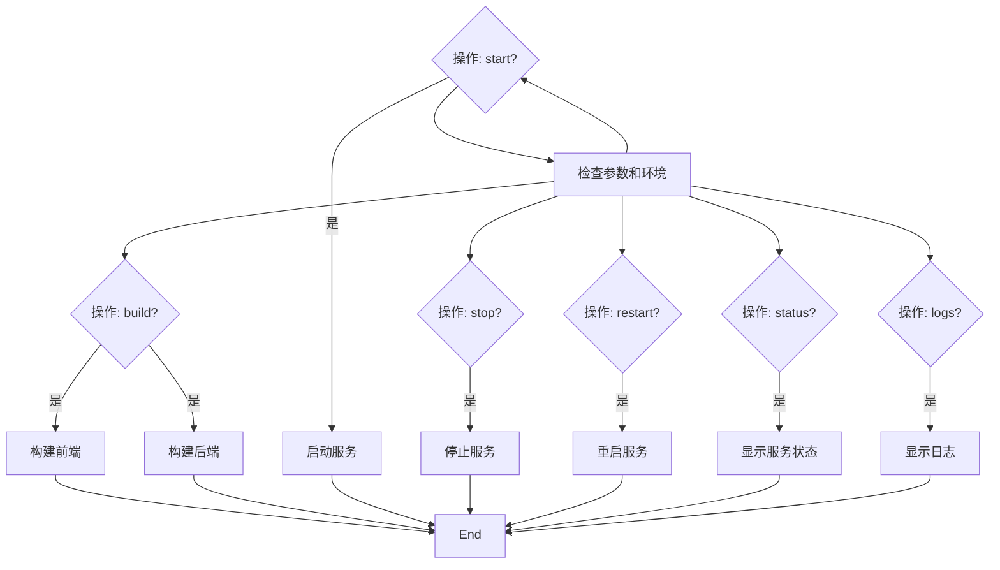
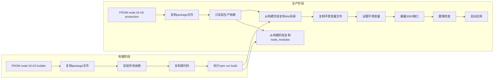
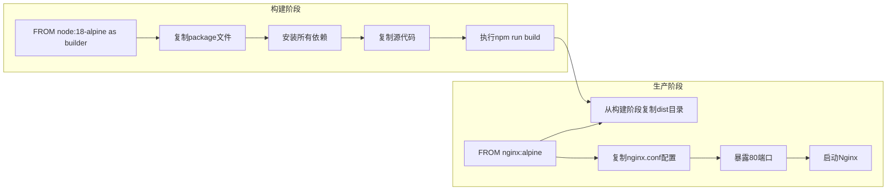
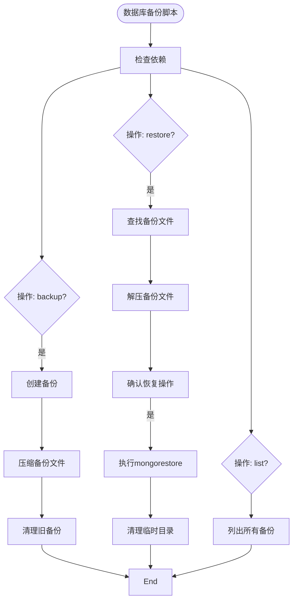

<docs>
# 部署与运维

<cite>
**本文档引用的文件**   
- [deploy.sh](file://scripts/deploy.sh)
- [pm2-deploy.sh](file://pm2-deploy.sh)
- [backend/Dockerfile](file://backend/Dockerfile)
- [frontend/Dockerfile](file://frontend/Dockerfile)
- [frontend/nginx.conf](file://frontend/nginx.conf)
- [backend/ecosystem.config.js](file://backend/ecosystem.config.js)
- [frontend/ecosystem.config.js](file://frontend/ecosystem.config.js)
- [scripts/db_backup.sh](file://scripts/db_backup.sh)
- [scripts/setup_cron_backup.sh](file://scripts/setup_cron_backup.sh)
- [backend/src/modules/auth/models/login-log.entity.ts](file://backend/src/modules/auth/models/login-log.entity.ts)
- [PRODUCTION_DEPLOYMENT.md](file://PRODUCTION_DEPLOYMENT.md)
- [update-production.sh](file://update-production.sh)
- [rollback-production.sh](file://rollback-production.sh)
- [monitor-production.sh](file://monitor-production.sh)
</cite>

## 更新摘要
**变更内容**   
- 新增了生产环境部署指南，整合了`update-production.sh`、`rollback-production.sh`和`monitor-production.sh`脚本的使用说明
- 更新了部署流程部分，增加了新的生产环境更新脚本和监控脚本
- 扩展了高可用性与灾备恢复章节，包含了新的监控和回滚机制
- 添加了生产环境脚本的详细说明和典型工作流程

## 目录
1. [部署流程](#部署流程)
2. [Docker镜像构建](#docker镜像构建)
3. [反向代理配置](#反向代理配置)
4. [PM2进程管理](#pm2进程管理)
5. [数据库备份与恢复](#数据库备份与恢复)
6. [系统监控与日志收集](#系统监控与日志收集)
7. [故障排查](#故障排查)
8. [高可用性与灾备恢复](#高可用性与灾备恢复)
9. [性能调优](#性能调优)

## 部署流程

本项目提供了两个主要的部署脚本：`deploy.sh` 和 `pm2-deploy.sh`，分别用于完整的生产部署和PM2进程管理。此外，新增了专门针对生产环境的更新、回滚和监控脚本。

`deploy.sh` 脚本实现了完整的自动化部署流程，包括代码更新、依赖安装、项目构建、服务部署和健康检查。该脚本支持多种操作模式，包括完整部署、快速重启、版本回滚和手动备份。


**图示来源**
- [deploy.sh](file://scripts/deploy.sh#L1-L305)

**本节来源**
- [deploy.sh](file://scripts/deploy.sh#L1-L305)

### 自动化部署脚本

`deploy.sh` 脚本的主要功能包括：

1. **备份当前版本**：在部署前创建前端和后端构建产物的备份，并保存PM2进程状态
2. **代码更新**：从Git仓库拉取最新代码
3. **依赖安装**：使用npm ci安装前后端依赖
4. **项目构建**：执行前后端的构建命令
5. **服务部署**：通过PM2重新加载后端服务并重启前端服务
6. **健康检查**：验证服务状态和API可用性
7. **回滚机制**：部署失败时自动恢复到上一个版本

```bash
# 完整部署流程
./scripts/deploy.sh deploy

# 快速重启服务（不更新代码）
./scripts/deploy.sh quick

# 回滚到指定版本
./scripts/deploy.sh rollback 20240604_102530

# 手动创建备份
./scripts/deploy.sh backup
```

**本节来源**
- [deploy.sh](file://scripts/deploy.sh#L1-L305)

### 生产环境专用脚本

项目新增了三个专门用于生产环境管理的脚本：`update-production.sh`、`rollback-production.sh`和`monitor-production.sh`，提供了更精细的生产环境控制。

#### 生产环境更新脚本 (update-production.sh)

该脚本专为生产环境设计，提供安全的更新流程：

```bash
# 更新全部（前后端）
./update-production.sh

# 只更新后端
./update-production.sh backend

# 只更新前端
./update-production.sh frontend
```

**功能特点：**
- 拉取最新代码
- 自动备份当前状态（代码版本 + PM2状态）
- 安装依赖并构建
- 重启PM2服务
- 执行健康检查

**本节来源**
- [update-production.sh](file://update-production.sh#L1-L100)

#### 生产环境回滚脚本 (rollback-production.sh)

该脚本提供快速回滚能力：

```bash
# 查看可用备份
./rollback-production.sh

# 回滚到指定备份
./rollback-production.sh backups/20241220_143022
```

**功能特点：**
- 回滚到指定备份版本
- 恢复Git代码
- 重新构建应用
- 恢复PM2服务

**本节来源**
- [rollback-production.sh](file://rollback-production.sh#L1-L80)

#### 生产环境监控脚本 (monitor-production.sh)

该脚本提供全面的监控功能：

```bash
# 执行一次检查
./monitor-production.sh check

# 持续监控（30秒间隔）
./monitor-production.sh watch

# 查看日志
./monitor-production.sh logs
```

**监控指标：**
- 服务状态检查
- 端口监听检查
- HTTP响应检查
- 系统资源监控
- 错误日志分析

**本节来源**
- [monitor-production.sh](file://monitor-production.sh#L1-L120)

### PM2部署管理

`pm2-deploy.sh` 脚本专门用于PM2进程的管理，支持开发和生产两种环境的启动、停止、重启、状态查看和日志查看。



**图示来源**
- [pm2-deploy.sh](file://pm2-deploy.sh#L1-L185)

**本节来源**
- [pm2-deploy.sh](file://pm2-deploy.sh#L1-L185)

## Docker镜像构建

项目通过Dockerfile为前后端分别构建生产环境镜像，采用多阶段构建策略优化镜像大小和安全性。

### 后端Docker镜像

后端Dockerfile采用多阶段构建，分为构建阶段和生产阶段：



**图示来源**
- [backend/Dockerfile](file://backend/Dockerfile#L1-L51)

**本节来源**
- [backend/Dockerfile](file://backend/Dockerfile#L1-L51)

### 前端Docker镜像

前端Dockerfile同样采用多阶段构建，使用Nginx作为生产环境的Web服务器：



**图示来源**
- [frontend/Dockerfile](file://frontend/Dockerfile#L1-L27)

**本节来源**
- [frontend/Dockerfile](file://frontend/Dockerfile#L1-L27)

## 反向代理配置

前端Nginx配置文件`nginx.conf`实现了反向代理功能，将API请求转发到后端服务，同时支持前端路由的HTML5 History模式。

```nginx
server {
    listen 80;
    server_name localhost;

    root /usr/share/nginx/html;
    index index.html;

    # 支持 HTML5 History 模式
    location / {
        try_files $uri $uri/ /index.html;
    }

    # API 代理配置
    location /api/ {
        proxy_pass http://localhost:3000/api/;
        proxy_http_version 1.1;
        proxy_set_header Upgrade $http_upgrade;
        proxy_set_header Connection 'upgrade';
        proxy_set_header Host $host;
        proxy_cache_bypass $http_upgrade;
        proxy_set_header X-Real-IP $remote_addr;
        proxy_set_header X-Forwarded-For $proxy_add_x_forwarded_for;
        proxy_set_header X-Forwarded-Proto $scheme;
    }

    # 静态资源缓存设置
    location /assets {
        expires 1y;
        add_header Cache-Control "public, no-transform";
    }

    # 禁止访问 . 文件
    location ~ /\. {
        deny all;
    }
}
```

**本节来源**
- [frontend/nginx.conf](file://frontend/nginx.conf#L1-L36)

## PM2进程管理

PM2是Node.js应用的进程管理器，项目通过`ecosystem.config.js`文件配置了前后端服务的管理参数。

### 后端PM2配置

后端配置文件定义了开发和生产两个环境的服务配置：

```javascript
module.exports = {
  apps: [
    {
      name: 'backend-dev',
      script: 'dist/main.js',
      watch: true,
      env: {
        NODE_ENV: 'development',
        PORT: 3001,
        // 其他环境变量
      },
      max_memory_restart: '300M',
      log_date_format: 'YYYY-MM-DD HH:mm:ss',
      error_file: 'logs/backend-dev-error.log',
      out_file: 'logs/backend-dev-out.log',
      merge_logs: true,
      instances: 1,
      exec_mode: 'fork',
      env_file: '.env'
    },
    {
      name: 'backend-prod',
      script: 'dist/main.js',
      env: {
        NODE_ENV: 'production',
        PORT: 3000,
        // 其他环境变量
      },
      max_memory_restart: '300M',
      log_date_format: 'YYYY-MM-DD HH:mm:ss',
      error_file: 'logs/backend-prod-error.log',
      out_file: 'logs/backend-prod-out.log',
      merge_logs: true,
      instances: 1,
      exec_mode: 'fork',
      env_file: '.env'
    }
  ]
};
```

**本节来源**
- [backend/ecosystem.config.js](file://backend/ecosystem.config.js#L1-L57)

### 前端PM2配置

前端配置文件定义了生产环境的预览服务：

```javascript
export default {
  apps: [
    {
      name: 'frontend-prod',
      script: 'node_modules/vite/bin/vite.js',
      args: 'preview --port 4173 --host',
      env: {
        NODE_ENV: 'production',
        PORT: 4173
      },
      max_memory_restart: '300M',
      log_date_format: 'YYYY-MM-DD HH:mm:ss',
      error_file: 'logs/frontend-prod-error.log',
      out_file: 'logs/frontend-prod-out.log',
      merge_logs: true,
      instances: 1,
      exec_mode: 'fork'
    }
  ]
};
```

**本节来源**
- [frontend/ecosystem.config.js](file://frontend/ecosystem.config.js#L1-L24)

## 数据库备份与恢复

项目提供了完整的数据库备份与恢复方案，通过`db_backup.sh`脚本实现MongoDB数据库的备份和恢复功能。

### 备份脚本功能

`db_backup.sh`脚本支持以下操作：

- 创建数据库备份
- 恢复指定备份
- 列出所有可用备份
- 显示帮助信息



**图示来源**
- [scripts/db_backup.sh](file://scripts/db_backup.sh#L1-L227)

**本节来源**
- [scripts/db_backup.sh](file://scripts/db_backup.sh#L1-L227)

### 定时备份设置

通过`setup_cron_backup.sh`脚本可以设置定时自动备份，支持每日、每周和每月三种频率：

```bash
# 设置每日备份（每天凌晨2点）
./scripts/setup_cron_backup.sh daily

# 设置每周备份（每周日凌晨3点）
./scripts/setup_cron_backup.sh weekly

# 设置每月备份（每月1日凌晨4点）
./scripts/setup_cron_backup.sh monthly
```

**本节来源**
- [scripts/setup_cron_backup.sh](file://scripts/setup_cron_backup.sh#L1-L128)

## 系统监控与日志收集

系统通过多种机制实现监控和日志收集，确保系统的稳定运行和问题的快速定位。

### 日志收集策略

系统采用分层日志