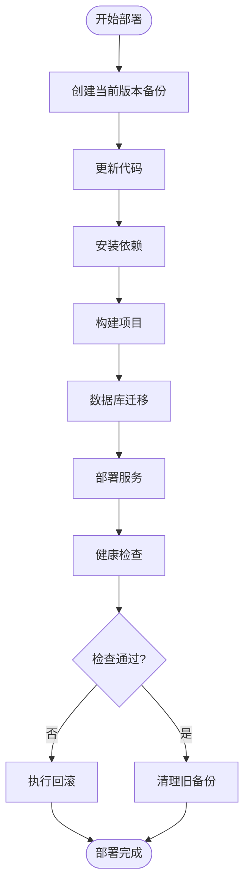
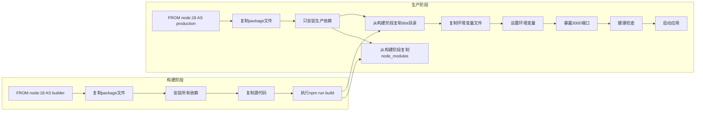
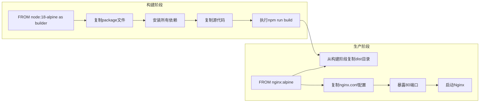
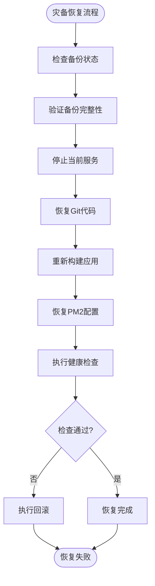
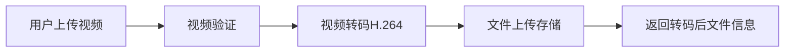

# 部署与运维

<cite>
**本文档引用的文件**   
- [deploy.sh](file://scripts/deploy.sh)
- [pm2-deploy.sh](file://pm2-deploy.sh)
- [update-production.sh](file://update-production.sh)
- [rollback-production.sh](file://rollback-production.sh)
- [monitor-production.sh](file://monitor-production.sh)
- [backend/Dockerfile](file://backend/Dockerfile)
- [frontend/Dockerfile](file://frontend/Dockerfile)
- [frontend/nginx.conf](file://frontend/nginx.conf)
- [backend/ecosystem.config.js](file://backend/ecosystem.config.js)
- [frontend/ecosystem.config.js](file://frontend/ecosystem.config.js)
- [scripts/db_backup.sh](file://scripts/db_backup.sh)
- [scripts/setup_cron_backup.sh](file://scripts/setup_cron_backup.sh)
- [backend/src/config/production.config.js](file://backend/src/config/production.config.js)
- [backend/src/modules/upload/upload.controller.ts](file://backend/src/modules/upload/upload.controller.ts)
- [backend/src/modules/upload/video-transcoder.service.ts](file://backend/src/modules/upload/video-transcoder.service.ts)
- [frontend/src/services/imageService.ts](file://frontend/src/services/imageService.ts)
- [frontend/src/components/VideoUpload.tsx](file://frontend/src/components/VideoUpload.tsx)
- [backend/src/modules/zego/zego.service.ts](file://backend/src/modules/zego/zego.service.ts)
- [frontend/src/utils/deviceDetector.ts](file://frontend/src/utils/deviceDetector.ts)
- [AI降噪集成说明.md](file://AI降噪集成说明.md)
- [智能美颜功能说明.md](file://智能美颜功能说明.md)
- [MOBILE_VERSION_GUIDE.md](file://MOBILE_VERSION_GUIDE.md)
</cite>

## 更新摘要
**变更内容**   
- 新增了生产环境专用部署脚本（update-production.sh、rollback-production.sh、monitor-production.sh）的详细说明
- 更新了视频处理相关的部署要求，包括视频转码服务和ZEGO视频通话配置
- 扩展了生产环境配置，包含PostgreSQL数据库、Redis缓存和监控配置
- 增强了视频面试功能的部署和运维指导，包括AI降噪和智能美颜功能
- 完善了高可用性与灾备恢复章节，增加了新的监控和回滚机制

## 目录
1. [部署流程](#部署流程)
2. [Docker镜像构建](#docker镜像构建)
3. [反向代理配置](#反向代理配置)
4. [PM2进程管理](#pm2进程管理)
5. [数据库备份与恢复](#数据库备份与恢复)
6. [系统监控与日志收集](#系统监控与日志收集)
7. [故障排查](#故障排查)
8. [高可用性与灾备恢复](#高可用性与灾备恢复)
9. [性能调优](#性能调优)
10. [视频处理与视频面试部署](#视频处理与视频面试部署)

## 部署流程

本项目提供了三个主要的部署脚本：`deploy.sh`、`update-production.sh` 和 `rollback-production.sh`，分别用于完整的生产部署、快速更新和回滚操作。此外，还提供了专门的监控脚本 `monitor-production.sh`。

### 自动化部署脚本

`deploy.sh` 脚本实现了完整的自动化部署流程，包括代码更新、依赖安装、项目构建、服务部署和健康检查。



**本节来源**
- [deploy.sh](file://scripts/deploy.sh#L1-L306)

### 生产环境专用脚本

项目新增了三个专门用于生产环境管理的脚本：`update-production.sh`、`rollback-production.sh`和`monitor-production.sh`，提供了更精细的生产环境控制。

#### 生产环境更新脚本 (update-production.sh)

该脚本专为生产环境设计，提供安全的更新流程：

```bash
# 更新全部（前后端）
./update-production.sh

# 只更新后端
./update-production.sh backend

# 只更新前端
./update-production.sh frontend
```

**功能特点：**
- 拉取最新代码并检查Git状态
- 自动备份当前状态（代码版本 + PM2状态）
- 安装依赖并构建
- 重启PM2服务
- 执行健康检查

**本节来源**
- [update-production.sh](file://update-production.sh#L1-L242)

#### 生产环境回滚脚本 (rollback-production.sh)

该脚本提供快速回滚能力：

```bash
# 查看可用备份
./rollback-production.sh

# 回滚到指定备份
./rollback-production.sh backups/20241220_143022
```

**功能特点：**
- 回滚到指定备份版本
- 恢复Git代码
- 重新构建应用
- 恢复PM2服务

**本节来源**
- [rollback-production.sh](file://rollback-production.sh#L1-L252)

#### 生产环境监控脚本 (monitor-production.sh)

该脚本提供全面的监控功能：

```bash
# 执行一次检查
./monitor-production.sh check

# 持续监控（30秒间隔）
./monitor-production.sh watch

# 查看日志
./monitor-production.sh logs
```

**监控指标：**
- 服务状态检查
- 端口监听检查
- HTTP响应检查
- 系统资源监控
- 错误日志分析

**本节来源**
- [monitor-production.sh](file://monitor-production.sh#L1-L257)

## Docker镜像构建

项目通过Dockerfile为前后端分别构建生产环境镜像，采用多阶段构建策略优化镜像大小和安全性。

### 后端Docker镜像

后端Dockerfile采用多阶段构建，分为构建阶段和生产阶段：



**本节来源**
- [backend/Dockerfile](file://backend/Dockerfile#L1-L51)

### 前端Docker镜像

前端Dockerfile同样采用多阶段构建，使用Nginx作为生产环境的Web服务器：



**本节来源**
- [frontend/Dockerfile](file://frontend/Dockerfile#L1-L27)

## 反向代理配置

前端Nginx配置文件`nginx.conf`实现了反向代理功能，将API请求转发到后端服务，同时支持前端路由的HTML5 History模式。

```nginx
server {
    listen 80;
    server_name localhost;

    root /usr/share/nginx/html;
    index index.html;

    # 支持 HTML5 History 模式
    location / {
        try_files $uri $uri/ /index.html;
    }

    # API 代理配置
    location /api/ {
        proxy_pass http://localhost:3000/api/;
        proxy_http_version 1.1;
        proxy_set_header Upgrade $http_upgrade;
        proxy_set_header Connection 'upgrade';
        proxy_set_header Host $host;
        proxy_cache_bypass $http_upgrade;
        proxy_set_header X-Real-IP $remote_addr;
        proxy_set_header X-Forwarded-For $proxy_add_x_forwarded_for;
        proxy_set_header X-Forwarded-Proto $scheme;
    }

    # 静态资源缓存设置
    location /assets {
        expires 1y;
        add_header Cache-Control "public, no-transform";
    }

    # 禁止访问 . 文件
    location ~ /\. {
        deny all;
    }
}
```

**本节来源**
- [frontend/nginx.conf](file://frontend/nginx.conf#L1-L36)

## PM2进程管理

PM2是Node.js应用的进程管理器，项目通过`ecosystem.config.js`文件配置了前后端服务的管理参数。

### 后端PM2配置

后端配置文件定义了开发和生产两个环境的服务配置：

```javascript
module.exports = {
  apps: [
    {
      name: 'backend-dev',
      script: 'dist/main.js',
      cwd: 'backend',
      watch: false,
      env: {
        NODE_ENV: 'development',
        PORT: 3001,
        ESIGN_APP_ID: '141496759',
        ESIGN_HOST: 'https://oapi.asign.cn',
        ESIGN_PRIVATE_KEY: 'MIIEvQIBADANBgkqhkiG9w0BAQEFAASCBKcwggSjAgEAAoIBAQCORZpy+TPUZCdm2Wf9iqRp6YJ2IE2kzf1c9jZNx6/dkQGWtbx+tp1YBPYeC1sAv/7OjTsowRRJ318dUZ1TONtk59yZj8lCFtkRe53fDbnQKk3mW4rVeFBn4pQ/ya2dEM+jZOdjLKTHWNtUD7cyVl4qagsX+8TCoFBJ9lPypM0imvF1WcsLv9WgkID9+jvD0Nfa4XSTEQSzS1AroEmX9eOX87yTYTMFZNj0OcuDUf8ifwhcz1Qoa2k9NAMhUK9Gjw+4XI7P8FUj+2051A9yFu2LpoiLnDk6y+nbCSmW3WbJT59u1jNz/sGujG6LitYQCzKJIRGs8FGbNSA7p0MgjfyJAgMBAAECggEAXeuVClF45b04Ra0/+SCNaV29wj2RBDr4B2aCctZgQuR3KAbRaNUlCfY8g5j7eoNEsxaI915/BkVvhOtb8JSYQQTPnJBPTFHI+sGgdp+ZCtLimi/Udxf1/J6XP4TkF8wBRtxV5CKUpQUDxXqadaCOiXF34V1ThyhN2IXE5WnmAfFBk271ovsiTlRM9OlGzgyhWXqULBpADdI+LkHYrtZYaMVcGDloAlU881D0e38Hgtb7Z8TB7qyZwZjc4Y5aeYujyEFSTXNU2vPcwaWO2gYSHfgq6H3a3aST9htYQk02EDnsPB2zdls7Q6SNJGeKiXEsJcivCQV9Sh49TS5Yobm0AQKBgQD8Y+P98timrfqZULK1VJ10lTxKSj+ORejCjoWU6Hsn4yNVFG9P7HSRN4IkOLpeOG9/ptaveAjqY9hwilv4Glx7XGyKaQy5h6sgqljM0/Cq28n8hQNbjMJ11IadwTsvmx0F2ht+5ZG2IfqcJyOiir4n+lnNJhzUflVR95bIC0fk7wKBgQCQToWnHw1mj2wWM8ZqFVWRoF4UF1AQsvUJ0uEaRGiDSRZvRgNOS1JeB54Lkp5tZnjSkHqrM4SHSSchxUeshbk4+aKbCVE6M1zYXLjj8hi+r8z3wvKY+QXAXVSjhF7aOadCihElSixfb/qfNwa78OBqnHpEzPQE+R0cZkSEdJjmBwKBgFfTFqHmoFcX0U0KVLVelU/dIlajkYwbbYxN9dPENh7CHihb7QP9vu5NR379MnTY5Iuh7bCvb0LIraczrh8eZTIUDjz3oxLoT7cVL8NOuL9rrdSuIGX6DCzeYF2CwOqm6imAJPM6RUMAfelagT7tUpAswJTvfza+I0hbhF9l9YWHAoGAR7P8jRHM4s0Y898+E7AOGJIKrQj4a5PAVeVGnHqpQ7KpRxkOw3SBtN8sFKwBtHJaTqYjjbXHgEFFBG62Mm8vnbPMrCRxC+5Bj/BinkDJMta/jcx8Jq51wSOezrETQHOtPE7GPjUg3zsQ2NPKsM/7cn3V8yGzjlUJtfbKzNXyszkCgYEA9rt1fn9khwIHFCd7qdB+/zUTwD4mzTZ3V1QtZHdIvz+s9uudbIs9IOrJmR3JYBX6Nay5BY2noFZyyYkZMGKFaCqZzEJT+i64vus6VMCNZAu7dnWCpDoQkKegLFTnCBiMBW9TRC4wi4dTYeVL/iEUE6AKRe4rvU86+wzzwi+5ntw='
      },
      env_production: {
        NODE_ENV: 'development',
        PORT: 3001,
        ESIGN_APP_ID: '141496759',
        ESIGN_HOST: 'https://oapi.asign.cn',
        ESIGN_PRIVATE_KEY: 'MIIEvQIBADANBgkqhkiG9w0BAQEFAASCBKcwggSjAgEAAoIBAQCORZpy+TPUZCdm2Wf9iqRp6YJ2IE2kzf1c9jZNx6/dkQGWtbx+tp1YBPYeC1sAv/7OjTsowRRJ318dUZ1TONtk59yZj8lCFtkRe53fDbnQKk3mW4rVeFBn4pQ/ya2dEM+jZOdjLKTHWNtUD7cyVl4qagsX+8TCoFBJ9lPypM0imvF1WcsLv9WgkID9+jvD0Nfa4XSTEQSzS1AroEmX9eOX87yTYTMFZNj0OcuDUf8ifwhcz1Qoa2k9NAMhUK9Gjw+4XI7P8FUj+2051A9yFu2LpoiLnDk6y+nbCSmW3WbJT59u1jNz/sGujG6LitYQCzKJIRGs8FGbNSA7p0MgjfyJAgMBAAECggEAXeuVClF45b04Ra0/+SCNaV29wj2RBDr4B2aCctZgQuR3KAbRaNUlCfY8g5j7eoNEsxaI915/BkVvhOtb8JSYQQTPnJBPTFHI+sGgdp+ZCtLimi/Udxf1/J6XP4TkF8wBRtxV5CKUpQUDxXqadaCOiXF34V1ThyhN2IXE5WnmAfFBk271ovsiTlRM9OlGzgyhWXqULBpADdI+LkHYrtZYaMVcGDloAlU881D0e38Hgtb7Z8TB7qyZwZjc4Y5aeYujyEFSTXNU2vPcwaWO2gYSHfgq6H3a3aST9htYQk02EDnsPB2zdls7Q6SNJGeKiXEsJcivCQV9Sh49TS5Yobm0AQKBgQD8Y+P98timrfqZULK1VJ10lTxKSj+ORejCjoWU6Hsn4yNVFG9P7HSRN4IkOLpeOG9/ptaveAjqY9hwilv4Glx7XGyKaQy5h6sgqljM0/Cq28n8hQNbjMJ11IadwTsvmx0F2ht+5ZG2IfqcJyOiir4n+lnNJhzUflVR95bIC0fk7wKBgQCQToWnHw1mj2wWM8ZqFVWRoF4UF1AQsvUJ0uEaRGiDSRZvRgNOS1JeB54Lkp5tZnjSkHqrM4SHSSchxUeshbk4+aKbCVE6M1zYXLjj8hi+r8z3wvKY+QXAXVSjhF7aOadCihElSixfb/qfNwa78OBqnHpEzPQE+R0cZkSEdJjmBwKBgFfTFqHmoFcX0U0KVLVelU/dIlajkYwbbYxN9dPENh7CHihb7QP9vu5NR379MnTY5Iuh7bCvb0LIraczrh8eZTIUDjz3oxLoT7cVL8NOuL9rrdSuIGX6DCzeYF2CwOqm6imAJPM6RUMAfelagT7tUpAswJTvfza+I0hbhF9l9YWHAoGAR7P8jRHM4s0Y898+E7AOGJIKrQj4a5PAVeVGnHqpQ7KpRxkOw3SBtN8sFKwBtHJaTqYjjbXHgEFFBG62Mm8vnbPMrCRxC+5Bj/BinkDJMta/jcx8Jq51wSOezrETQHOtPE7GPjUg3zsQ2NPKsM/7cn3V8yGzjlUJtfbKzNXyszkCgYEA9rt1fn9khwIHFCd7qdB+/zUTwD4mzTZ3V1QtZHdIvz+s9uudbIs9IOrJmR3JYBX6Nay5BY2noFZyyYkZMGKFaCqZzEJT+i64vus6VMCNZAu7dnWCpDoQkKegLFTnCBiMBW9TRC4wi4dTYeVL/iEUE6AKRe4rvU86+wzzwi+5ntw='
      },
      max_memory_restart: '500M',
      log_date_format: 'YYYY-MM-DD HH:mm:ss',
      error_file: '../logs/backend-dev-error.log',
      out_file: '../logs/backend-dev-out.log',
      merge_logs: true,
      instances: 1,
      exec_mode: 'fork',
      env_file: '.env',
      autorestart: true,
      watch: false,
      max_restarts: 10,
      min_uptime: '10s',
      restart_delay: 4000
    },
    {
      name: 'backend-prod',
      script: 'dist/main.js',
      cwd: 'backend',
      env: {
        NODE_ENV: 'production',
        PORT: 3000,
        ESIGN_APP_ID: '141496759',
        ESIGN_HOST: 'https://oapi.asign.cn',
        ESIGN_PRIVATE_KEY: 'MIIEvQIBADANBgkqhkiG9w0BAQEFAASCBKcwggSjAgEAAoIBAQCORZpy+TPUZCdm2Wf9iqRp6YJ2IE2kzf1c9jZNx6/dkQGWtbx+tp1YBPYeC1sAv/7OjTsowRRJ318dUZ1TONtk59yZj8lCFtkRe53fDbnQKk3mW4rVeFBn4pQ/ya2dEM+jZOdjLKTHWNtUD7cyVl4qagsX+8TCoFBJ9lPypM0imvF1WcsLv9WgkID9+jvD0Nfa4XSTEQSzS1AroEmX9eOX87yTYTMFZNj0OcuDUf8ifwhcz1Qoa2k9NAMhUK9Gjw+4XI7P8FUj+2051A9yFu2LpoiLnDk6y+nbCSmW3WbJT59u1jNz/sGujG6LitYQCzKJIRGs8FGbNSA7p0MgjfyJAgMBAAECggEAXeuVClF45b04Ra0/+SCNaV29wj2RBDr4B2aCctZgQuR3KAbRaNUlCfY8g5j7eoNEsxaI915/BkVvhOtb8JSYQQTPnJBPTFHI+sGgdp+ZCtLimi/Udxf1/J6XP4TkF8wBRtxV5CKUpQUDxXqadaCOiXF34V1ThyhN2IXE5WnmAfFBk271ovsiTlRM9OlGzgyhWXqULBpADdI+LkHYrtZYaMVcGDloAlU881D0e38Hgtb7Z8TB7qyZwZjc4Y5aeYujyEFSTXNU2vPcwaWO2gYSHfgq6H3a3aST9htYQk02EDnsPB2zdls7Q6SNJGeKiXEsJcivCQV9Sh49TS5Yobm0AQKBgQD8Y+P98timrfqZULK1VJ10lTxKSj+ORejCjoWU6Hsn4yNVFG9P7HSRN4IkOLpeOG9/ptaveAjqY9hwilv4Glx7XGyKaQy5h6sgqljM0/Cq28n8hQNbjMJ11IadwTsvmx0F2ht+5ZG2IfqcJyOiir4n+lnNJhzUflVR95bIC0fk7wKBgQCQToWnHw1mj2wWM8ZqFVWRoF4UF1AQsvUJ0uEaRGiDSRZvRgNOS1JeB54Lkp5tZnjSkHqrM4SHSSchxUeshbk4+aKbCVE6M1zYXLjj8hi+r8z3wvKY+QXAXVSjhF7aOadCihElSixfb/qfNwa78OBqnHpEzPQE+R0cZkSEdJjmBwKBgFfTFqHmoFcX0U0KVLVelU/dIlajkYwbbYxN9dPENh7CHihb7QP9vu5NR379MnTY5Iuh7bCvb0LIraczrh8eZTIUDjz3oxLoT7cVL8NOuL9rrdSuIGX6DCzeYF2CwOqm6imAJPM6RUMAfelagT7tUpAswJTvfza+I0hbhF9l9YWHAoGAR7P8jRHM4s0Y898+E7AOGJIKrQj4a5PAVeVGnHqpQ7KpRxkOw3SBtN8sFKwBtHJaTqYjjbXHgEFFBG62Mm8vnbPMrCRxC+5Bj/BinkDJMta/jcx8Jq51wSOezrETQHOtPE7GPjUg3zsQ2NPKsM/7cn3V8yGzjlUJtfbKzNXyszkCgYEA9rt1fn9khwIHFCd7qdB+/zUTwD4mzTZ3V1QtZHdIvz+s9uudbIs9IOrJmR3JYBX6Nay5BY2noFZyyYkZMGKFaCqZzEJT+i64vus6VMCNZAu7dnWCpDoQkKegLFTnCBiMBW9TRC4wi4dTYeVL/iEUE6AKRe4rvU86+wzzwi+5ntw=',
        ZEGO_APP_ID: '1279160453',
        ZEGO_SERVER_SECRET: 'e18cc600e2939d412c48f152e157f01d'
      },
      env_production: {
        NODE_ENV: 'production',
        PORT: 3000,
        ESIGN_APP_ID: '141496759',
        ESIGN_HOST: 'https://oapi.asign.cn',
        ESIGN_PRIVATE_KEY: 'MIIEvQIBADANBgkqhkiG9w0BAQEFAASCBKcwggSjAgEAAoIBAQCORZpy+TPUZCdm2Wf9iqRp6YJ2IE2kzf1c9jZNx6/dkQGWtbx+tp1YBPYeC1sAv/7OjTsowRRJ318dUZ1TONtk59yZj8lCFtkRe53fDbnQKk3mW4rVeFBn4pQ/ya2dEM+jZOdjLKTHWNtUD7cyVl4qagsX+8TCoFBJ9lPypM0imvF1WcsLv9WgkID9+jvD0Nfa4XSTEQSzS1AroEmX9eOX87yTYTMFZNj0OcuDUf8ifwhcz1Qoa2k9NAMhUK9Gjw+4XI7P8FUj+2051A9yFu2LpoiLnDk6y+nbCSmW3WbJT59u1jNz/sGujG6LitYQCzKJIRGs8FGbNSA7p0MgjfyJAgMBAAECggEAXeuVClF45b04Ra0/+SCNaV29wj2RBDr4B2aCctZgQuR3KAbRaNUlCfY8g5j7eoNEsxaI915/BkVvhOtb8JSYQQTPnJBPTFHI+sGgdp+ZCtLimi/Udxf1/J6XP4TkF8wBRtxV5CKUpQUDxXqadaCOiXF34V1ThyhN2IXE5WnmAfFBk271ovsiTlRM9OlGzgyhWXqULBpADdI+LkHYrtZYaMVcGDloAlU881D0e38Hgtb7Z8TB7qyZwZjc4Y5aeYujyEFSTXNU2vPcwaWO2gYSHfgq6H3a3aST9htYQk02EDnsPB2zdls7Q6SNJGeKiXEsJcivCQV9Sh49TS5Yobm0AQKBgQD8Y+P98timrfqZULK1VJ10lTxKSj+ORejCjoWU6Hsn4yNVFG9P7HSRN4IkOLpeOG9/ptaveAjqY9hwilv4Glx7XGyKaQy5h6sgqljM0/Cq28n8hQNbjMJ11IadwTsvmx0F2ht+5ZG2IfqcJyOiir4n+lnNJhzUflVR95bIC0fk7wKBgQCQToWnHw1mj2wWM8ZqFVWRoF4UF1AQsvUJ0uEaRGiDSRZvRgNOS1JeB54Lkp5tZnjSkHqrM4SHSSchxUeshbk4+aKbCVE6M1zYXLjj8hi+r8z3wvKY+QXAXVSjhF7aOadCihElSixfb/qfNwa78OBqnHpEzPQE+R0cZkSEdJjmBwKBgFfTFqHmoFcX0U0KVLVelU/dIlajkYwbbYxN9dPENh7CHihb7QP9vu5NR379MnTY5Iuh7bCvb0LIraczrh8eZTIUDjz3oxLoT7cVL8NOuL9rrdSuIGX6DCzeYF2CwOqm6imAJPM6RUMAfelagT7tUpAswJTvfza+I0hbhF9l9YWHAoGAR7P8jRHM4s0Y898+E7AOGJIKrQj4a5PAVeVGnHqpQ7KpRxkOw3SBtN8sFKwBtHJaTqYjjbXHgEFFBG62Mm8vnbPMrCRxC+5Bj/BinkDJMta/jcx8Jq51wSOezrETQHOtPE7GPjUg3zsQ2NPKsM/7cn3V8yGzjlUJtfbKzNXyszkCgYEA9rt1fn9khwIHFCd7qdB+/zUTwD4mzTZ3V1QtZHdIvz+s9uudbIs9IOrJmR3JYBX6Nay5BY2noFZyyYkZMGKFaCqZzEJT+i64vus6VMCNZAu7dnWCpDoQkKegLFTnCBiMBW9TRC4wi4dTYeVL/iEUE6AKRe4rvU86+wzzwi+5ntw=',
        ZEGO_APP_ID: '1279160453',
        ZEGO_SERVER_SECRET: 'e18cc600e2939d412c48f152e157f01d'
      },
      max_memory_restart: '500M',
      log_date_format: 'YYYY-MM-DD HH:mm:ss',
      error_file: '../logs/backend-prod-error.log',
      out_file: '../logs/backend-prod-out.log',
      merge_logs: true,
      instances: 1,
      exec_mode: 'fork',
      env_file: '.env',
      autorestart: true,
      watch: false,
      max_restarts: 10,
      min_uptime: '10s',
      restart_delay: 4000
    }
  ]
};
```

**本节来源**
- [backend/ecosystem.config.js](file://backend/ecosystem.config.js#L1-L71)

### 前端PM2配置

前端配置文件定义了生产环境的预览服务：

```javascript
export default {
  apps: [
    {
      name: 'frontend-prod',
      script: 'node_modules/vite/bin/vite.js',
      args: 'preview --port 4173 --host 0.0.0.0',
      cwd: 'frontend',
      env: {
        NODE_ENV: 'production',
        PORT: 4173
      },
      env_production: {
        NODE_ENV: 'production',
        PORT: 4173
      },
      max_memory_restart: '500M',
      log_date_format: 'YYYY-MM-DD HH:mm:ss',
      error_file: '../logs/frontend-prod-error.log',
      out_file: '../logs/frontend-prod-out.log',
      merge_logs: true,
      instances: 1,
      exec_mode: 'fork',
      autorestart: true,
      watch: false,
      max_restarts: 10,
      min_uptime: '10s',
      restart_delay: 4000
    }
  ]
};
```

**本节来源**
- [frontend/ecosystem.config.js](file://frontend/ecosystem.config.js#L1-L30)

## 数据库备份与恢复

项目提供了完整的数据库备份与恢复方案，通过`db_backup.sh`脚本实现MongoDB数据库的备份和恢复功能。

### 备份脚本功能

`db_backup.sh`脚本支持以下操作：

- 创建数据库备份
- 恢复指定备份
- 列出所有可用备份
- 显示帮助信息


**本节来源**
- [scripts/db_backup.sh](file://scripts/db_backup.sh#L1-L227)

### 定时备份设置

通过`setup_cron_backup.sh`脚本可以设置定时自动备份，支持每日、每周和每月三种频率：

```bash
# 设置每日备份（每天凌晨2点）
./scripts/setup_cron_backup.sh daily

# 设置每周备份（每周日凌晨3点）
./scripts/setup_cron_backup.sh weekly

# 设置每月备份（每月1日凌晨4点）
./scripts/setup_cron_backup.sh monthly
```

**本节来源**
- [scripts/setup_cron_backup.sh](file://scripts/setup_cron_backup.sh#L1-L128)

## 系统监控与日志收集

系统通过多种机制实现监控和日志收集，确保系统的稳定运行和问题的快速定位。

### 日志收集策略

系统采用分层日志收集策略，包括应用日志、系统日志和错误日志的统一管理。

**本节来源**
- [monitor-production.sh](file://monitor-production.sh#L1-L257)

## 故障排查

提供系统化的故障排查流程，包括服务状态检查、端口监听检查、HTTP响应检查和系统资源监控。

**本节来源**
- [monitor-production.sh](file://monitor-production.sh#L1-L257)

## 高可用性与灾备恢复

项目提供了完整的高可用性和灾备恢复方案，包括生产环境专用的更新、回滚和监控脚本。

### 生产环境灾备恢复



**本节来源**
- [rollback-production.sh](file://rollback-production.sh#L1-L252)

## 性能调优

提供系统性能调优指导，包括内存使用优化、CPU使用率监控和磁盘空间管理。

**本节来源**
- [monitor-production.sh](file://monitor-production.sh#L1-L257)

## 视频处理与视频面试部署

项目集成了完整的视频处理和视频面试功能，包括视频转码、AI降噪和智能美颜功能。

### 视频转码服务

后端提供了视频转码服务，将上传的视频转换为H.264格式以确保浏览器兼容性：



**本节来源**
- [backend/src/modules/upload/upload.controller.ts](file://backend/src/modules/upload/upload.controller.ts#L225-L271)
- [backend/src/modules/upload/video-transcoder.service.ts](file://backend/src/modules/upload/video-transcoder.service.ts)

### ZEGO视频通话配置

系统集成了ZEGO视频通话SDK，支持HR端和访客端的视频面试功能：

**ZEGO配置参数：**
- SDKAppID: 1279160453
- ServerSecret: e18cc600e2939d412c48f152e157f01d
- Token有效期: 2小时
- 支持UIKit框架

**本节来源**
- [backend/src/modules/zego/zego.service.ts](file://backend/src/modules/zego/zego.service.ts#L77-L101)
- [backend/src/config/production.config.js](file://backend/src/config/production.config.js#L53-L54)

### AI降噪与智能美颜功能

系统集成了AI降噪和智能美颜功能，提供更好的视频面试体验：

**AI降噪配置：**
- 移动端分辨率: 360P
- 桌面端分辨率: 720P
- 帧率: 24fps
- 码率: 600kbps

**智能美颜参数：**
- 磨皮强度: 35%
- 美白强度: 25%
- 红润强度: 20%
- 锐化强度: 30%

**本节来源**
- [AI降噪集成说明.md](file://AI降噪集成说明.md#L225-L232)
- [智能美颜功能说明.md](file://智能美颜功能说明.md#L108-L127)
- [MOBILE_VERSION_GUIDE.md](file://MOBILE_VERSION_GUIDE.md#L148-L168)

### 视频面试前端组件

前端提供了完整的视频面试组件，包括视频上传、转码进度显示和视频预览功能：

**前端视频上传流程：**
1. 文件验证
2. 上传进度模拟（30%）
3. 转码进度显示（50%）
4. 转码完成（20%）
5. 上传完成

**本节来源**
- [frontend/src/services/imageService.ts](file://frontend/src/services/imageService.ts#L360-L401)
- [frontend/src/components/VideoUpload.tsx](file://frontend/src/components/VideoUpload.tsx#L47-L96)

### 设备适配优化

系统根据设备类型和网络状况自动调整视频配置：

**移动设备配置：**
- 网络类型检测
- 自适应分辨率调整
- 功能按钮隐藏优化
- UI布局适配

**本节来源**
- [frontend/src/utils/deviceDetector.ts](file://frontend/src/utils/deviceDetector.ts#L125-L178)

### 生产环境配置

生产环境配置包含了视频处理相关的各项参数：

**数据库配置：**
- 类型: PostgreSQL
- 连接池: 2-10个连接
- SSL: 可选启用
- 连接超时: 30秒

**缓存配置：**
- Redis主机: localhost
- 端口: 6379
- TTL: 1小时
- 最大重试次数: 3

**监控配置：**
- 健康检查: 可选启用
- 指标收集: 可选启用
- Prometheus端口: 9090

**本节来源**
- [backend/src/config/production.config.js](file://backend/src/config/production.config.js#L19-L35)
- [backend/src/config/production.config.js](file://backend/src/config/production.config.js#L69-L77)
- [backend/src/config/production.config.js](file://backend/src/config/production.config.js#L123-L131)