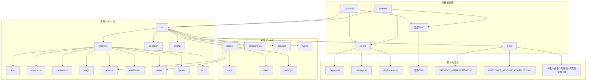
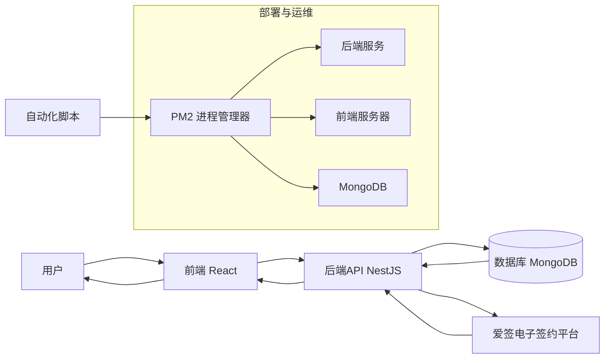
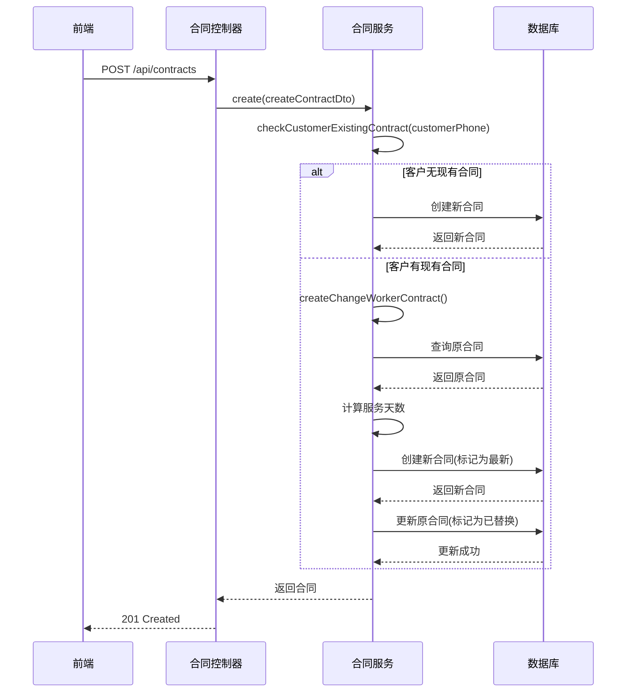
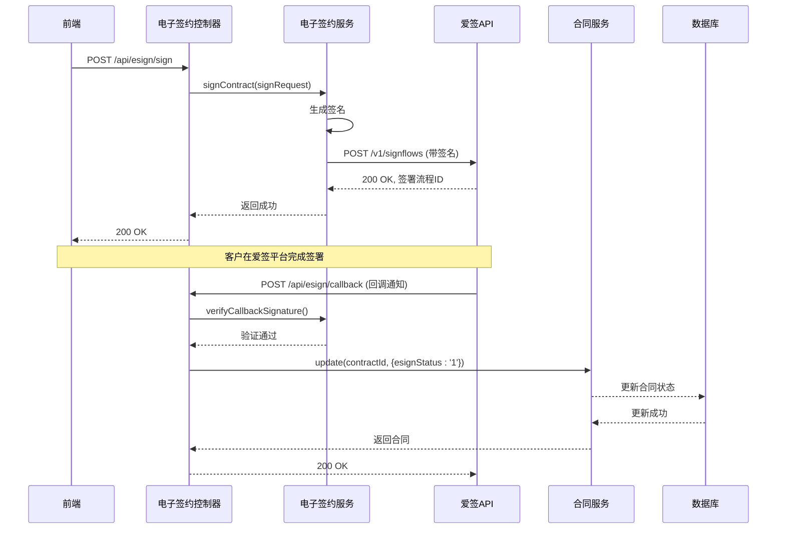
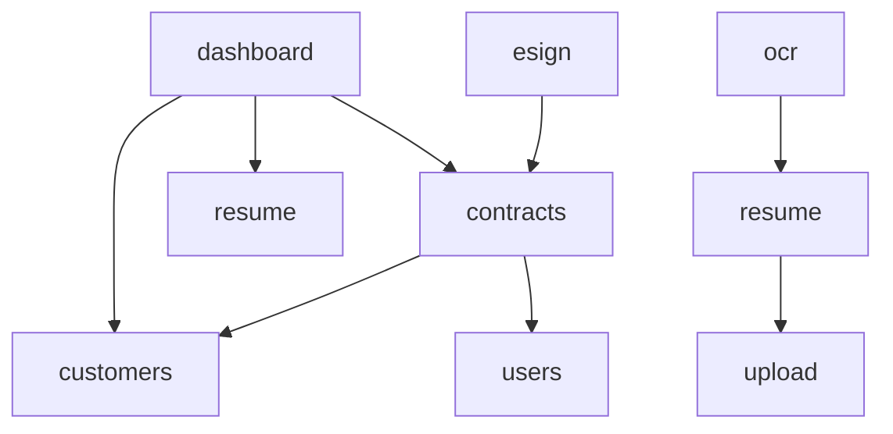

# 项目概述

<cite>
**本文档引用的文件**   
- [README.md](file://README.md)
- [PROJECT_MANAGEMENT.md](file://PROJECT_MANAGEMENT.md)
- [CUSTOMER_MODULE_COMPLETE.md](file://CUSTOMER_MODULE_COMPLETE.md)
- [A客户换多个阿姨-技术实现文档.md](file://A客户换多个阿姨-技术实现文档.md)
- [contracts.service.ts](file://backend/src/modules/contracts/contracts.service.ts)
- [esign.service.ts](file://backend/src/modules/esign/esign.service.ts)
- [contracts.controller.ts](file://backend/src/modules/contracts/contracts.controller.ts)
- [esign.controller.ts](file://backend/src/modules/esign/esign.controller.ts)
- [customer.model.ts](file://backend/src/modules/customers/models/customer.model.ts)
- [contract.model.ts](file://backend/src/modules/contracts/models/contract.model.ts)
- [resume.service.ts](file://backend/src/modules/resume/resume.service.ts)
- [dashboard.service.ts](file://backend/src/modules/dashboard/dashboard.service.ts)
</cite>

## 目录
1. [引言](#引言)
2. [项目结构](#项目结构)
3. [核心组件](#核心组件)
4. [架构概述](#架构概述)
5. [详细组件分析](#详细组件分析)
6. [依赖分析](#依赖分析)
7. [性能考虑](#性能考虑)
8. [故障排除指南](#故障排除指南)
9. [结论](#结论)

## 引言

安德家政CRM系统是一个专为家政服务企业设计的现代化客户关系管理平台，旨在通过数字化手段优化客户管理、合同生命周期、电子签约和阿姨简历管理等核心业务流程。该系统采用前后端分离架构，后端基于NestJS框架，前端采用React技术栈，结合MongoDB作为数据存储，实现了高可用性和可扩展性。系统通过PM2进行进程管理，确保服务的稳定运行，并支持无缝部署和自动备份。本项目文档旨在为开发者和业务人员提供一个全面的系统全景图，从架构设计到核心功能实现，深入解析系统的各个组成部分及其相互关系。

## 项目结构

安德家政CRM系统采用模块化设计，代码库清晰地分为前端、后端和脚本三大主要部分。后端使用NestJS框架，遵循MVC模式，将业务逻辑、数据模型和控制器分离，便于维护和扩展。前端采用React + Vite构建，利用TypeScript确保类型安全，并通过Ant Design提供一致的用户界面。系统还包含一系列自动化脚本，用于部署、备份和日常运维，极大地简化了操作流程。



**图源**
- [README.md](file://README.md)
- [PROJECT_MANAGEMENT.md](file://PROJECT_MANAGEMENT.md)

**本节来源**
- [README.md](file://README.md#L0-L64)
- [PROJECT_MANAGEMENT.md](file://PROJECT_MANAGEMENT.md#L0-L165)

## 核心组件

安德家政CRM系统的核心组件围绕客户管理、合同管理、电子签约和阿姨简历四大业务领域构建。客户管理模块实现了客户信息的增删改查、跟进记录和状态跟踪，支持复杂的搜索和筛选功能。合同管理模块是系统的核心，不仅处理合同的创建和维护，还创新性地解决了“客户更换阿姨”这一复杂业务场景，通过合同版本管理和历史记录，确保业务的连续性和数据的完整性。电子签约模块集成了爱签SDK，实现了合同的在线签署、状态同步和智能撤销/作废，将传统的纸质流程数字化。阿姨简历模块则为家政公司提供了强大的阿姨信息管理能力，支持简历的创建、OCR识别和查询。

**本节来源**
- [CUSTOMER_MODULE_COMPLETE.md](file://CUSTOMER_MODULE_COMPLETE.md#L0-L204)
- [A客户换多个阿姨-技术实现文档.md](file://A客户换多个阿姨-技术实现文档.md#L0-L344)
- [contracts.service.ts](file://backend/src/modules/contracts/contracts.service.ts#L0-L645)
- [esign.service.ts](file://backend/src/modules/esign/esign.service.ts#L0-L199)

## 架构概述

安德家政CRM系统采用典型的前后端分离架构。前端作为用户界面，负责展示数据和接收用户输入，通过RESTful API与后端进行通信。后端作为业务逻辑和数据访问层，接收前端请求，处理业务逻辑，并与数据库交互。数据库（MongoDB）存储所有业务数据。系统通过PM2进行进程管理，确保后端服务和前端静态服务器的高可用性。电子签约功能通过集成爱签的OpenAPI实现，系统作为客户端与爱签的云服务进行双向通信。



**图源**
- [README.md](file://README.md#L0-L64)
- [PROJECT_MANAGEMENT.md](file://PROJECT_MANAGEMENT.md#L0-L165)

## 详细组件分析

### 合同管理模块分析

合同管理模块是系统最复杂的部分，其核心在于处理“客户更换阿姨”这一业务需求。系统通过在合同模型中引入`isLatest`和`contractStatus`等字段，以及创建`CustomerContractHistory`模型来记录历史，实现了合同的版本控制。

#### 合同服务类分析
```mermaid
classDiagram
class ContractsService {
+checkCustomerExistingContract(customerPhone) Promise~{hasContract, contract, contractCount}~
+createChangeWorkerContract(createContractDto, originalContractId, userId) Promise~Contract~
+getCustomerContractHistory(customerPhone) Promise~any~
-generateContractNumber() string
}
class Contract {
+_id : string
+contractNumber : string
+customerName : string
+customerPhone : string
+workerName : string
+workerPhone : string
+startDate : Date
+endDate : Date
+isLatest : boolean
+contractStatus : ContractStatus
+replacesContractId? : ObjectId
+replacedByContractId? : ObjectId
+changeDate? : Date
+serviceDays? : number
}
class CustomerContractHistory {
+customerPhone : string
+customerName : string
+contracts : ContractHistoryRecord[]
+latestContractId : ObjectId
+totalWorkers : number
}
enum ContractStatus {
DRAFT
SIGNING
ACTIVE
REPLACED
CANCELLED
}
ContractsService --> Contract : "创建/查询"
ContractsService --> CustomerContractHistory : "创建/更新"
Contract <|-- "历史合同" : "继承"
```

**图源**
- [A客户换多个阿姨-技术实现文档.md](file://A客户换多个阿姨-技术实现文档.md#L0-L344)
- [contracts.service.ts](file://backend/src/modules/contracts/contracts.service.ts#L0-L645)
- [contract.model.ts](file://backend/src/modules/contracts/models/contract.model.ts)

#### 合同创建流程序列图
当用户创建合同时，系统会智能判断是新建合同还是进入“换人模式”。



**图源**
- [A客户换多个阿姨-技术实现文档.md](file://A客户换多个阿姨-技术实现文档.md#L0-L344)
- [contracts.service.ts](file://backend/src/modules/contracts/contracts.service.ts#L0-L645)

**本节来源**
- [A客户换多个阿姨-技术实现文档.md](file://A客户换多个阿姨-技术实现文档.md#L0-L344)
- [contracts.service.ts](file://backend/src/modules/contracts/contracts.service.ts#L0-L645)

### 电子签约模块分析

电子签约模块负责与爱签平台的集成，处理合同的发起、状态同步和回调。

#### 电子签约服务类分析
```mermaid
classDiagram
class ESignService {
-config : ESignConfig
-axiosInstance : AxiosInstance
+testConnection() Promise~{success, message, config}~
+getDebugConfig() any
+signContract(signRequest) Promise~ESignResponse~
+withdrawContract(contractNo) Promise~any~
+invalidateContract(contractNo) Promise~any~
+cancelContract(contractNo, reason) Promise~any~
+verifyCallbackSignature(data, signature) boolean
}
class ESignConfig {
+type : string
+appId : string
+publicKey : string
+privateKey : string
+host : string
+version : string
+notifyUrl : string
}
class SignRequest {
+contractId : string
+documentTitle : string
+signers : Signer[]
+signFlowConfig : SignFlowConfig
}
class Signer {
+name : string
+mobile : string
+signType : 'PERSONAL' | 'COMPANY'
+signAction : 'SIGN' | 'APPROVAL'
}
ESignService --> ESignConfig : "配置"
ESignService --> SignRequest : "输入"
ESignService --> "爱签API" : "HTTP调用"
```

**图源**
- [esign.service.ts](file://backend/src/modules/esign/esign.service.ts#L0-L199)
- [爱签SDK](file://爱签SDK)

#### 电子签约流程序列图


**图源**
- [esign.service.ts](file://backend/src/modules/esign/esign.service.ts#L0-L199)
- [contracts.service.ts](file://backend/src/modules/contracts/contracts.service.ts#L0-L645)

**本节来源**
- [esign.service.ts](file://backend/src/modules/esign/esign.service.ts#L0-L199)

### 客户管理模块分析

客户管理模块是系统的基础，为其他模块提供客户数据支持。

```mermaid
classDiagram
class CustomersService {
+create(createCustomerDto) Promise~Customer~
+findAll(page, limit, search) Promise~{customers, total}~
+findOne(id) Promise~Customer~
+update(id, updateCustomerDto) Promise~Customer~
+remove(id) Promise~void~
}
class Customer {
+_id : string
+customerId : string
+customerName : string
+customerPhone : string
+source : string
+level : string
+status : string
+serviceCategory : string
+budget : number
+expectedStartDate : Date
+address : string
+createdAt : Date
+updatedAt : Date
}
CustomersService --> Customer : "CRUD操作"
```

**图源**
- [CUSTOMER_MODULE_COMPLETE.md](file://CUSTOMER_MODULE_COMPLETE.md#L0-L204)
- [customer.model.ts](file://backend/src/modules/customers/models/customer.model.ts)

**本节来源**
- [CUSTOMER_MODULE_COMPLETE.md](file://CUSTOMER_MODULE_COMPLETE.md#L0-L204)

## 依赖分析

系统内部模块间存在清晰的依赖关系。`contracts`模块依赖于`customers`和`users`模块，以获取客户和创建人信息。`esign`模块依赖于`contracts`模块，以获取合同详情并更新其电子签约状态。`dashboard`模块则依赖于`contracts`、`customers`和`resume`模块，以聚合数据生成统计报表。外部依赖方面，系统通过`axios`与爱签的OpenAPI进行通信，并使用`mongoose`作为MongoDB的ODM。



**图源**
- [contracts.service.ts](file://backend/src/modules/contracts/contracts.service.ts#L0-L645)
- [esign.service.ts](file://backend/src/modules/esign/esign.service.ts#L0-L199)
- [dashboard.service.ts](file://backend/src/modules/dashboard/dashboard.service.ts)
- [resume.service.ts](file://backend/src/modules/resume/resume.service.ts)

**本节来源**
- [contracts.service.ts](file://backend/src/modules/contracts/contracts.service.ts#L0-L645)
- [esign.service.ts](file://backend/src/modules/esign/esign.service.ts#L0-L199)

## 性能考虑

系统在设计时考虑了性能因素。后端使用NestJS的依赖注入和模块化，保证了代码的高效执行。数据库查询在`contracts`和`customers`模块中都实现了分页和索引，避免了全表扫描。PM2的集群模式允许后端服务利用多核CPU，提高并发处理能力。前端使用Vite进行快速构建和热更新，提升了开发效率。对于可能的性能瓶颈，如OCR识别和大量数据导出，系统可以通过引入消息队列（如Redis）进行异步处理，但这在当前版本中尚未实现。

## 故障排除指南

当系统出现问题时，可以按照以下步骤进行排查：

1.  **服务状态检查**：首先使用`./scripts/manage.sh status`检查PM2中所有服务的状态，确认后端、前端和数据库是否都在运行。
2.  **日志查看**：使用`./scripts/manage.sh logs`查看实时日志，重点关注错误（ERROR）和警告（WARN）信息。对于特定服务，可以使用`./scripts/manage.sh logs backend`。
3.  **API测试**：使用`curl`或Postman直接调用API端点，例如`GET /api/health`来检查后端健康状况。
4.  **数据库连接**：确认MongoDB服务正在运行，并且后端的连接字符串配置正确。
5.  **电子签约问题**：如果电子签约失败，检查`esign.service.ts`中的配置（`appId`、`privateKey`、`host`）是否正确，并查看爱签API的响应错误码。文档中已列出常见错误码（如101000表示合同已签署完成）。
6.  **客户换阿姨问题**：如果换人流程不工作，检查`contracts.service.ts`中的`checkCustomerExistingContract`方法，确保`customerPhone`字段的查询条件正确，并且数据库中存在对应数据。

**本节来源**
- [PROJECT_MANAGEMENT.md](file://PROJECT_MANAGEMENT.md#L0-L165)
- [esign.service.ts](file://backend/src/modules/esign/esign.service.ts#L0-L199)
- [contracts.service.ts](file://backend/src/modules/contracts/contracts.service.ts#L0-L645)

## 结论

安德家政CRM系统是一个功能完备、架构清晰的家政服务管理平台。它成功地将复杂的业务流程（如客户更换阿姨）通过技术创新（合同版本管理）优雅地解决。系统采用现代化的技术栈（NestJS + React + MongoDB），并利用PM2进行高效的运维管理，具备良好的可维护性和扩展性。详细的文档和自动化脚本降低了团队的协作成本。未来，系统可以通过引入工作流引擎、消息队列和更智能的推荐算法，进一步提升自动化水平和用户体验。